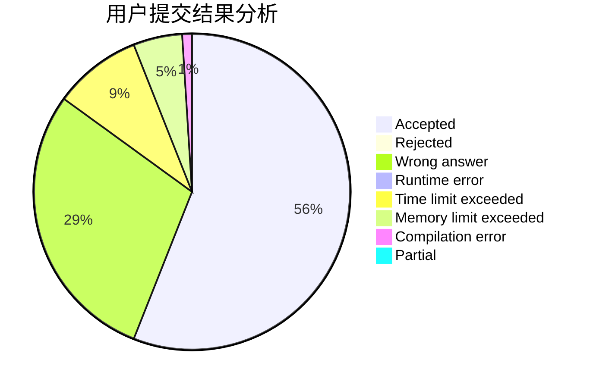
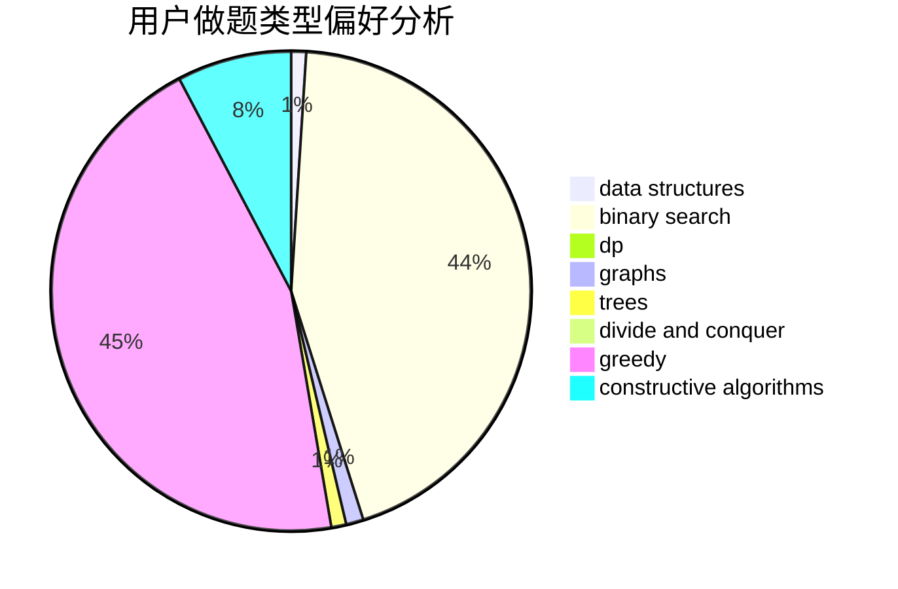

# WuYantao

<!-- tabs:start -->

#### **用户提交结果分析**

#### **用户做题类型偏好分析**

#### **用户错题知识点分析**

<!-- tabs:end -->
# 推荐题目
[1105D](https://codeforces.com/contest/1105/problem/D)		dfs and similar,
                        graphs,
                        implementation,
                        shortest paths		  
[746A](https://codeforces.com/contest/746/problem/A)		implementation,
                        math		  
[767D](https://codeforces.com/contest/767/problem/D)		binary search,
                        data structures,
                        greedy,
                        sortings,
                        two pointers		  
[865G](https://codeforces.com/contest/865/problem/G)		combinatorics,
                        math,
                        matrices		  
[1207C](https://codeforces.com/contest/1207/problem/C)		dp,
                        greedy		  
[193A](https://codeforces.com/contest/193/problem/A)		constructive algorithms,
                        graphs,
                        trees		  
[1241D](https://codeforces.com/contest/1241/problem/D)		dsu,graphs,sortings,trees		  
[1381A1](https://codeforces.com/contest/1381A/problem/1)		constructive algorithms,
                        data structures,
                        strings		  
[1250N](https://codeforces.com/contest/1250/problem/N)		dfs and similar,
                        graphs,
                        greedy		  
[1484B](https://codeforces.com/contest/1484/problem/B)		dsu,graphs,sortings,trees		  
