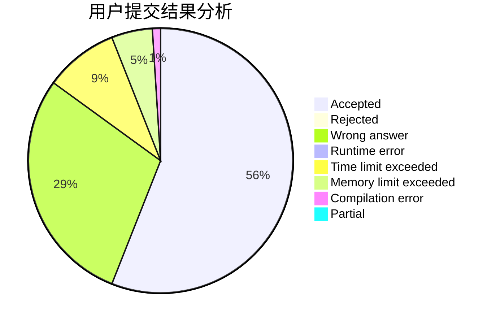
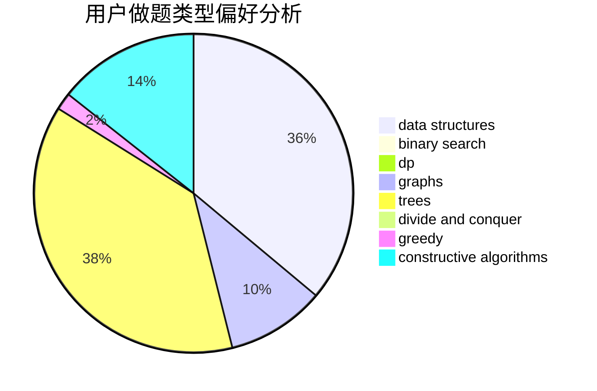

# WuYantao

<!-- tabs:start -->

#### **用户提交结果分析**

#### **用户做题类型偏好分析**

#### **用户错题知识点分析**

<!-- tabs:end -->
# 推荐题目
[1106B](https://codeforces.com/contest/1106/problem/B)		data structures,
                        implementation		  
[765C](https://codeforces.com/contest/765/problem/C)		math		  
[787A](https://codeforces.com/contest/787/problem/A)		brute force,
                        math,
                        number theory		  
[886C](https://codeforces.com/contest/886/problem/C)		dsu,
                        greedy,
                        implementation,
                        trees		  
[12131](https://codeforces.com/contest/1213/problem/1)		dsu,graphs,sortings,trees		  
[216B](https://codeforces.com/contest/216/problem/B)		dfs and similar,
                        implementation		  
[12472](https://codeforces.com/contest/1247/problem/2)		dsu,graphs,sortings,trees		  
[1391B](https://codeforces.com/contest/1391/problem/B)		brute force,
                        greedy,
                        implementation		  
[1256A](https://codeforces.com/contest/1256/problem/A)		math		  
[1491F](https://codeforces.com/contest/1491/problem/F)		binary search,
                        constructive algorithms,
                        interactive		  
