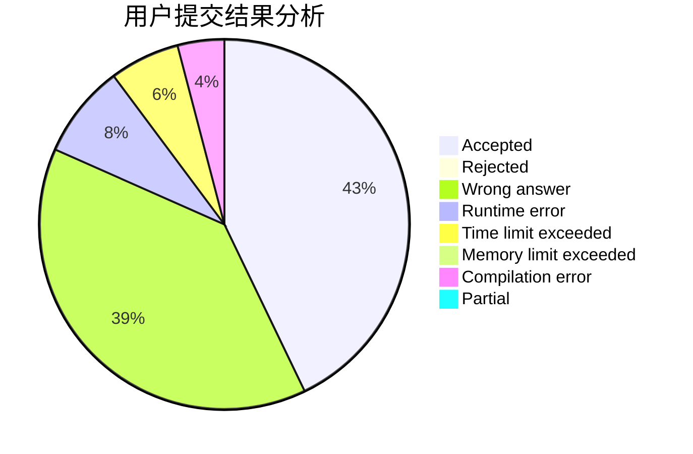
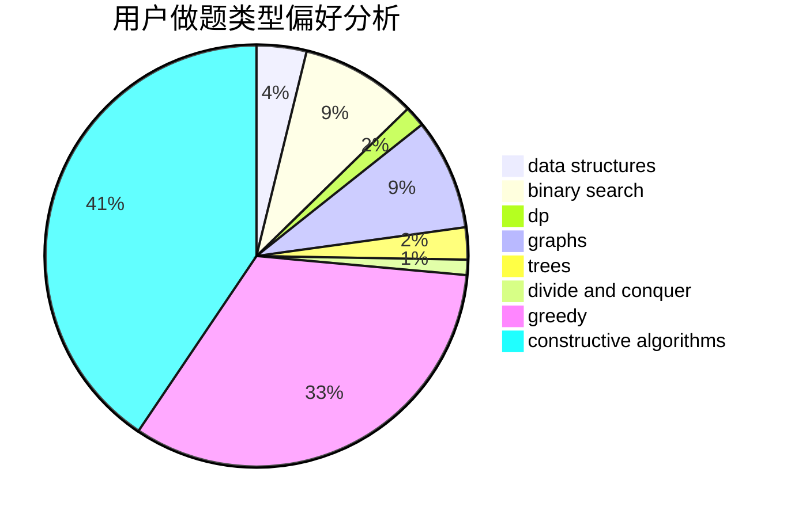
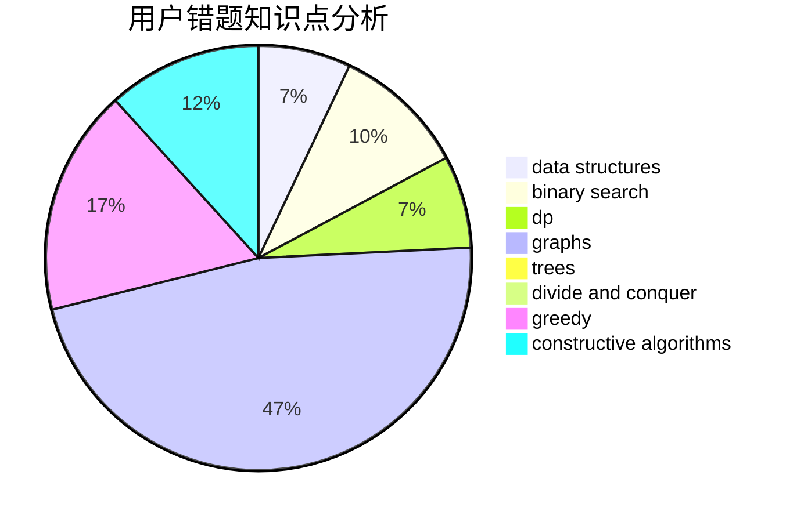

# Wu_Yuanhun

<!-- tabs:start -->

#### **用户提交结果分析**

#### **用户做题类型偏好分析**

#### **用户错题知识点分析**

<!-- tabs:end -->
# 推荐题目
[772E](https://codeforces.com/contest/772/problem/E)		binary search,
                        divide and conquer,
                        interactive,
                        trees		  
[268B](https://codeforces.com/contest/268/problem/B)		implementation,
                        math		  
[545A](https://codeforces.com/contest/545/problem/A)		implementation		  
[1417C](https://codeforces.com/contest/1417/problem/C)		dsu,graphs,sortings,trees		  
[140C](https://codeforces.com/contest/140/problem/C)		binary search,
                        data structures,
                        greedy		  
[1513F](https://codeforces.com/contest/1513/problem/F)		brute force,
                        constructive algorithms,
                        data structures,
                        sortings		  
[418E](https://codeforces.com/contest/418/problem/E)		data structures		  
[759B](https://codeforces.com/contest/759/problem/B)		dsu,graphs,sortings,trees		  
[253D](https://codeforces.com/contest/253/problem/D)		brute force,
                        two pointers		  
[759A](https://codeforces.com/contest/759/problem/A)		dsu,graphs,sortings,trees		  
