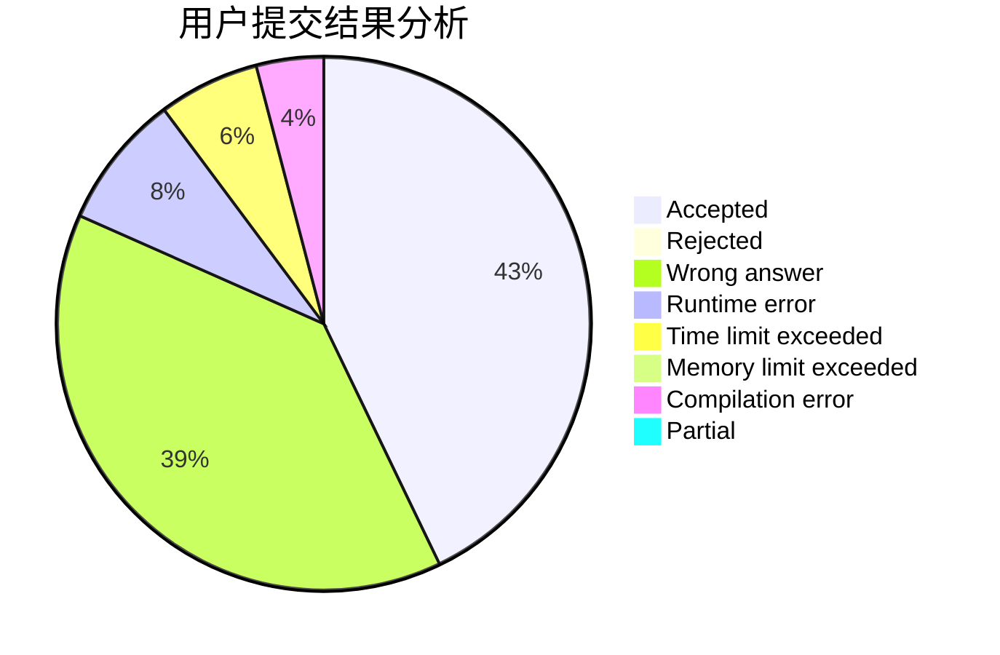
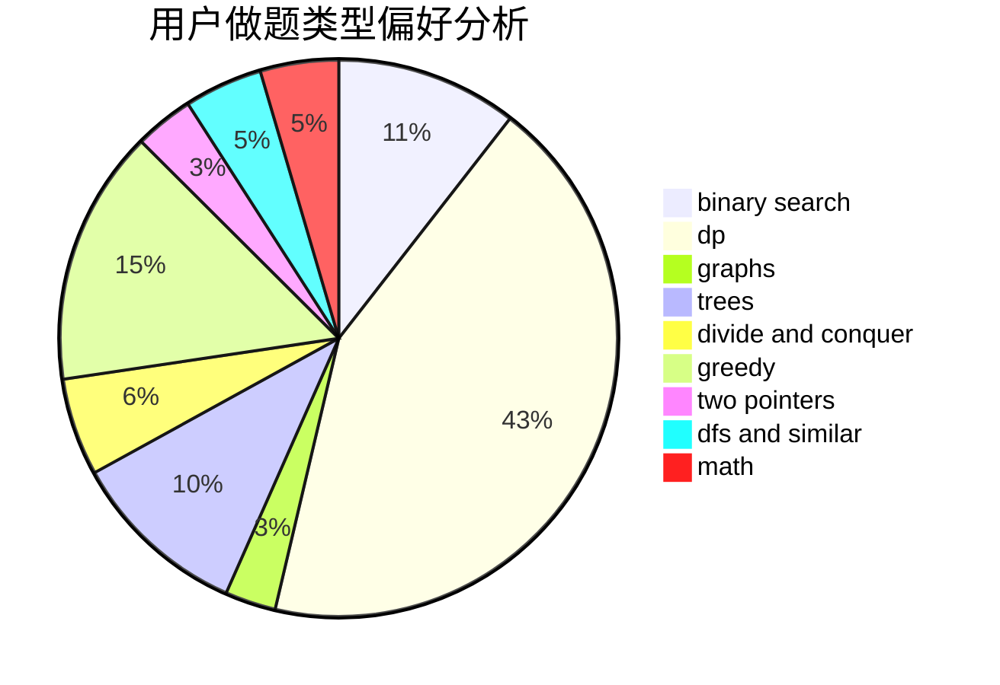

# Wu_Yuanhun

<!-- tabs:start -->

#### **用户提交结果分析**

#### **用户做题类型偏好分析**

<!-- tabs:end -->
# 推荐题目
[792C](https://codeforces.com/contest/792/problem/C)
[283C](https://codeforces.com/contest/283/problem/C)
[56A](https://codeforces.com/contest/56/problem/A)
[1424M](https://codeforces.com/contest/1424/problem/M)
[1420E](https://codeforces.com/contest/1420/problem/E)
[174B](https://codeforces.com/contest/174/problem/B)
[444D](https://codeforces.com/contest/444/problem/D)
[778D](https://codeforces.com/contest/778/problem/D)
[271D](https://codeforces.com/contest/271/problem/D)
[778C](https://codeforces.com/contest/778/problem/C)
