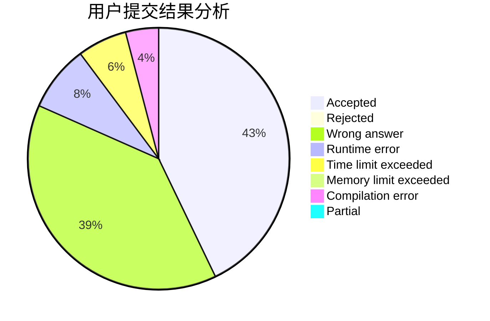
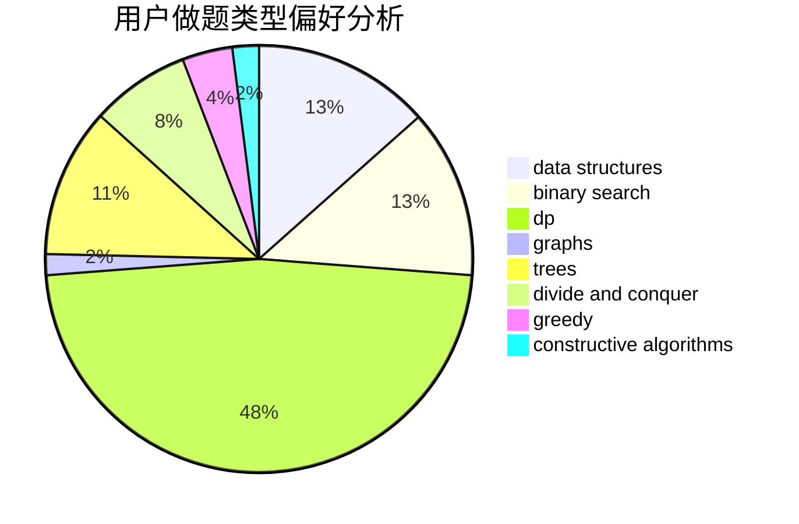
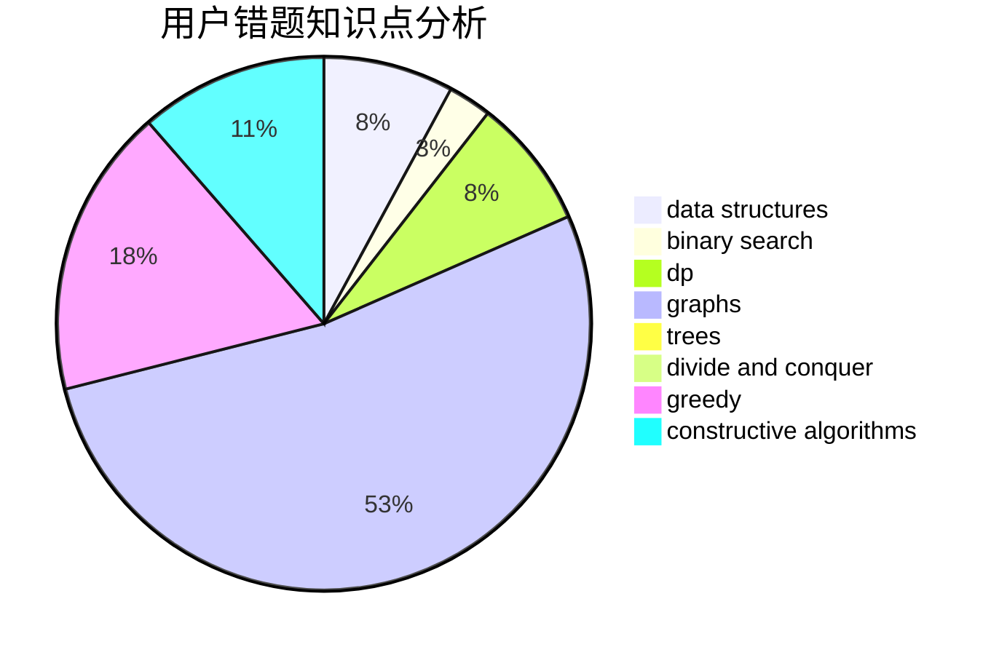

# Wu_Yuanhun

<!-- tabs:start -->

#### **用户提交结果分析**

#### **用户做题类型偏好分析**

#### **用户错题知识点分析**

<!-- tabs:end -->
# 推荐题目
[792C](https://codeforces.com/contest/792/problem/C)		dp,
                        greedy,
                        math,
                        number theory		  
[283C](https://codeforces.com/contest/283/problem/C)		dp		  
[56A](https://codeforces.com/contest/56/problem/A)		implementation		  
[1424M](https://codeforces.com/contest/1424/problem/M)		graphs,
                        sortings		  
[1420E](https://codeforces.com/contest/1420/problem/E)		dp,
                        greedy		  
[174B](https://codeforces.com/contest/174/problem/B)		dp,
                        greedy,
                        implementation		  
[444D](https://codeforces.com/contest/444/problem/D)		binary search,
                        hashing,
                        strings,
                        two pointers		  
[778D](https://codeforces.com/contest/778/problem/D)		constructive algorithms		  
[271D](https://codeforces.com/contest/271/problem/D)		data structures,
                        strings		  
[778C](https://codeforces.com/contest/778/problem/C)		brute force,
                        dfs and similar,
                        dsu,
                        hashing,
                        strings,
                        trees		  
