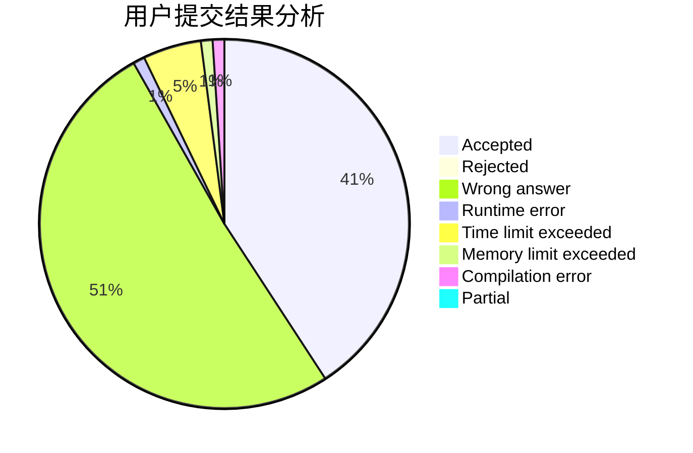
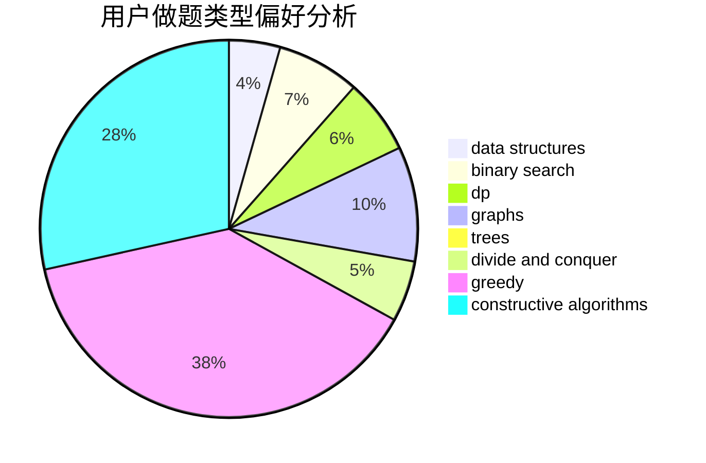

# WyyOIER

<!-- tabs:start -->

#### **用户提交结果分析**

#### **用户做题类型偏好分析**

#### **用户错题知识点分析**

<!-- tabs:end -->
# 推荐题目
[1475F](https://codeforces.com/contest/1475/problem/F)		2-sat,
                        brute force,
                        constructive algorithms		  
[1487F](https://codeforces.com/contest/1487/problem/F)		dp,
                        greedy,
                        shortest paths		  
[1471C](https://codeforces.com/contest/1471/problem/C)		dsu,graphs,sortings,trees		  
[438B](https://codeforces.com/contest/438/problem/B)		dsu,graphs,sortings,trees		  
[1015E2](https://codeforces.com/contest/1015E/problem/2)		binary search,
                        dp,
                        greedy		  
[677A](https://codeforces.com/contest/677/problem/A)		implementation		  
[2A](https://codeforces.com/contest/2/problem/A)		hashing,
                        implementation		  
[58E](https://codeforces.com/contest/58/problem/E)		dp		  
[963C](https://codeforces.com/contest/963/problem/C)		brute force,
                        math,
                        number theory		  
[15A](https://codeforces.com/contest/15/problem/A)		implementation,
                        sortings		  
