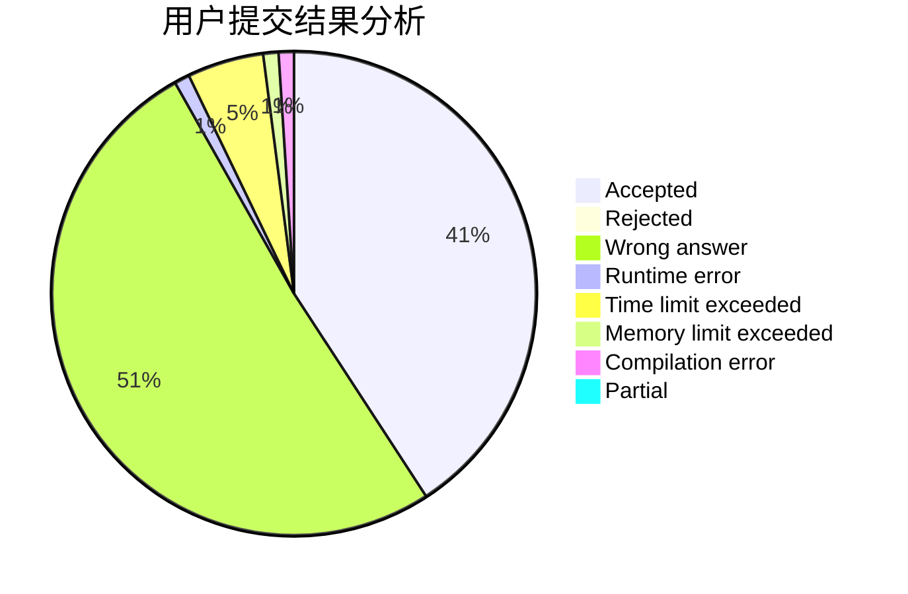
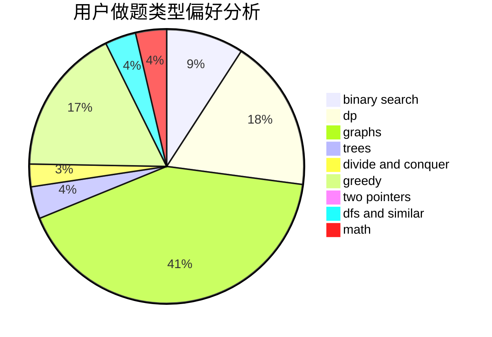

# WyyOIER

<!-- tabs:start -->

#### **用户提交结果分析**

#### **用户做题类型偏好分析**

<!-- tabs:end -->
# 推荐题目
[1484C](https://codeforces.com/contest/1484/problem/C)
[1495C](https://codeforces.com/contest/1495/problem/C)
[1479E](https://codeforces.com/contest/1479/problem/E)
[45G](https://codeforces.com/contest/45/problem/G)
[1016B](https://codeforces.com/contest/1016/problem/B)
[701A](https://codeforces.com/contest/701/problem/A)
[317E](https://codeforces.com/contest/317/problem/E)
[609E](https://codeforces.com/contest/609/problem/E)
[986A](https://codeforces.com/contest/986/problem/A)
[181B](https://codeforces.com/contest/181/problem/B)
