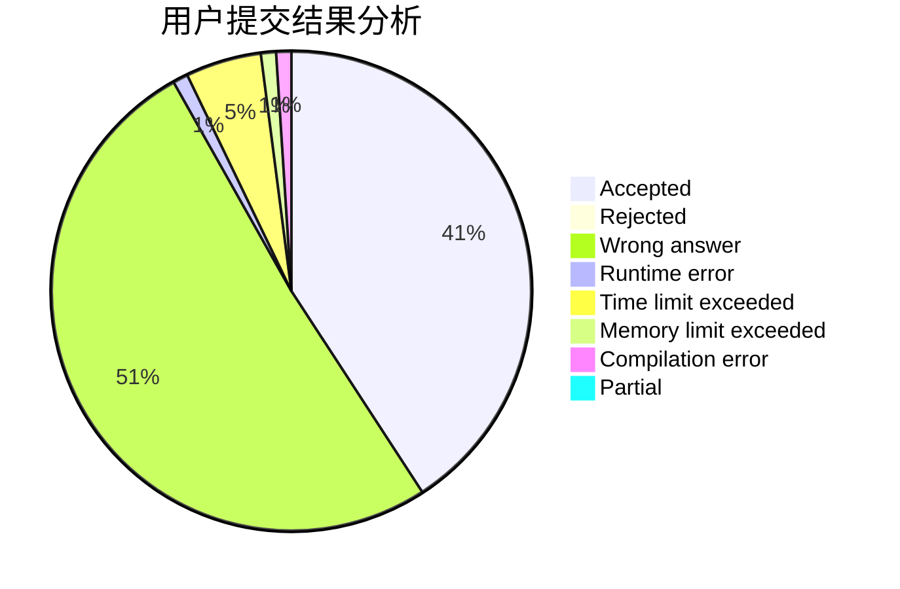
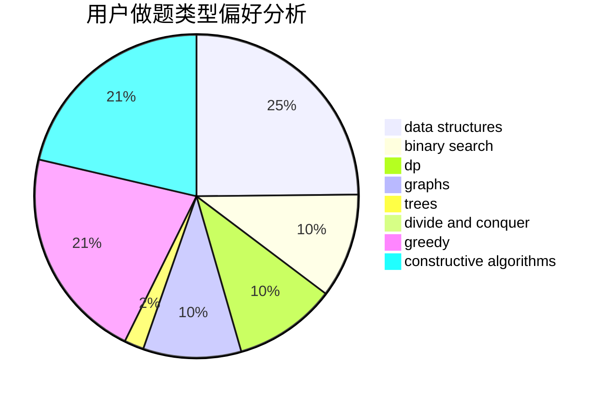

# WyyOIER

<!-- tabs:start -->

#### **用户提交结果分析**

#### **用户做题类型偏好分析**

#### **用户错题知识点分析**

<!-- tabs:end -->
# 推荐题目
[1484C](https://codeforces.com/contest/1484/problem/C)		dsu,graphs,sortings,trees		  
[1495C](https://codeforces.com/contest/1495/problem/C)		constructive algorithms,
                        graphs		  
[1479E](https://codeforces.com/contest/1479/problem/E)		dp,
                        fft,
                        math,
                        number theory,
                        probabilities		  
[45G](https://codeforces.com/contest/45/problem/G)		number theory		  
[1016B](https://codeforces.com/contest/1016/problem/B)		brute force,
                        implementation		  
[701A](https://codeforces.com/contest/701/problem/A)		greedy,
                        implementation		  
[317E](https://codeforces.com/contest/317/problem/E)		constructive algorithms,
                        shortest paths		  
[609E](https://codeforces.com/contest/609/problem/E)		data structures,
                        dfs and similar,
                        dsu,
                        graphs,
                        trees		  
[986A](https://codeforces.com/contest/986/problem/A)		graphs,
                        greedy,
                        number theory,
                        shortest paths		  
[181B](https://codeforces.com/contest/181/problem/B)		binary search,
                        brute force		  
