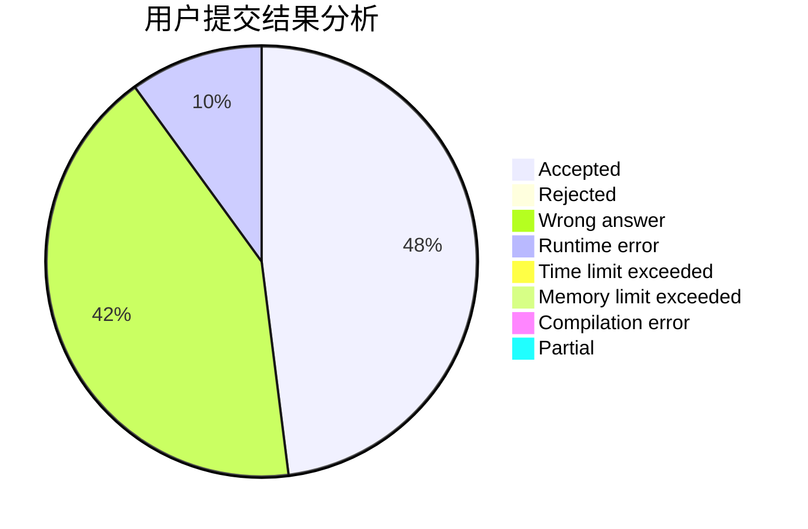
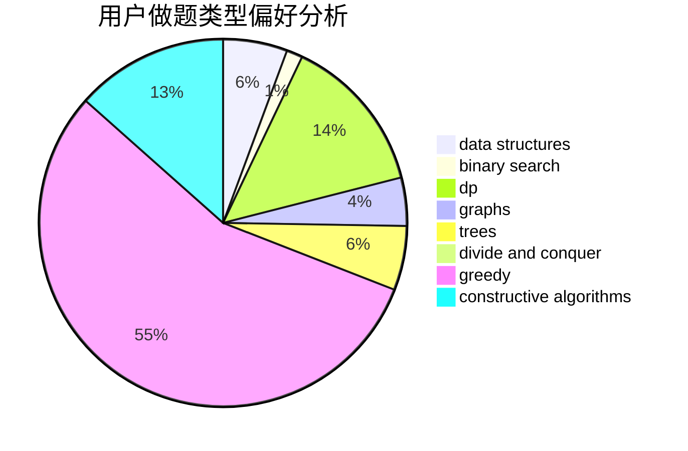
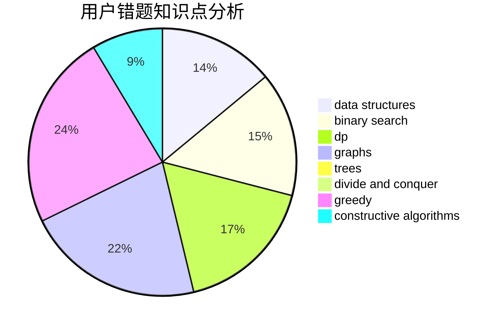

# XEZELOH

<!-- tabs:start -->

#### **用户提交结果分析**

#### **用户做题类型偏好分析**

#### **用户错题知识点分析**

<!-- tabs:end -->
# 推荐题目
[907C](https://codeforces.com/contest/907/problem/C)		dsu,graphs,sortings,trees		  
[40E](https://codeforces.com/contest/40/problem/E)		combinatorics		  
[1272E](https://codeforces.com/contest/1272/problem/E)		dfs and similar,
                        graphs,
                        shortest paths		  
[1368A](https://codeforces.com/contest/1368/problem/A)		brute force,
                        greedy,
                        implementation,
                        math		  
[1030C](https://codeforces.com/contest/1030/problem/C)		implementation		  
[704E](https://codeforces.com/contest/704/problem/E)		data structures,
                        geometry,
                        trees		  
[1197B](https://codeforces.com/contest/1197/problem/B)		greedy,
                        implementation		  
[850D](https://codeforces.com/contest/850/problem/D)		constructive algorithms,
                        dp,
                        graphs,
                        greedy,
                        math		  
[504A](https://codeforces.com/contest/504/problem/A)		dsu,graphs,sortings,trees		  
[893C](https://codeforces.com/contest/893/problem/C)		dfs and similar,
                        graphs,
                        greedy		  
