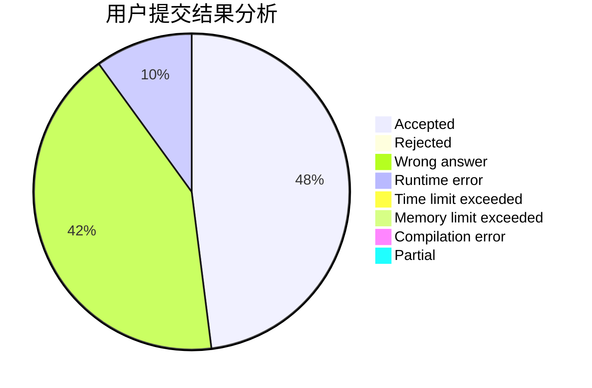
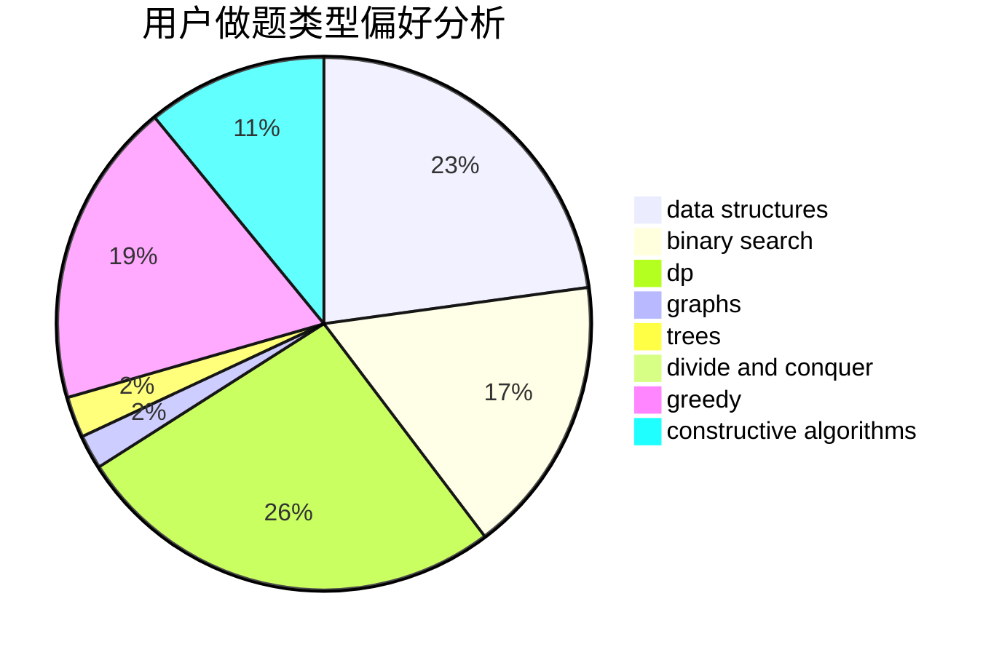
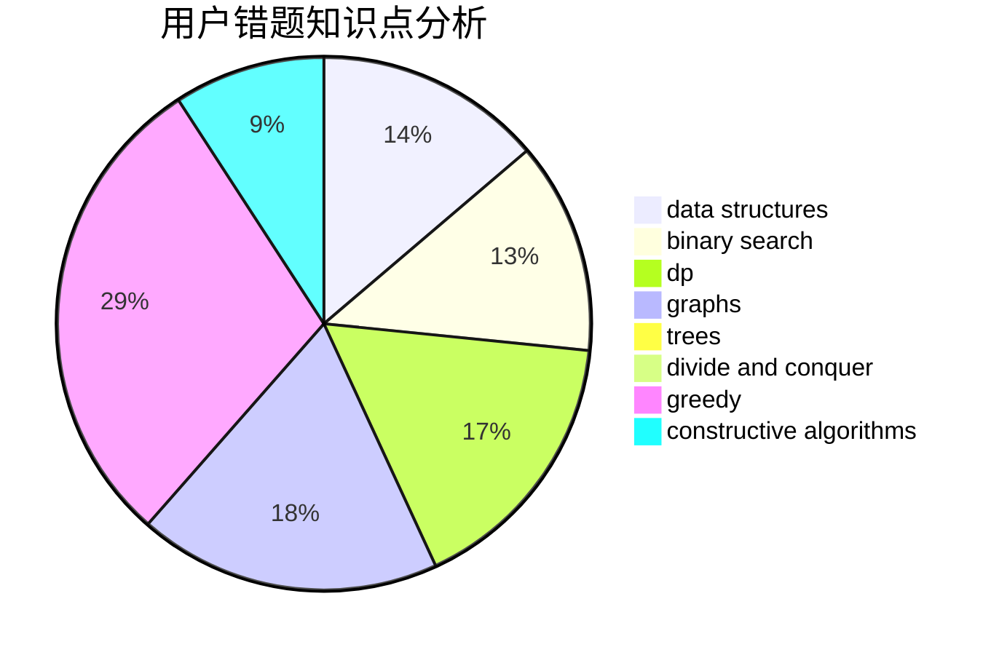

# XEZELOH

<!-- tabs:start -->

#### **用户提交结果分析**

#### **用户做题类型偏好分析**

#### **用户错题知识点分析**

<!-- tabs:end -->
# 推荐题目
[888A](https://codeforces.com/contest/888/problem/A)		brute force,
                        implementation		  
[380B](https://codeforces.com/contest/380/problem/B)		graphs,
                        implementation		  
[1267B](https://codeforces.com/contest/1267/problem/B)		nan		  
[1360B](https://codeforces.com/contest/1360/problem/B)		greedy,
                        sortings		  
[102B](https://codeforces.com/contest/102/problem/B)		implementation		  
[681A](https://codeforces.com/contest/681/problem/A)		implementation		  
[1191C](https://codeforces.com/contest/1191/problem/C)		dsu,graphs,sortings,trees		  
[832B](https://codeforces.com/contest/832/problem/B)		implementation,
                        strings		  
[483B](https://codeforces.com/contest/483/problem/B)		binary search,
                        math		  
[872A](https://codeforces.com/contest/872/problem/A)		dsu,graphs,sortings,trees		  
