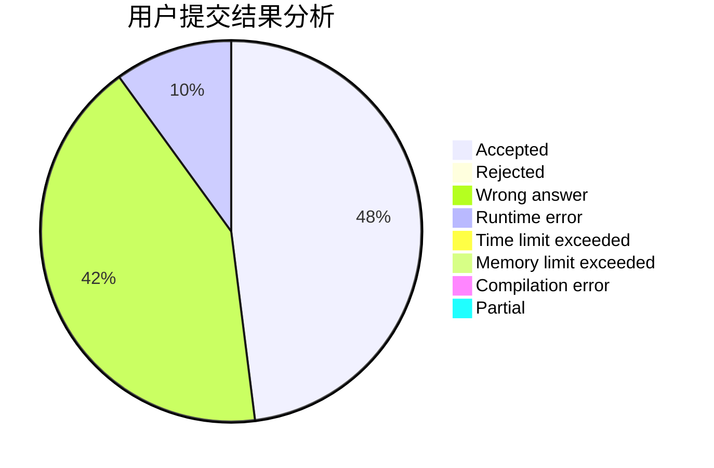
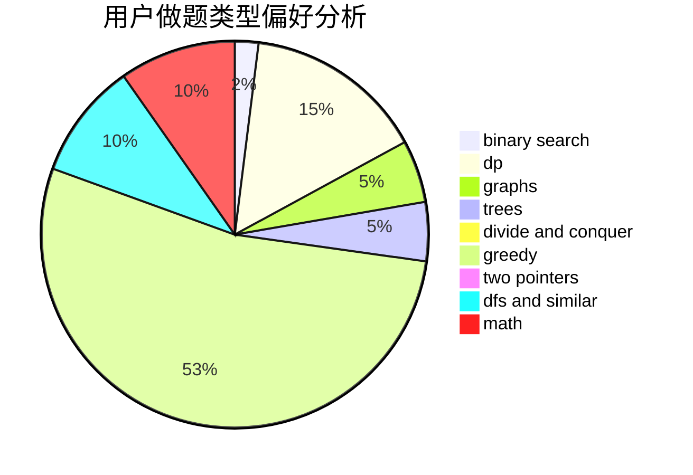

# XEZELOH

<!-- tabs:start -->

#### **用户提交结果分析**

#### **用户做题类型偏好分析**

<!-- tabs:end -->
# 推荐题目
[907C](https://codeforces.com/contest/907/problem/C)
[40E](https://codeforces.com/contest/40/problem/E)
[1272E](https://codeforces.com/contest/1272/problem/E)
[1368A](https://codeforces.com/contest/1368/problem/A)
[1030C](https://codeforces.com/contest/1030/problem/C)
[704E](https://codeforces.com/contest/704/problem/E)
[1197B](https://codeforces.com/contest/1197/problem/B)
[850D](https://codeforces.com/contest/850/problem/D)
[504A](https://codeforces.com/contest/504/problem/A)
[893C](https://codeforces.com/contest/893/problem/C)
