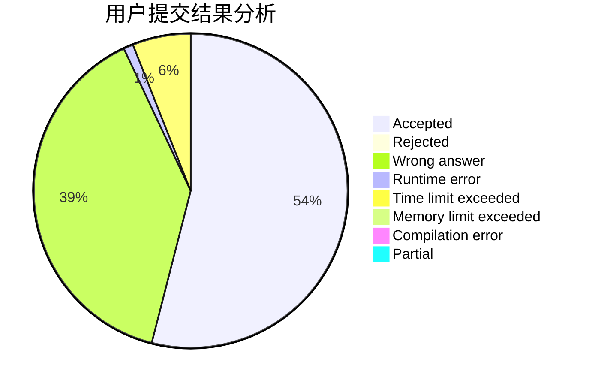
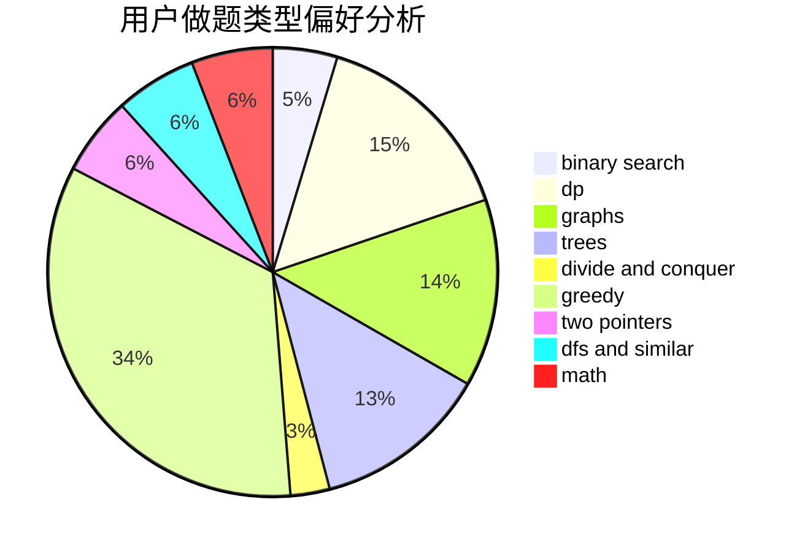

# Akiyama_Mio

<!-- tabs:start -->

#### **用户提交结果分析**

#### **用户做题类型偏好分析**

<!-- tabs:end -->
# 推荐题目
[1420A](https://codeforces.com/contest/1420/problem/A)
[1270D](https://codeforces.com/contest/1270/problem/D)
[1324E](https://codeforces.com/contest/1324/problem/E)
[25A](https://codeforces.com/contest/25/problem/A)
[1037C](https://codeforces.com/contest/1037/problem/C)
[25D](https://codeforces.com/contest/25/problem/D)
[258D](https://codeforces.com/contest/258/problem/D)
[208A](https://codeforces.com/contest/208/problem/A)
[260D](https://codeforces.com/contest/260/problem/D)
[258B](https://codeforces.com/contest/258/problem/B)
