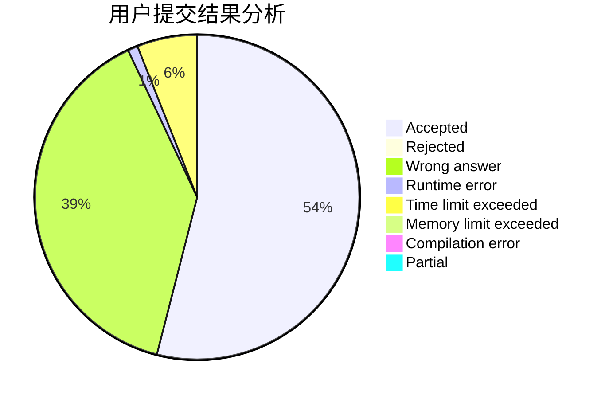
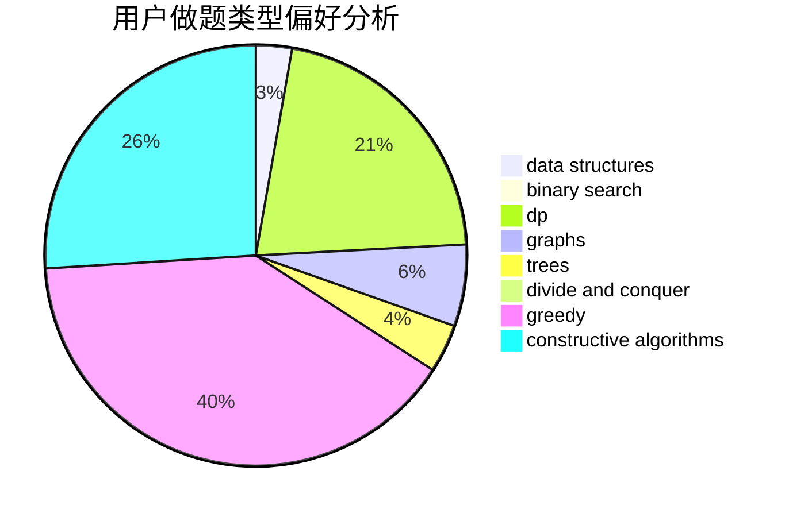
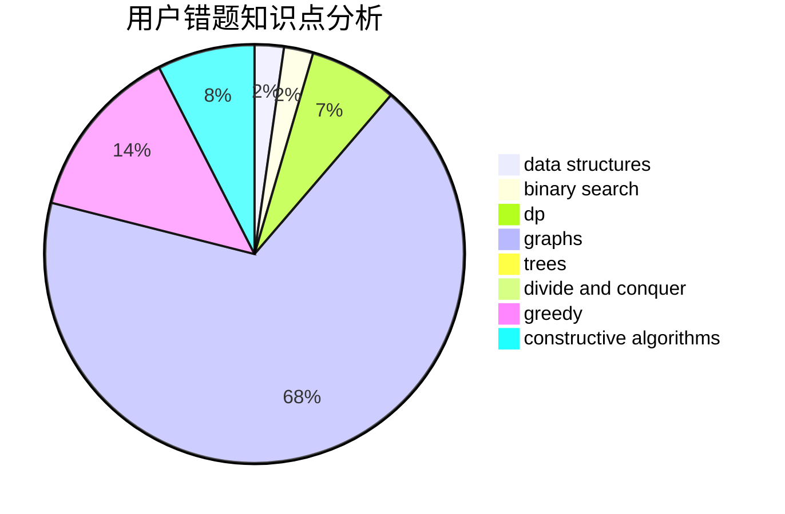

# Akiyama_Mio

<!-- tabs:start -->

#### **用户提交结果分析**

#### **用户做题类型偏好分析**

#### **用户错题知识点分析**

<!-- tabs:end -->
# 推荐题目
[1409F](https://codeforces.com/contest/1409/problem/F)		dp,
                        strings		  
[1264E](https://codeforces.com/contest/1264/problem/E)		constructive algorithms,
                        flows,
                        graph matchings		  
[1314F](https://codeforces.com/contest/1314/problem/F)		dsu,graphs,sortings,trees		  
[236D](https://codeforces.com/contest/236/problem/D)		dsu,graphs,sortings,trees		  
[1036F](https://codeforces.com/contest/1036/problem/F)		combinatorics,
                        math,
                        number theory		  
[238A](https://codeforces.com/contest/238/problem/A)		constructive algorithms,
                        math		  
[235E](https://codeforces.com/contest/235/problem/E)		combinatorics,
                        dp,
                        implementation,
                        math,
                        number theory		  
[180D](https://codeforces.com/contest/180/problem/D)		greedy,
                        strings		  
[23B](https://codeforces.com/contest/23/problem/B)		constructive algorithms,
                        graphs,
                        math		  
[235C](https://codeforces.com/contest/235/problem/C)		data structures,
                        string suffix structures,
                        strings		  
