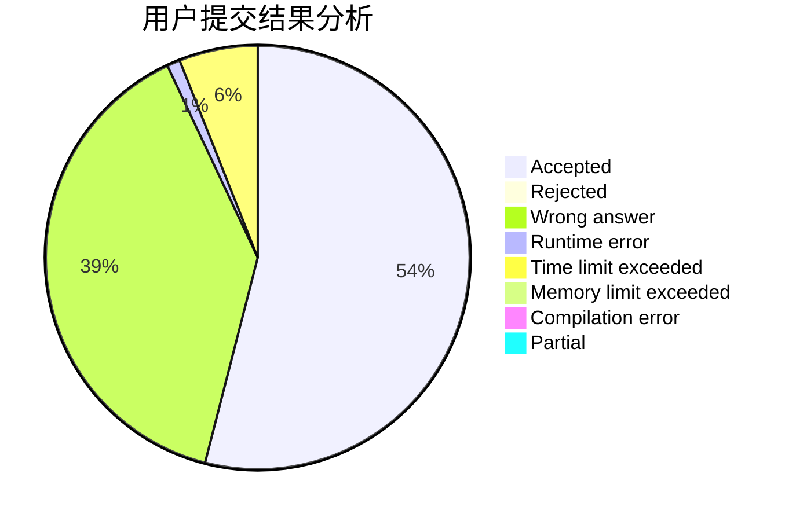
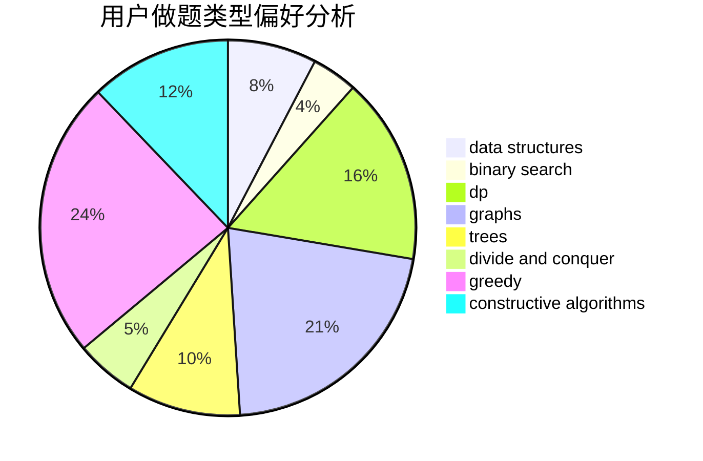
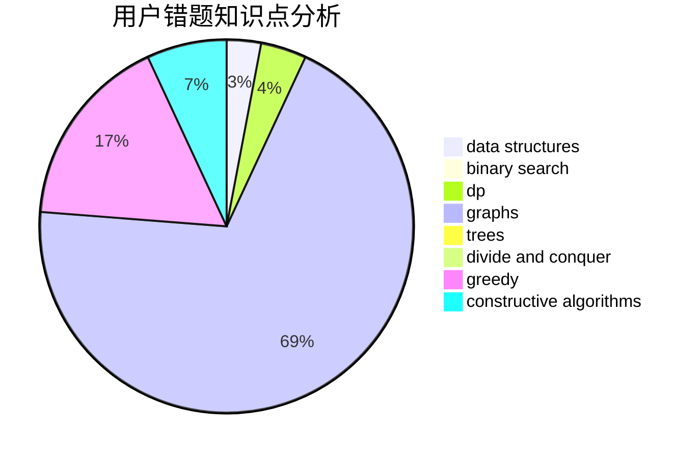

# Akiyama_Mio

<!-- tabs:start -->

#### **用户提交结果分析**

#### **用户做题类型偏好分析**

#### **用户错题知识点分析**

<!-- tabs:end -->
# 推荐题目
[1420A](https://codeforces.com/contest/1420/problem/A)		math,
                        sortings		  
[1270D](https://codeforces.com/contest/1270/problem/D)		constructive algorithms,
                        interactive,
                        math,
                        sortings		  
[1324E](https://codeforces.com/contest/1324/problem/E)		dp,
                        implementation		  
[25A](https://codeforces.com/contest/25/problem/A)		brute force		  
[1037C](https://codeforces.com/contest/1037/problem/C)		dp,
                        greedy,
                        strings		  
[25D](https://codeforces.com/contest/25/problem/D)		dsu,
                        graphs,
                        trees		  
[258D](https://codeforces.com/contest/258/problem/D)		dp,
                        math,
                        probabilities		  
[208A](https://codeforces.com/contest/208/problem/A)		strings		  
[260D](https://codeforces.com/contest/260/problem/D)		constructive algorithms,
                        dsu,
                        graphs,
                        greedy,
                        trees		  
[258B](https://codeforces.com/contest/258/problem/B)		brute force,
                        combinatorics,
                        dp		  
