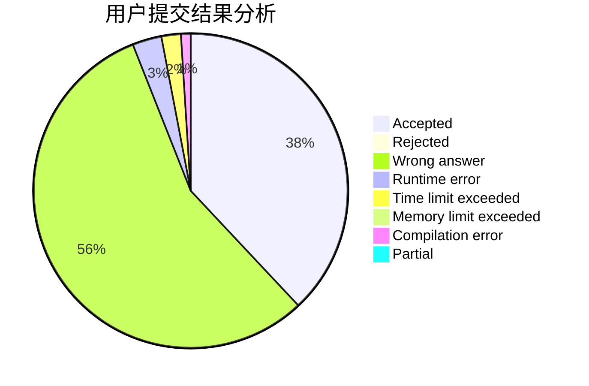
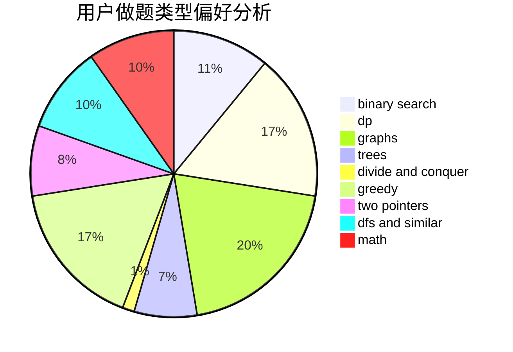

# XIRHXQ

<!-- tabs:start -->

#### **用户提交结果分析**

#### **用户做题类型偏好分析**

<!-- tabs:end -->
# 推荐题目
[1404E](https://codeforces.com/contest/1404/problem/E)
[1004C](https://codeforces.com/contest/1004/problem/C)
[9581](https://codeforces.com/contest/958/problem/1)
[246D](https://codeforces.com/contest/246/problem/D)
[851D](https://codeforces.com/contest/851/problem/D)
[1385G](https://codeforces.com/contest/1385/problem/G)
[1431G](https://codeforces.com/contest/1431/problem/G)
[1423K](https://codeforces.com/contest/1423/problem/K)
[934E](https://codeforces.com/contest/934/problem/E)
[524E](https://codeforces.com/contest/524/problem/E)
