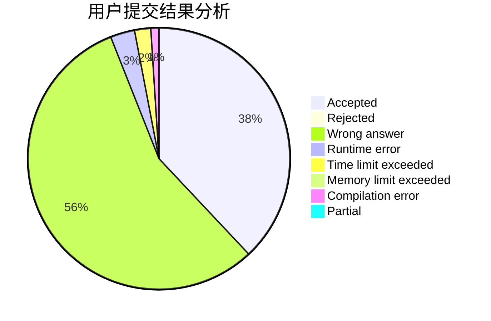
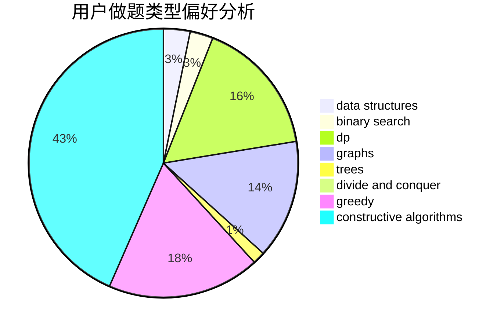
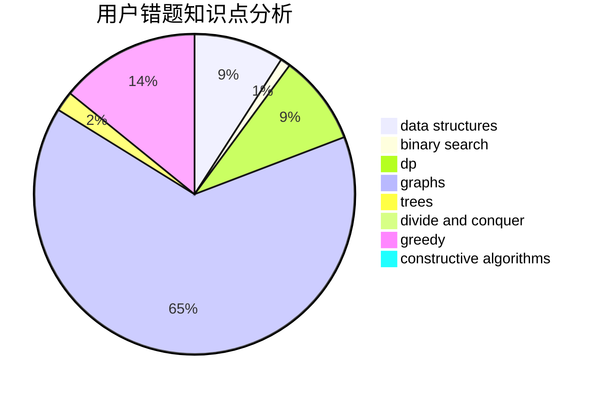

# XIRHXQ

<!-- tabs:start -->

#### **用户提交结果分析**

#### **用户做题类型偏好分析**

#### **用户错题知识点分析**

<!-- tabs:end -->
# 推荐题目
[1396A](https://codeforces.com/contest/1396/problem/A)		constructive algorithms,
                        greedy,
                        number theory		  
[1003F](https://codeforces.com/contest/1003/problem/F)		dp,
                        hashing,
                        strings		  
[936A](https://codeforces.com/contest/936/problem/A)		binary search,
                        implementation,
                        math		  
[228D](https://codeforces.com/contest/228/problem/D)		data structures		  
[833D](https://codeforces.com/contest/833/problem/D)		data structures,
                        divide and conquer,
                        implementation,
                        trees		  
[1376B3](https://codeforces.com/contest/1376B/problem/3)		dsu,graphs,sortings,trees		  
[1423J](https://codeforces.com/contest/1423/problem/J)		bitmasks,
                        constructive algorithms,
                        dp,
                        math		  
[1416A](https://codeforces.com/contest/1416/problem/A)		binary search,
                        data structures,
                        implementation,
                        two pointers		  
[915A](https://codeforces.com/contest/915/problem/A)		implementation		  
[504A](https://codeforces.com/contest/504/problem/A)		dsu,graphs,sortings,trees		  
