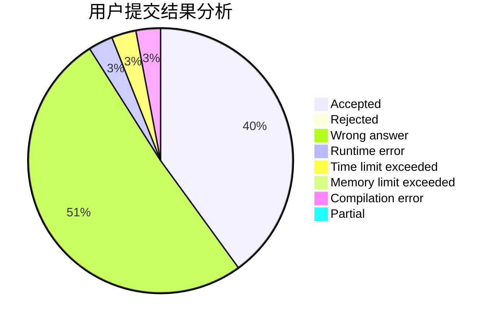
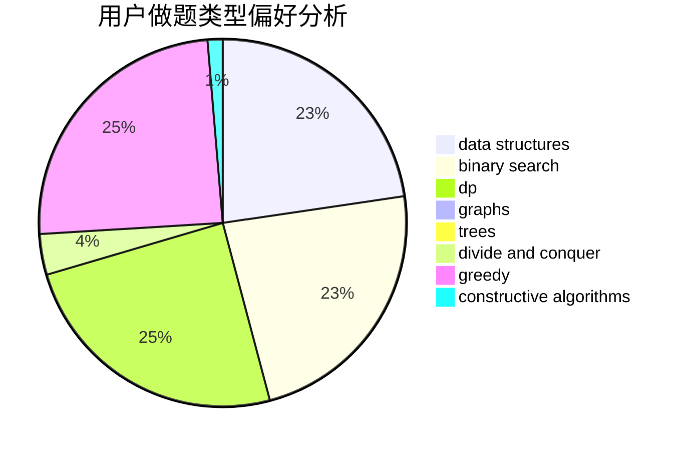
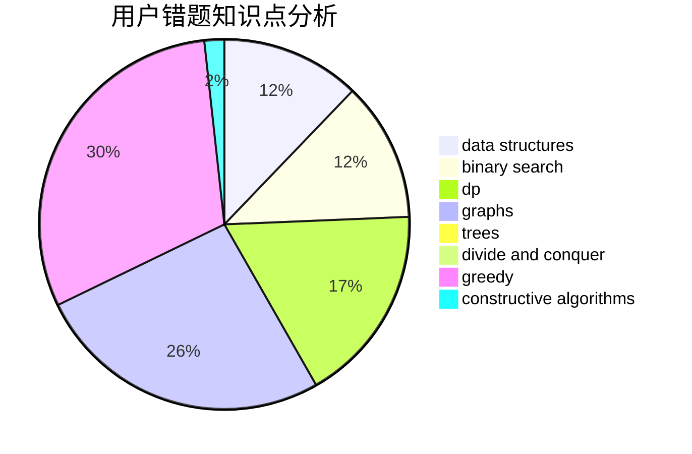

# XLor

<!-- tabs:start -->

#### **用户提交结果分析**

#### **用户做题类型偏好分析**

#### **用户错题知识点分析**

<!-- tabs:end -->
# 推荐题目
[1288B](https://codeforces.com/contest/1288/problem/B)		math		  
[1079C](https://codeforces.com/contest/1079/problem/C)		dsu,graphs,sortings,trees		  
[22B](https://codeforces.com/contest/22/problem/B)		brute force,
                        dp		  
[1288D](https://codeforces.com/contest/1288/problem/D)		binary search,
                        bitmasks,
                        dp		  
[645F](https://codeforces.com/contest/645/problem/F)		combinatorics,
                        math,
                        number theory		  
[1164Q](https://codeforces.com/contest/1164/problem/Q)		dsu,graphs,sortings,trees		  
[1142E](https://codeforces.com/contest/1142/problem/E)		graphs,
                        interactive		  
[1037F](https://codeforces.com/contest/1037/problem/F)		combinatorics,
                        data structures,
                        math		  
[1400C](https://codeforces.com/contest/1400/problem/C)		2-sat,
                        brute force,
                        constructive algorithms,
                        greedy		  
[808D](https://codeforces.com/contest/808/problem/D)		binary search,
                        data structures,
                        implementation		  
