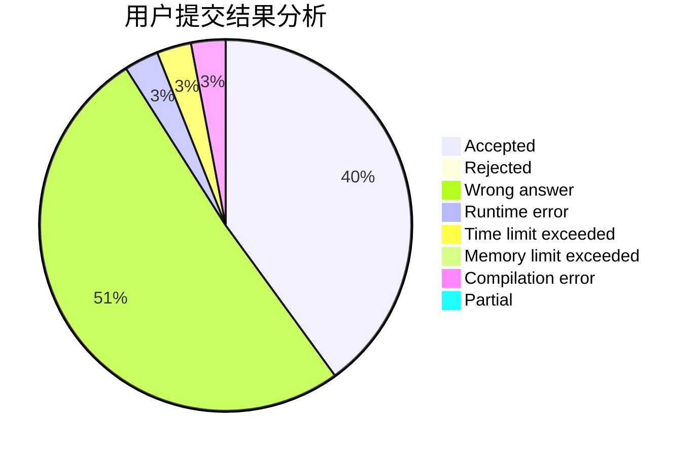
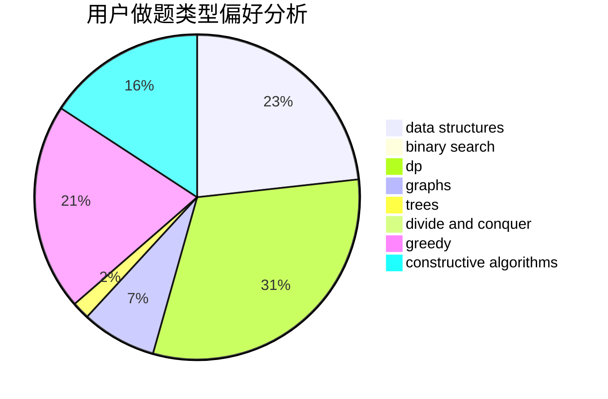
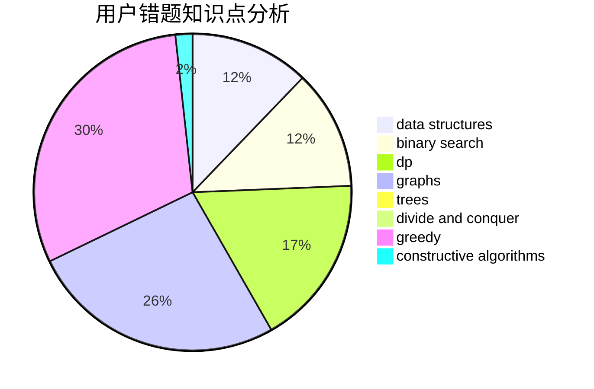

# XLor

<!-- tabs:start -->

#### **用户提交结果分析**

#### **用户做题类型偏好分析**

#### **用户错题知识点分析**

<!-- tabs:end -->
# 推荐题目
[1295D](https://codeforces.com/contest/1295/problem/D)		math,
                        number theory		  
[107B](https://codeforces.com/contest/107/problem/B)		combinatorics,
                        dp,
                        math,
                        probabilities		  
[24E](https://codeforces.com/contest/24/problem/E)		binary search		  
[1295F](https://codeforces.com/contest/1295/problem/F)		combinatorics,
                        dp,
                        probabilities		  
[672B](https://codeforces.com/contest/672/problem/B)		constructive algorithms,
                        implementation,
                        strings		  
[1167A](https://codeforces.com/contest/1167/problem/A)		brute force,
                        greedy,
                        strings		  
[1144G](https://codeforces.com/contest/1144/problem/G)		dp,
                        greedy		  
[1038A](https://codeforces.com/contest/1038/problem/A)		implementation,
                        strings		  
[140B](https://codeforces.com/contest/140/problem/B)		brute force,
                        greedy,
                        implementation		  
[825C](https://codeforces.com/contest/825/problem/C)		greedy,
                        implementation		  
