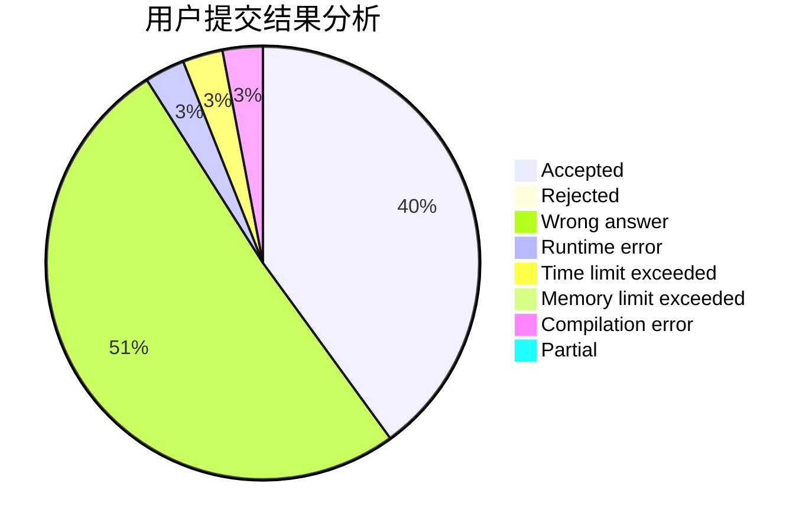
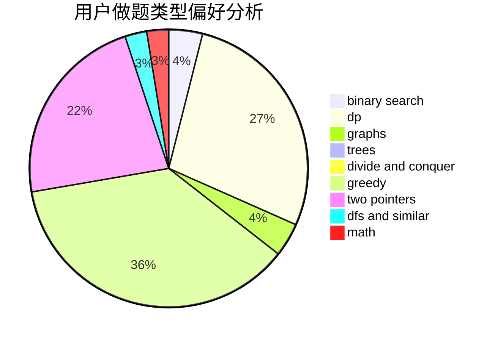

# XLor

<!-- tabs:start -->

#### **用户提交结果分析**

#### **用户做题类型偏好分析**

<!-- tabs:end -->
# 推荐题目
[1295D](https://codeforces.com/contest/1295/problem/D)
[107B](https://codeforces.com/contest/107/problem/B)
[24E](https://codeforces.com/contest/24/problem/E)
[1295F](https://codeforces.com/contest/1295/problem/F)
[672B](https://codeforces.com/contest/672/problem/B)
[1167A](https://codeforces.com/contest/1167/problem/A)
[1144G](https://codeforces.com/contest/1144/problem/G)
[1038A](https://codeforces.com/contest/1038/problem/A)
[140B](https://codeforces.com/contest/140/problem/B)
[825C](https://codeforces.com/contest/825/problem/C)
