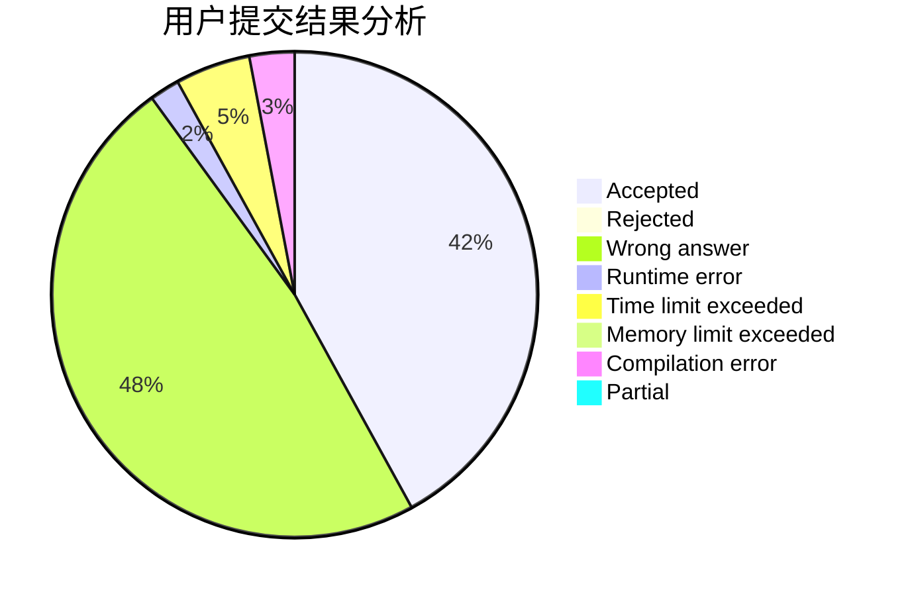
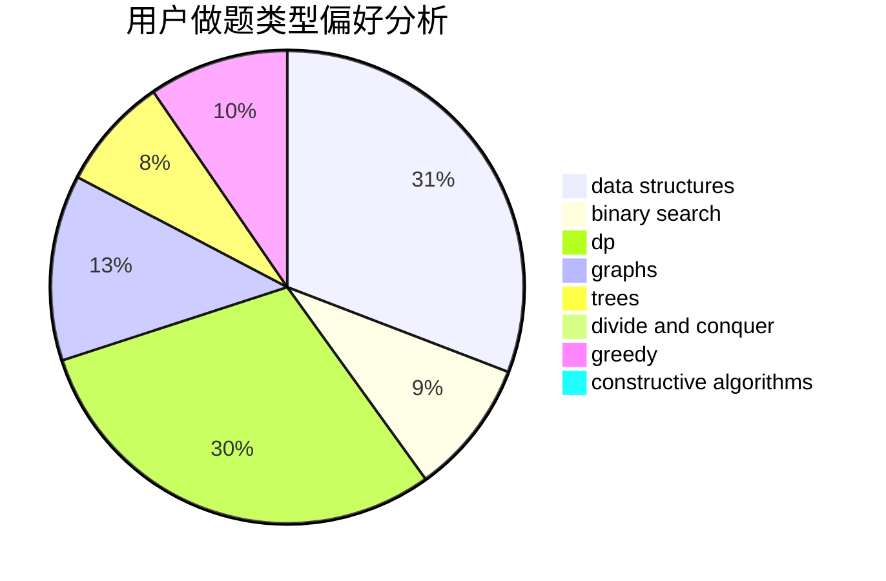
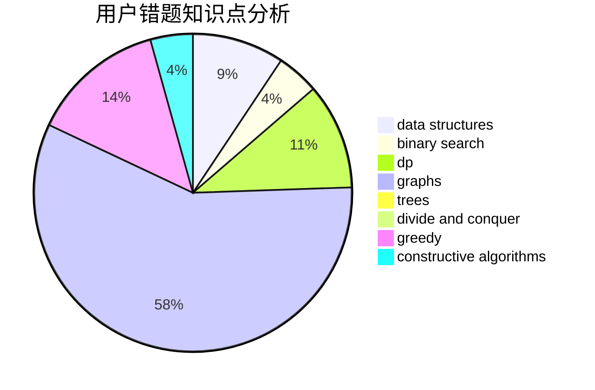

# Xcanf

<!-- tabs:start -->

#### **用户提交结果分析**

#### **用户做题类型偏好分析**

#### **用户错题知识点分析**

<!-- tabs:end -->
# 推荐题目
[1500C](https://codeforces.com/contest/1500/problem/C)		bitmasks,
                        brute force,
                        constructive algorithms,
                        greedy,
                        two pointers		  
[963C](https://codeforces.com/contest/963/problem/C)		brute force,
                        math,
                        number theory		  
[1016D](https://codeforces.com/contest/1016/problem/D)		constructive algorithms,
                        flows,
                        math		  
[838F](https://codeforces.com/contest/838/problem/F)		nan		  
[1009E](https://codeforces.com/contest/1009/problem/E)		combinatorics,
                        math,
                        probabilities		  
[922B](https://codeforces.com/contest/922/problem/B)		brute force		  
[30A](https://codeforces.com/contest/30/problem/A)		brute force,
                        math		  
[1093G](https://codeforces.com/contest/1093/problem/G)		bitmasks,
                        data structures		  
[1146D](https://codeforces.com/contest/1146/problem/D)		dfs and similar,
                        math,
                        number theory		  
[582B](https://codeforces.com/contest/582/problem/B)		constructive algorithms,
                        dp,
                        matrices		  
