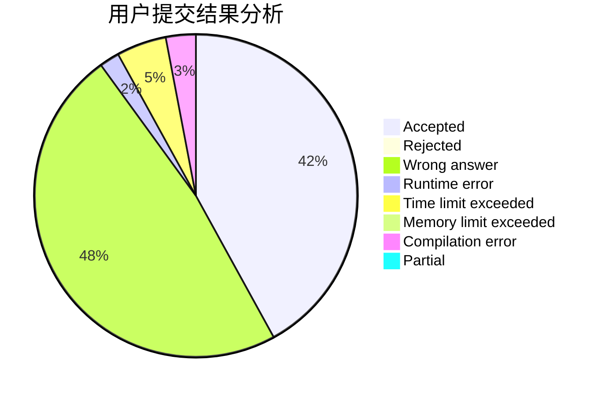
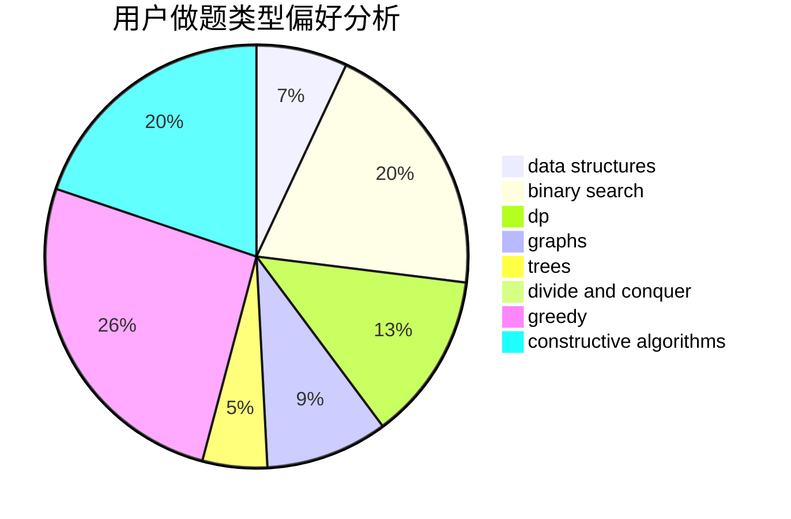
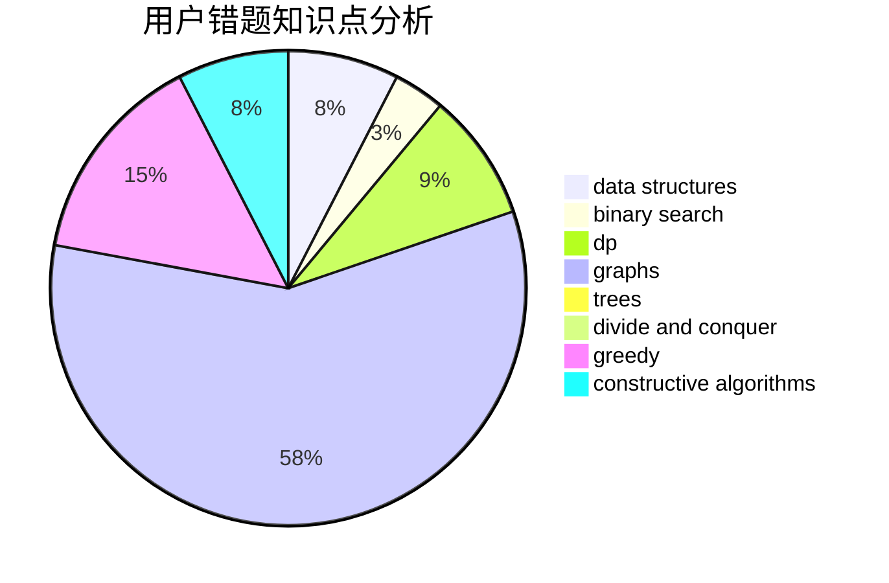

# Xcanf

<!-- tabs:start -->

#### **用户提交结果分析**

#### **用户做题类型偏好分析**

#### **用户错题知识点分析**

<!-- tabs:end -->
# 推荐题目
[1492B](https://codeforces.com/contest/1492/problem/B)		data structures,
                        greedy,
                        math		  
[946F](https://codeforces.com/contest/946/problem/F)		combinatorics,
                        dp,
                        matrices		  
[1016A](https://codeforces.com/contest/1016/problem/A)		greedy,
                        implementation,
                        math		  
[818G](https://codeforces.com/contest/818/problem/G)		flows,
                        graphs		  
[1009B](https://codeforces.com/contest/1009/problem/B)		greedy,
                        implementation		  
[908A](https://codeforces.com/contest/908/problem/A)		brute force,
                        implementation		  
[293C](https://codeforces.com/contest/293/problem/C)		brute force,
                        math,
                        number theory		  
[1093D](https://codeforces.com/contest/1093/problem/D)		dfs and similar,
                        graphs		  
[1144C](https://codeforces.com/contest/1144/problem/C)		constructive algorithms,
                        sortings		  
[559D](https://codeforces.com/contest/559/problem/D)		combinatorics,
                        geometry,
                        probabilities		  
