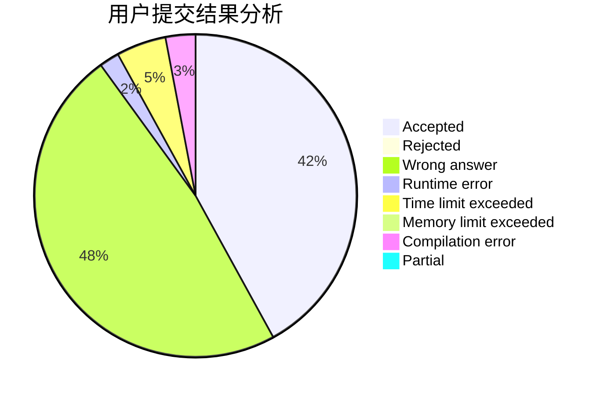
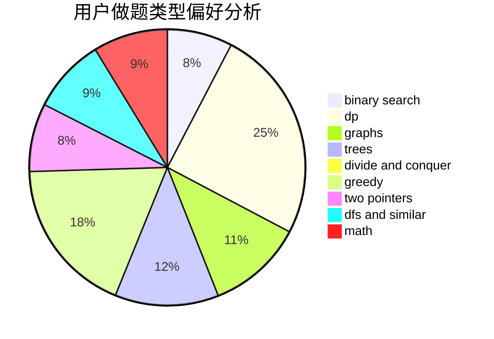

# Xcanf

<!-- tabs:start -->

#### **用户提交结果分析**

#### **用户做题类型偏好分析**

<!-- tabs:end -->
# 推荐题目
[1500C](https://codeforces.com/contest/1500/problem/C)
[963C](https://codeforces.com/contest/963/problem/C)
[1016D](https://codeforces.com/contest/1016/problem/D)
[838F](https://codeforces.com/contest/838/problem/F)
[1009E](https://codeforces.com/contest/1009/problem/E)
[922B](https://codeforces.com/contest/922/problem/B)
[30A](https://codeforces.com/contest/30/problem/A)
[1093G](https://codeforces.com/contest/1093/problem/G)
[1146D](https://codeforces.com/contest/1146/problem/D)
[582B](https://codeforces.com/contest/582/problem/B)
