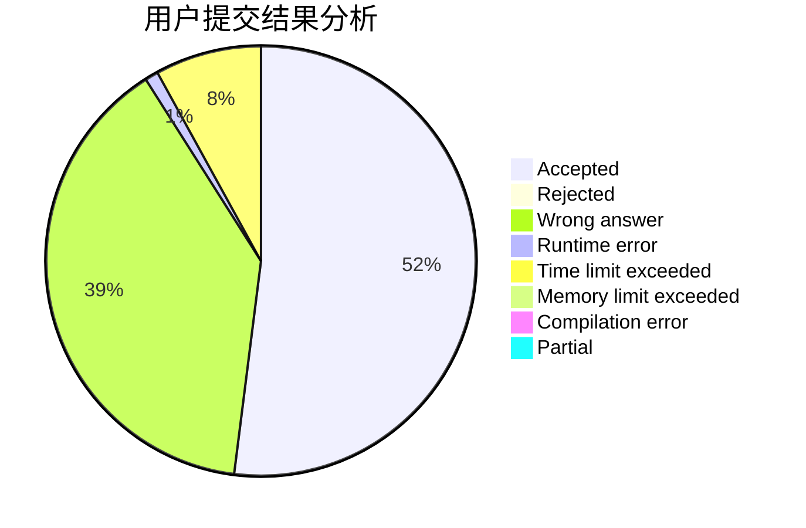
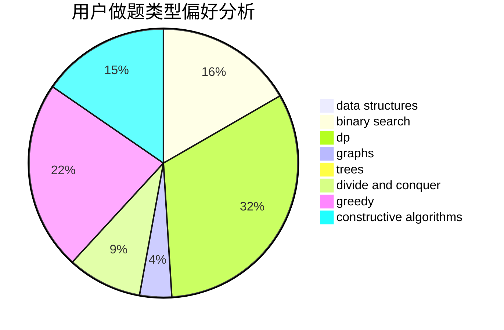
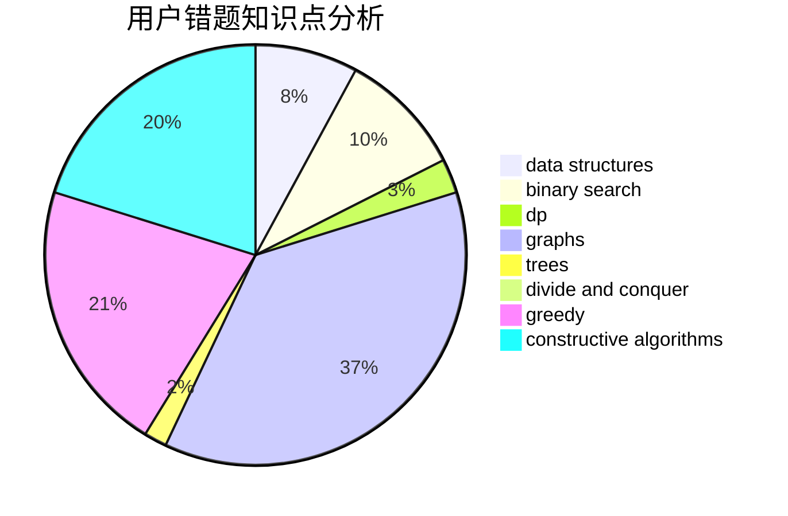

# Xhnxhn

<!-- tabs:start -->

#### **用户提交结果分析**

#### **用户做题类型偏好分析**

#### **用户错题知识点分析**

<!-- tabs:end -->
# 推荐题目
[982D](https://codeforces.com/contest/982/problem/D)		brute force,
                        data structures,
                        dsu,
                        trees		  
[55D](https://codeforces.com/contest/55/problem/D)		dp,
                        number theory		  
[1216D](https://codeforces.com/contest/1216/problem/D)		math		  
[1285E](https://codeforces.com/contest/1285/problem/E)		brute force,
                        constructive algorithms,
                        data structures,
                        dp,
                        graphs,
                        sortings,
                        trees,
                        two pointers		  
[1184C2](https://codeforces.com/contest/1184C/problem/2)		data structures		  
[622B](https://codeforces.com/contest/622/problem/B)		implementation		  
[567B](https://codeforces.com/contest/567/problem/B)		implementation		  
[925E](https://codeforces.com/contest/925/problem/E)		data structures,
                        trees		  
[409G](https://codeforces.com/contest/409/problem/G)		*special problem,
                        geometry		  
[674G](https://codeforces.com/contest/674/problem/G)		dsu,graphs,sortings,trees		  
