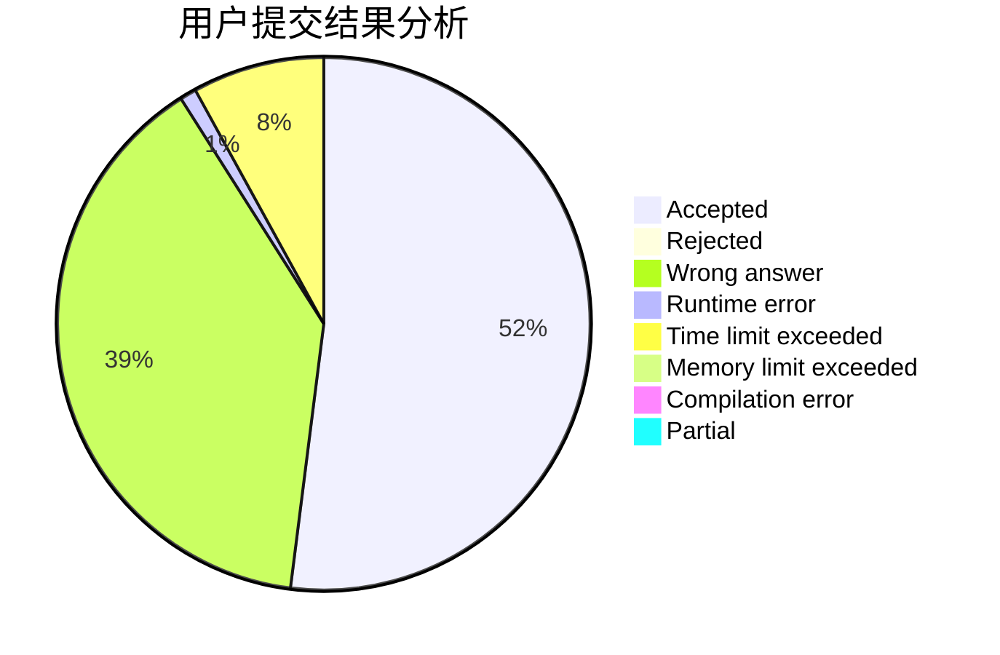
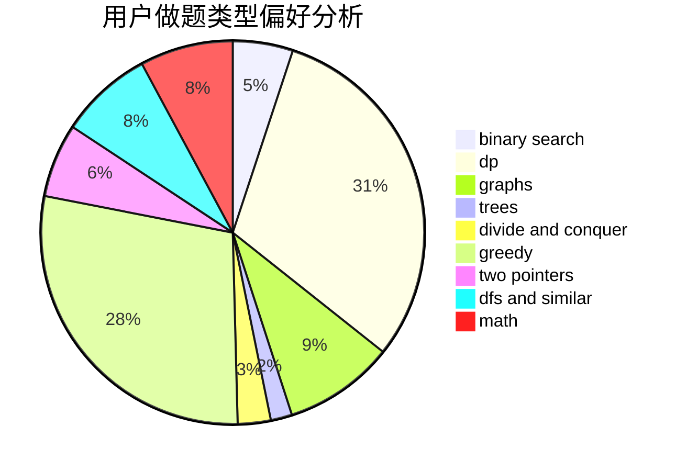

# Xhnxhn

<!-- tabs:start -->

#### **用户提交结果分析**

#### **用户做题类型偏好分析**

<!-- tabs:end -->
# 推荐题目
[998B](https://codeforces.com/contest/998/problem/B)
[584B](https://codeforces.com/contest/584/problem/B)
[1223A](https://codeforces.com/contest/1223/problem/A)
[1292F](https://codeforces.com/contest/1292/problem/F)
[11881](https://codeforces.com/contest/1188/problem/1)
[650B](https://codeforces.com/contest/650/problem/B)
[586F](https://codeforces.com/contest/586/problem/F)
[949B](https://codeforces.com/contest/949/problem/B)
[437A](https://codeforces.com/contest/437/problem/A)
[699D](https://codeforces.com/contest/699/problem/D)
