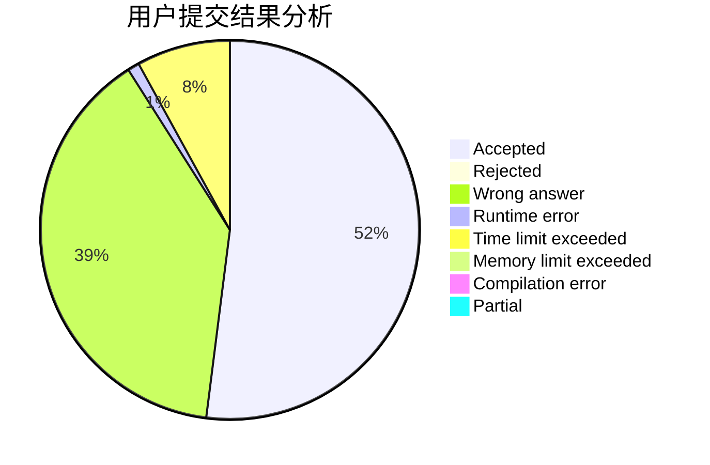
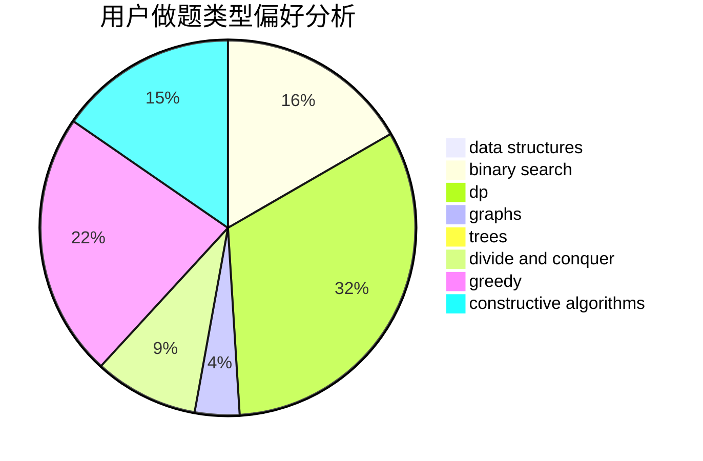
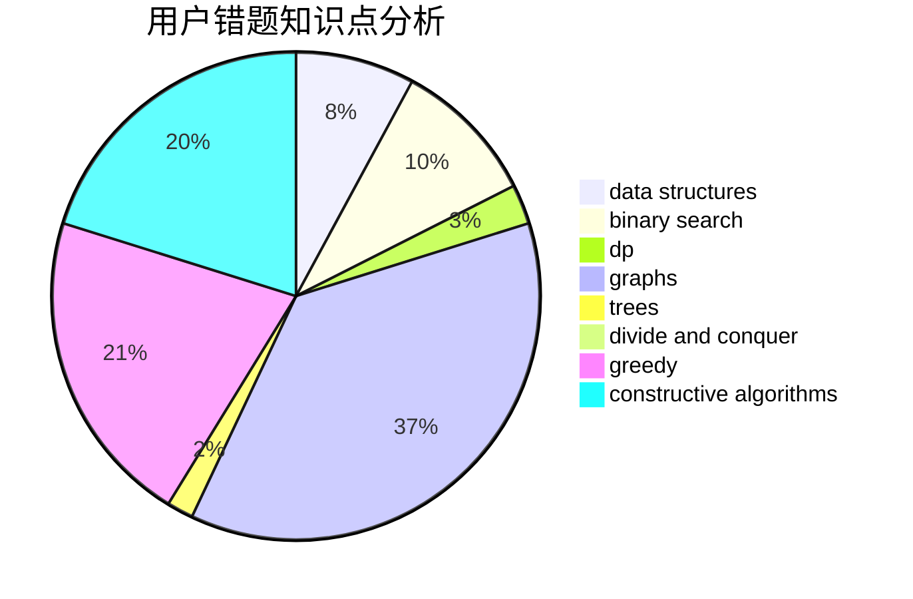

# Xhnxhn
<!-- tabs:start -->
#### **用户提交结果分析**

#### **用户做题类型偏好分析**

#### **用户错题知识点分析**

<!-- tabs:end -->
# 推荐题目
[Shark](http://codeforces.com/problemset/problem/982/D)		brute force,
                        data structures,
                        dsu,
                        trees		  
[Beautiful numbers](http://codeforces.com/problemset/problem/55/D)		dp,
                        number theory		  
[Swords](http://codeforces.com/problemset/problem/1216/D)		math		  
[Delete a Segment](http://codeforces.com/problemset/problem/1285/E)		brute force,
                        constructive algorithms,
                        data structures,
                        dp,
                        graphs,
                        sortings,
                        trees,
                        two pointers		  
[Divisibility](http://codeforces.com/problemset/problem/597/A)		math		  
[The Time](http://codeforces.com/problemset/problem/622/B)		implementation		  
[Guess two numbers](https://codeforces.com/contest/1008/problem/E)		binary search,
                        interactive		  
[On a plane](http://codeforces.com/problemset/problem/409/G)		*special problem,
                        geometry		  
[Heidi and the Turing Test (Medium)](http://codeforces.com/problemset/problem/1184/C2)		data structures		  
[Bear and String Distance](http://codeforces.com/problemset/problem/628/C)		greedy,
                        strings		  
<!-- tabs:start -->
#### **data structures**
[Shark](http://codeforces.com/problemset/problem/982/D)		brute force,
                        data structures,
                        dsu,
                        trees		  
[Beautiful numbers](http://codeforces.com/problemset/problem/1285/E)		brute force,
                        constructive algorithms,
                        data structures,
                        dp,
                        graphs,
                        sortings,
                        trees,
                        two pointers		  
[Swords](http://codeforces.com/problemset/problem/1184/C2)		data structures		  
[Delete a Segment](http://codeforces.com/problemset/problem/1266/D)		constructive algorithms,
                        data structures,
                        graphs,
                        greedy,
                        implementation,
                        math,
                        two pointers		  
[Divisibility](http://codeforces.com/problemset/problem/1446/F)		binary search,
                        data structures,
                        geometry		  
[The Time](http://codeforces.com/problemset/problem/925/E)		data structures,
                        trees		  
[Guess two numbers](http://codeforces.com/problemset/problem/487/B)		binary search,
                        data structures,
                        dp,
                        two pointers		  
[On a plane](https://codeforces.com/contest/674/problem/G)		data structures		  
[Heidi and the Turing Test (Medium)](http://codeforces.com/problemset/problem/1304/E)		data structures,
                        dfs and similar,
                        shortest paths,
                        trees		  
[Bear and String Distance](http://codeforces.com/problemset/problem/348/C)		brute force,
                        data structures		  
#### **binary search**
[Shark](https://codeforces.com/contest/1008/problem/E)		binary search,
                        interactive		  
[Beautiful numbers](http://codeforces.com/problemset/problem/1446/F)		binary search,
                        data structures,
                        geometry		  
[Swords](http://codeforces.com/problemset/problem/487/B)		binary search,
                        data structures,
                        dp,
                        two pointers		  
[Delete a Segment](http://codeforces.com/problemset/problem/1454/F)		binary search,
                        data structures,
                        greedy,
                        two pointers		  
[Divisibility](http://codeforces.com/problemset/problem/1492/C)		binary search,
                        data structures,
                        dp,
                        greedy,
                        two pointers		  
[The Time](http://codeforces.com/problemset/problem/1463/D)		binary search,
                        constructive algorithms,
                        greedy,
                        two pointers		  
[Guess two numbers](http://codeforces.com/problemset/problem/1490/G)		binary search,
                        data structures,
                        math		  
[On a plane](http://codeforces.com/problemset/problem/1479/D)		binary search,
                        bitmasks,
                        brute force,
                        data structures,
                        probabilities,
                        trees		  
[Heidi and the Turing Test (Medium)](http://codeforces.com/problemset/problem/1436/E)		binary search,
                        data structures,
                        two pointers		  
[Bear and String Distance](http://codeforces.com/problemset/problem/1461/D)		binary search,
                        brute force,
                        data structures,
                        divide and conquer,
                        implementation,
                        sortings		  
#### **dp**
[Shark](http://codeforces.com/problemset/problem/55/D)		dp,
                        number theory		  
[Beautiful numbers](http://codeforces.com/problemset/problem/1285/E)		brute force,
                        constructive algorithms,
                        data structures,
                        dp,
                        graphs,
                        sortings,
                        trees,
                        two pointers		  
[Swords](http://codeforces.com/problemset/problem/1268/E)		dp		  
[Delete a Segment](http://codeforces.com/problemset/problem/922/E)		dp		  
[Divisibility](http://codeforces.com/problemset/problem/487/B)		binary search,
                        data structures,
                        dp,
                        two pointers		  
[The Time](http://codeforces.com/problemset/problem/353/D)		constructive algorithms,
                        dp		  
[Guess two numbers](http://codeforces.com/problemset/problem/1073/E)		bitmasks,
                        combinatorics,
                        dp,
                        math		  
[On a plane](http://codeforces.com/problemset/problem/1492/C)		binary search,
                        data structures,
                        dp,
                        greedy,
                        two pointers		  
[Heidi and the Turing Test (Medium)](https://codeforces.com/contest/1457/problem/C)		brute force,
                        dp,
                        implementation		  
[Bear and String Distance](http://codeforces.com/problemset/problem/1491/C)		brute force,
                        data structures,
                        dp,
                        greedy,
                        implementation		  
#### **graph**
[Shark](http://codeforces.com/problemset/problem/1285/E)		brute force,
                        constructive algorithms,
                        data structures,
                        dp,
                        graphs,
                        sortings,
                        trees,
                        two pointers		  
[Beautiful numbers](http://codeforces.com/problemset/problem/1291/F)		graphs,
                        interactive		  
[Swords](http://codeforces.com/problemset/problem/1266/D)		constructive algorithms,
                        data structures,
                        graphs,
                        greedy,
                        implementation,
                        math,
                        two pointers		  
[Delete a Segment](http://codeforces.com/problemset/problem/25/C)		graphs,
                        shortest paths		  
[Divisibility](http://codeforces.com/problemset/problem/780/C)		dfs and similar,
                        graphs,
                        greedy,
                        trees		  
[The Time](http://codeforces.com/problemset/problem/1361/E)		dfs and similar,
                        graphs,
                        probabilities,
                        trees		  
[Guess two numbers](http://codeforces.com/problemset/problem/938/G)		bitmasks,
                        data structures,
                        dsu,
                        graphs		  
[On a plane](https://codeforces.com/contest/1483/problem/D)		graphs,
                        shortest paths		  
[Heidi and the Turing Test (Medium)](http://codeforces.com/problemset/problem/1487/C)		brute force,
                        constructive algorithms,
                        dfs and similar,
                        graphs,
                        greedy,
                        implementation,
                        math		  
[Bear and String Distance](http://codeforces.com/problemset/problem/1437/C)		dp,
                        flows,
                        graph matchings,
                        greedy,
                        math,
                        sortings		  
#### **trees**
[Shark](http://codeforces.com/problemset/problem/982/D)		brute force,
                        data structures,
                        dsu,
                        trees		  
[Beautiful numbers](http://codeforces.com/problemset/problem/1285/E)		brute force,
                        constructive algorithms,
                        data structures,
                        dp,
                        graphs,
                        sortings,
                        trees,
                        two pointers		  
[Swords](http://codeforces.com/problemset/problem/925/E)		data structures,
                        trees		  
[Delete a Segment](http://codeforces.com/problemset/problem/780/C)		dfs and similar,
                        graphs,
                        greedy,
                        trees		  
[Divisibility](http://codeforces.com/problemset/problem/1361/E)		dfs and similar,
                        graphs,
                        probabilities,
                        trees		  
[The Time](http://codeforces.com/problemset/problem/1304/E)		data structures,
                        dfs and similar,
                        shortest paths,
                        trees		  
[Guess two numbers](http://codeforces.com/problemset/problem/838/B)		data structures,
                        dfs and similar,
                        trees		  
[On a plane](http://codeforces.com/problemset/problem/1479/D)		binary search,
                        bitmasks,
                        brute force,
                        data structures,
                        probabilities,
                        trees		  
[Heidi and the Turing Test (Medium)](http://codeforces.com/problemset/problem/1511/C)		brute force,
                        data structures,
                        implementation,
                        trees		  
[Bear and String Distance](http://codeforces.com/problemset/problem/1499/F)		combinatorics,
                        dfs and similar,
                        dp,
                        trees		  
#### **divide and conquer**
[Shark](http://codeforces.com/problemset/problem/1461/D)		binary search,
                        brute force,
                        data structures,
                        divide and conquer,
                        implementation,
                        sortings		  
[Beautiful numbers](http://codeforces.com/problemset/problem/1466/G)		combinatorics,
                        divide and conquer,
                        hashing,
                        math,
                        string suffix structures,
                        strings		  
[Swords](http://codeforces.com/problemset/problem/1490/D)		dfs and similar,
                        divide and conquer,
                        implementation		  
[Delete a Segment](https://codeforces.com/contest/1483/problem/C)		data structures,
                        divide and conquer,
                        dp		  
[Divisibility](http://codeforces.com/problemset/problem/1491/E)		brute force,
                        dfs and similar,
                        divide and conquer,
                        number theory,
                        trees		  
[The Time](http://codeforces.com/problemset/problem/1303/G)		data structures,
                        divide and conquer,
                        geometry,
                        trees		  
[Guess two numbers](http://codeforces.com/problemset/problem/1494/D)		constructive algorithms,
                        data structures,
                        dfs and similar,
                        divide and conquer,
                        dsu,
                        greedy,
                        sortings,
                        trees		  
[On a plane](http://codeforces.com/problemset/problem/1482/E)		data structures,
                        divide and conquer,
                        dp		  
[Heidi and the Turing Test (Medium)](http://codeforces.com/problemset/problem/566/C)		dfs and similar,
                        divide and conquer,
                        trees		  
[Bear and String Distance](http://codeforces.com/problemset/problem/1428/F)		binary search,
                        data structures,
                        divide and conquer,
                        dp,
                        two pointers		  
#### **greedy**
[Shark](http://codeforces.com/problemset/problem/628/C)		greedy,
                        strings		  
[Beautiful numbers](http://codeforces.com/problemset/problem/1266/D)		constructive algorithms,
                        data structures,
                        graphs,
                        greedy,
                        implementation,
                        math,
                        two pointers		  
[Swords](http://codeforces.com/problemset/problem/166/C)		greedy,
                        math,
                        sortings		  
[Delete a Segment](http://codeforces.com/problemset/problem/853/A)		greedy		  
[Divisibility](http://codeforces.com/problemset/problem/578/B)		brute force,
                        greedy		  
[The Time](http://codeforces.com/problemset/problem/464/A)		greedy,
                        strings		  
[Guess two numbers](http://codeforces.com/problemset/problem/780/C)		dfs and similar,
                        graphs,
                        greedy,
                        trees		  
[On a plane](http://codeforces.com/problemset/problem/1454/F)		binary search,
                        data structures,
                        greedy,
                        two pointers		  
[Heidi and the Turing Test (Medium)](http://codeforces.com/problemset/problem/1218/I)		2-sat,
                        dfs and similar,
                        greedy		  
[Bear and String Distance](http://codeforces.com/problemset/problem/700/D)		data structures,
                        greedy		  
#### **constructive algorithms**
[Shark](http://codeforces.com/problemset/problem/1285/E)		brute force,
                        constructive algorithms,
                        data structures,
                        dp,
                        graphs,
                        sortings,
                        trees,
                        two pointers		  
[Beautiful numbers](http://codeforces.com/problemset/problem/1266/D)		constructive algorithms,
                        data structures,
                        graphs,
                        greedy,
                        implementation,
                        math,
                        two pointers		  
[Swords](http://codeforces.com/problemset/problem/1506/E)		constructive algorithms,
                        implementation		  
[Delete a Segment](http://codeforces.com/problemset/problem/1365/E)		brute force,
                        constructive algorithms		  
[Divisibility](http://codeforces.com/problemset/problem/353/D)		constructive algorithms,
                        dp		  
[The Time](http://codeforces.com/problemset/problem/1493/A)		constructive algorithms,
                        greedy		  
[Guess two numbers](http://codeforces.com/problemset/problem/1463/D)		binary search,
                        constructive algorithms,
                        greedy,
                        two pointers		  
[On a plane](https://codeforces.com/contest/1456/problem/B)		bitmasks,
                        brute force,
                        constructive algorithms		  
[Heidi and the Turing Test (Medium)](http://codeforces.com/problemset/problem/1492/D)		bitmasks,
                        constructive algorithms,
                        greedy,
                        math		  
[Bear and String Distance](https://codeforces.com/contest/1504/problem/D)		constructive algorithms,
                        games,
                        interactive		  
#### **sortings**
[Shark](http://codeforces.com/problemset/problem/1285/E)		brute force,
                        constructive algorithms,
                        data structures,
                        dp,
                        graphs,
                        sortings,
                        trees,
                        two pointers		  
[Beautiful numbers](http://codeforces.com/problemset/problem/166/C)		greedy,
                        math,
                        sortings		  
[Swords](https://codeforces.com/contest/1496/problem/C)		geometry,
                        greedy,
                        math,
                        sortings		  
[Delete a Segment](http://codeforces.com/problemset/problem/1495/A)		geometry,
                        greedy,
                        math,
                        sortings		  
[Divisibility](http://codeforces.com/problemset/problem/1497/A)		brute force,
                        data structures,
                        greedy,
                        sortings		  
[The Time](http://codeforces.com/problemset/problem/1427/A)		math,
                        sortings		  
[Guess two numbers](http://codeforces.com/problemset/problem/1461/D)		binary search,
                        brute force,
                        data structures,
                        divide and conquer,
                        implementation,
                        sortings		  
[On a plane](http://codeforces.com/problemset/problem/1437/C)		dp,
                        flows,
                        graph matchings,
                        greedy,
                        math,
                        sortings		  
[Heidi and the Turing Test (Medium)](http://codeforces.com/problemset/problem/1473/A)		greedy,
                        implementation,
                        math,
                        sortings		  
[Bear and String Distance](http://codeforces.com/problemset/problem/1486/B)		binary search,
                        geometry,
                        shortest paths,
                        sortings		  
<!-- tabs:end -->
