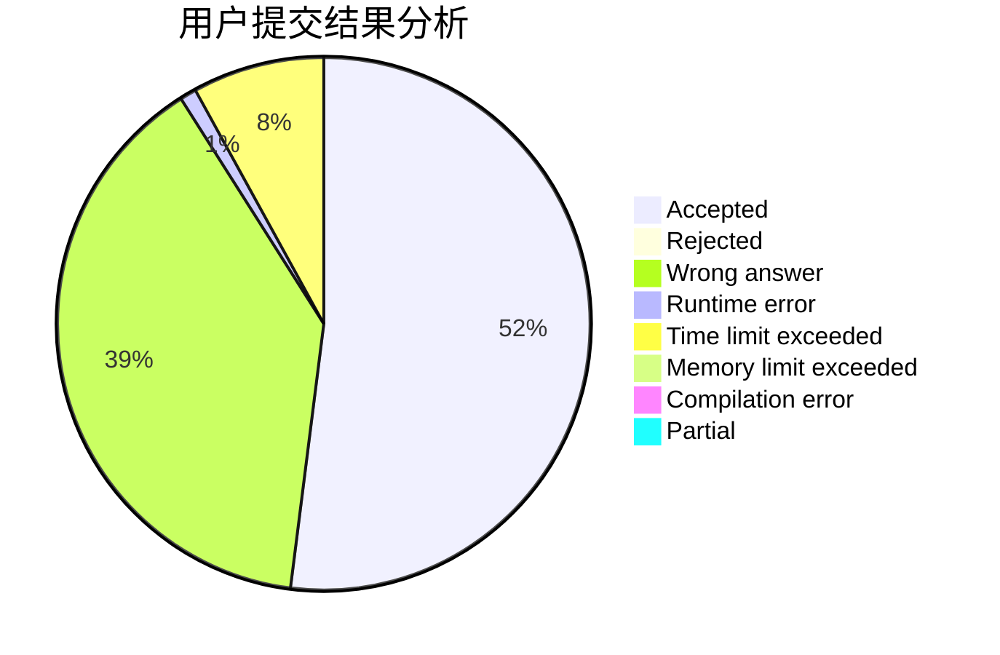
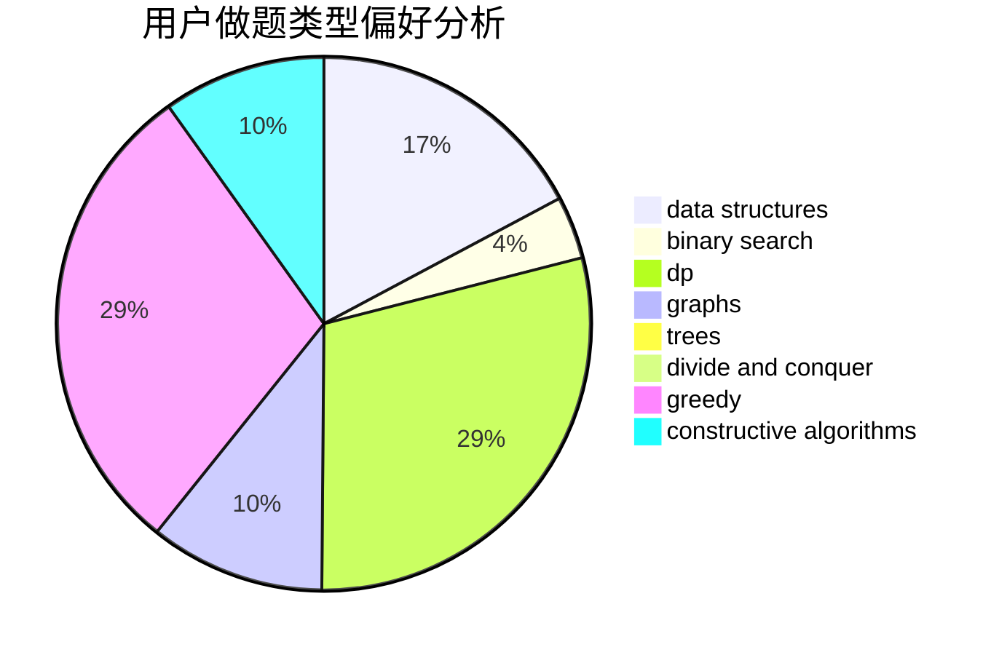
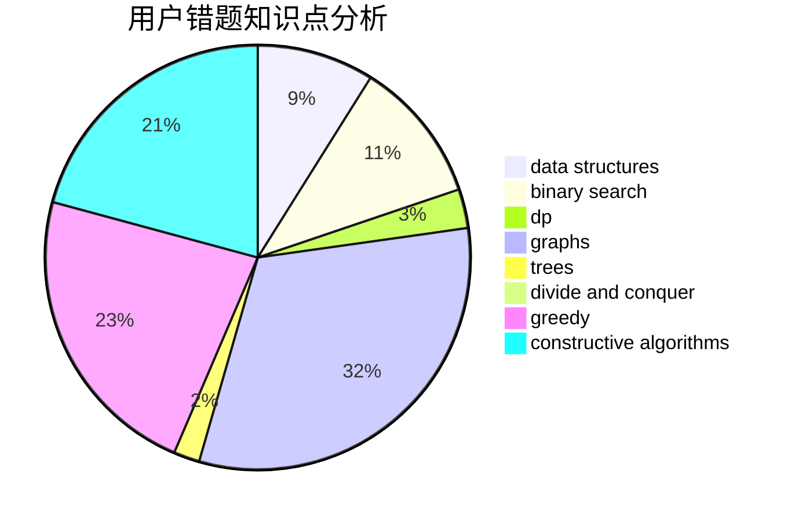

# Xhnxhn

<!-- tabs:start -->

#### **用户提交结果分析**

#### **用户做题类型偏好分析**

#### **用户错题知识点分析**

<!-- tabs:end -->
# 推荐题目
[998B](https://codeforces.com/contest/998/problem/B)		dp,
                        greedy,
                        sortings		  
[584B](https://codeforces.com/contest/584/problem/B)		combinatorics		  
[1223A](https://codeforces.com/contest/1223/problem/A)		math		  
[1292F](https://codeforces.com/contest/1292/problem/F)		bitmasks,
                        combinatorics,
                        dp		  
[11881](https://codeforces.com/contest/1188/problem/1)		dsu,graphs,sortings,trees		  
[650B](https://codeforces.com/contest/650/problem/B)		binary search,
                        brute force,
                        dp,
                        two pointers		  
[586F](https://codeforces.com/contest/586/problem/F)		dsu,graphs,sortings,trees		  
[949B](https://codeforces.com/contest/949/problem/B)		constructive algorithms,
                        math		  
[437A](https://codeforces.com/contest/437/problem/A)		implementation		  
[699D](https://codeforces.com/contest/699/problem/D)		dsu,graphs,sortings,trees		  
