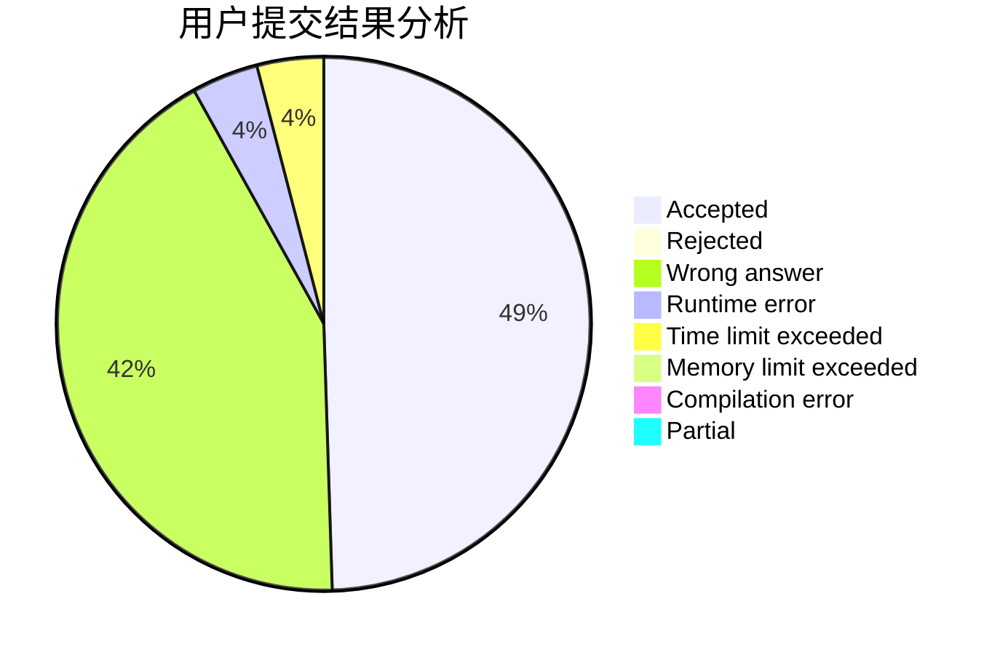
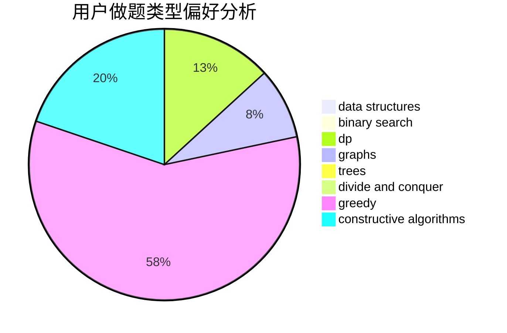
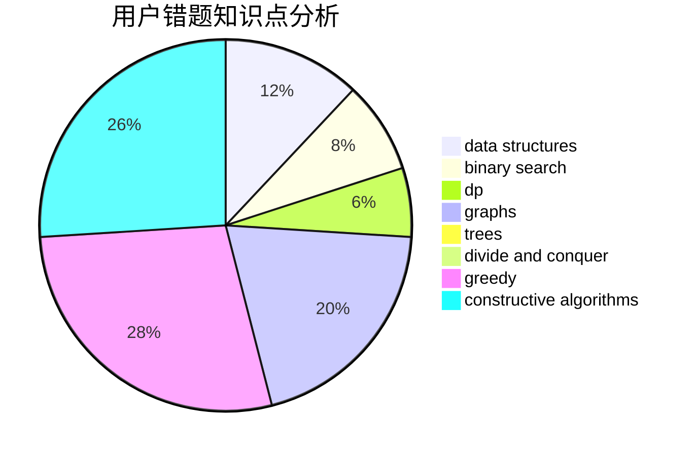

# XianHZ

<!-- tabs:start -->

#### **用户提交结果分析**

#### **用户做题类型偏好分析**

#### **用户错题知识点分析**

<!-- tabs:end -->
# 推荐题目
[56B](https://codeforces.com/contest/56/problem/B)		implementation		  
[542E](https://codeforces.com/contest/542/problem/E)		graphs,
                        shortest paths		  
[508A](https://codeforces.com/contest/508/problem/A)		brute force		  
[468D](https://codeforces.com/contest/468/problem/D)		graph matchings		  
[1104B](https://codeforces.com/contest/1104/problem/B)		data structures,
                        implementation,
                        math		  
[1380G](https://codeforces.com/contest/1380/problem/G)		greedy,
                        math,
                        probabilities		  
[414B](https://codeforces.com/contest/414/problem/B)		combinatorics,
                        dp,
                        number theory		  
[1450C2](https://codeforces.com/contest/1450C/problem/2)		constructive algorithms,
                        math		  
[268B](https://codeforces.com/contest/268/problem/B)		implementation,
                        math		  
[1138C](https://codeforces.com/contest/1138/problem/C)		dsu,graphs,sortings,trees		  
