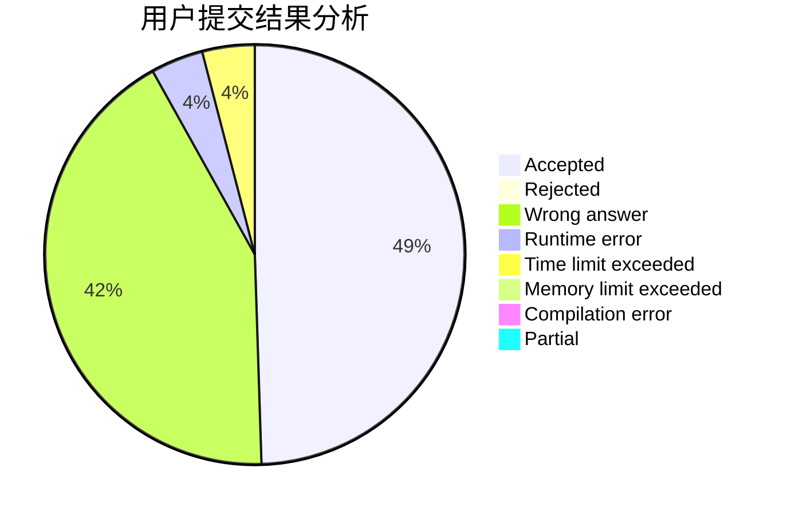
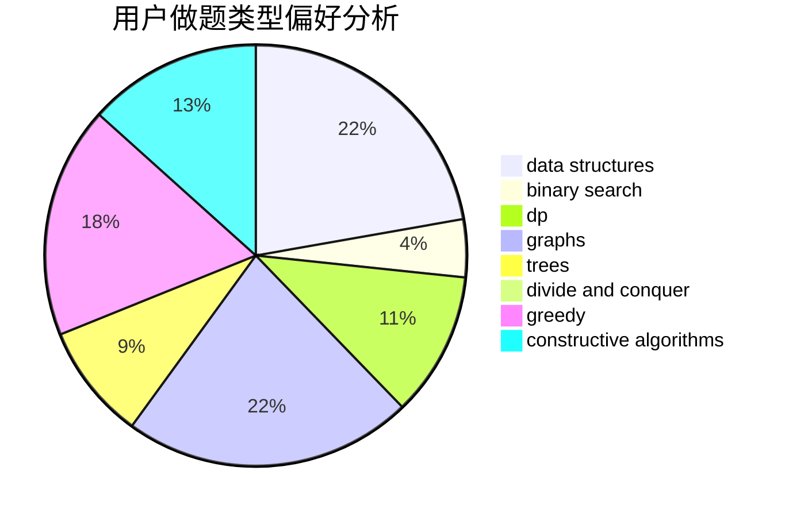
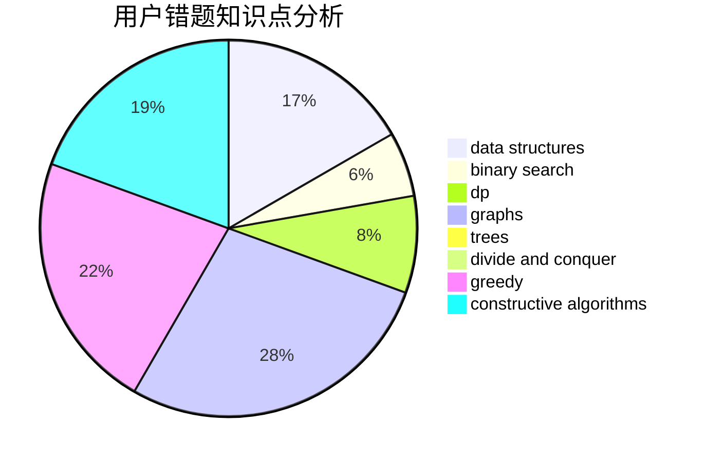

# XianHZ

<!-- tabs:start -->

#### **用户提交结果分析**

#### **用户做题类型偏好分析**

#### **用户错题知识点分析**

<!-- tabs:end -->
# 推荐题目
[58E](https://codeforces.com/contest/58/problem/E)		dp		  
[567A](https://codeforces.com/contest/567/problem/A)		greedy,
                        implementation		  
[528A](https://codeforces.com/contest/528/problem/A)		dsu,graphs,sortings,trees		  
[488B](https://codeforces.com/contest/488/problem/B)		brute force,
                        constructive algorithms,
                        math		  
[1104E](https://codeforces.com/contest/1104/problem/E)		dsu,graphs,sortings,trees		  
[1391A](https://codeforces.com/contest/1391/problem/A)		constructive algorithms,
                        math		  
[439D](https://codeforces.com/contest/439/problem/D)		binary search,
                        sortings,
                        ternary search,
                        two pointers		  
[1458F](https://codeforces.com/contest/1458/problem/F)		data structures,
                        trees		  
[283C](https://codeforces.com/contest/283/problem/C)		dp		  
[1140A](https://codeforces.com/contest/1140/problem/A)		implementation		  
