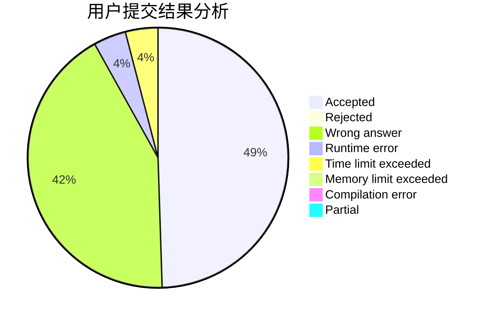
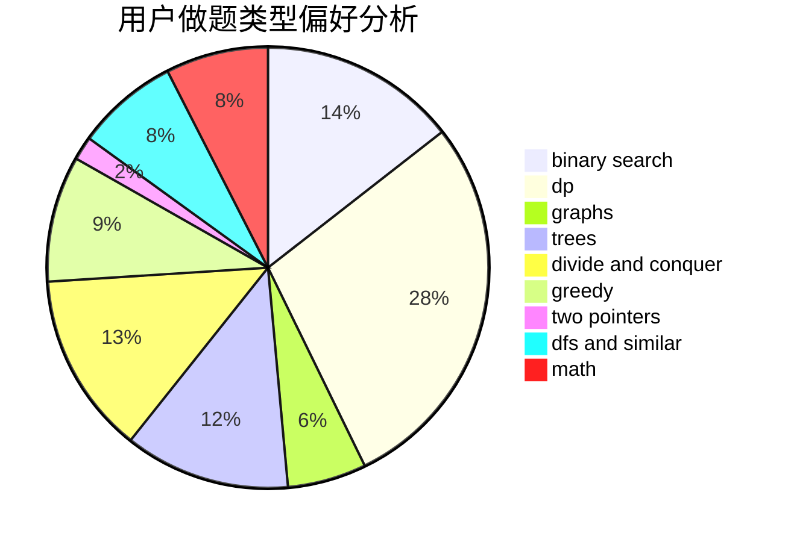

# XianHZ

<!-- tabs:start -->

#### **用户提交结果分析**

#### **用户做题类型偏好分析**

<!-- tabs:end -->
# 推荐题目
[58E](https://codeforces.com/contest/58/problem/E)
[567A](https://codeforces.com/contest/567/problem/A)
[528A](https://codeforces.com/contest/528/problem/A)
[488B](https://codeforces.com/contest/488/problem/B)
[1104E](https://codeforces.com/contest/1104/problem/E)
[1391A](https://codeforces.com/contest/1391/problem/A)
[439D](https://codeforces.com/contest/439/problem/D)
[1458F](https://codeforces.com/contest/1458/problem/F)
[283C](https://codeforces.com/contest/283/problem/C)
[1140A](https://codeforces.com/contest/1140/problem/A)
