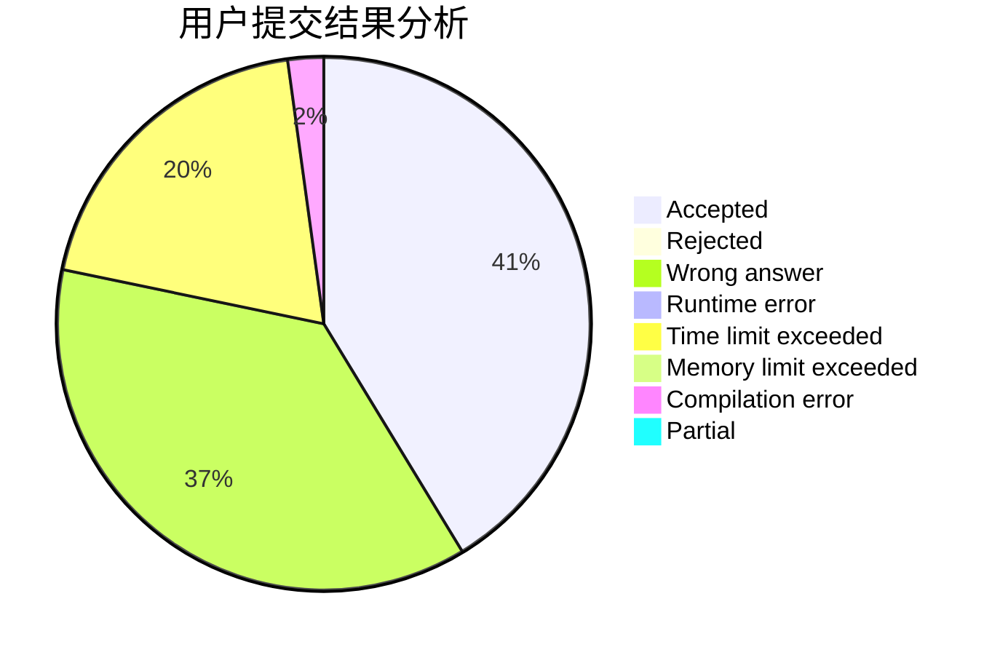
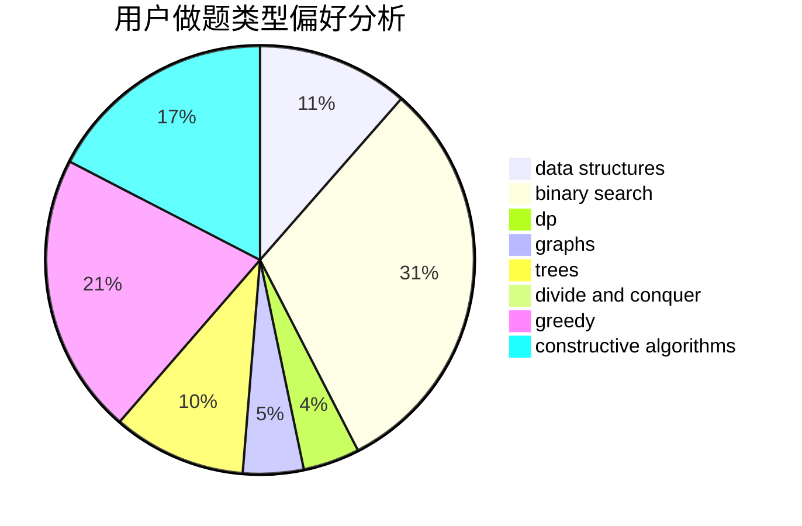
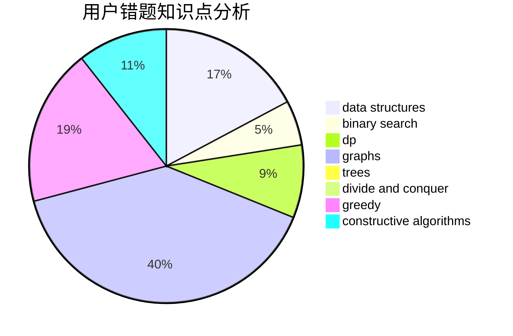

# XiaoXkkk

<!-- tabs:start -->

#### **用户提交结果分析**

#### **用户做题类型偏好分析**

#### **用户错题知识点分析**

<!-- tabs:end -->
# 推荐题目
[895C](https://codeforces.com/contest/895/problem/C)		bitmasks,
                        combinatorics,
                        dp,
                        math		  
[12D](https://codeforces.com/contest/12/problem/D)		data structures,
                        sortings		  
[802C](https://codeforces.com/contest/802/problem/C)		flows		  
[967D](https://codeforces.com/contest/967/problem/D)		dsu,graphs,sortings,trees		  
[1271A](https://codeforces.com/contest/1271/problem/A)		brute force,
                        greedy,
                        math		  
[1129B](https://codeforces.com/contest/1129/problem/B)		constructive algorithms		  
[193C](https://codeforces.com/contest/193/problem/C)		constructive algorithms,
                        greedy,
                        math,
                        matrices		  
[311B](https://codeforces.com/contest/311/problem/B)		data structures,
                        dp		  
[1030E](https://codeforces.com/contest/1030/problem/E)		bitmasks,
                        dp		  
[286D](https://codeforces.com/contest/286/problem/D)		data structures,
                        sortings		  
