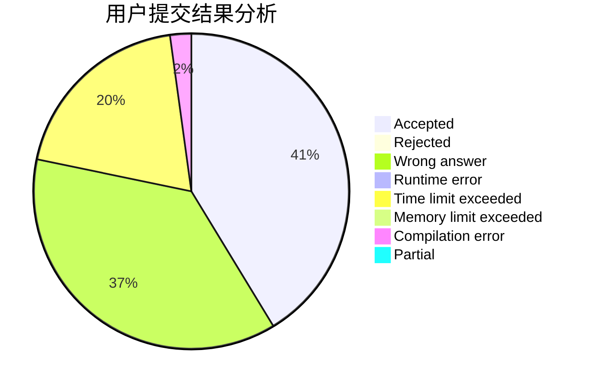
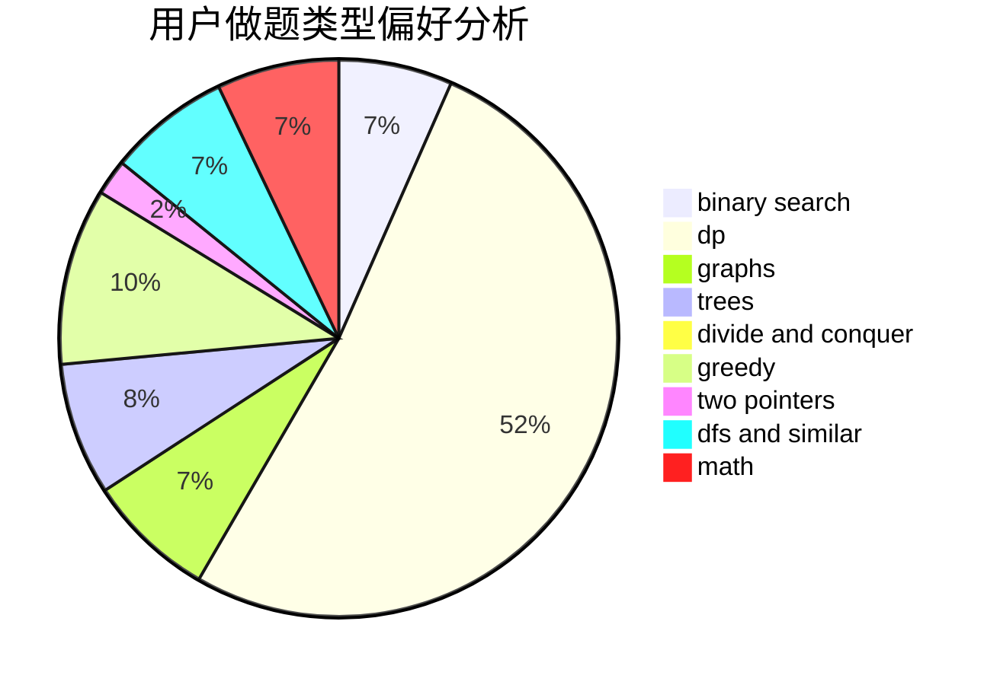

# XiaoXkkk

<!-- tabs:start -->

#### **用户提交结果分析**

#### **用户做题类型偏好分析**

<!-- tabs:end -->
# 推荐题目
[913A](https://codeforces.com/contest/913/problem/A)
[1307E](https://codeforces.com/contest/1307/problem/E)
[817B](https://codeforces.com/contest/817/problem/B)
[989A](https://codeforces.com/contest/989/problem/A)
[1280C](https://codeforces.com/contest/1280/problem/C)
[1131B](https://codeforces.com/contest/1131/problem/B)
[216D](https://codeforces.com/contest/216/problem/D)
[334B](https://codeforces.com/contest/334/problem/B)
[1031B](https://codeforces.com/contest/1031/problem/B)
[300E](https://codeforces.com/contest/300/problem/E)
