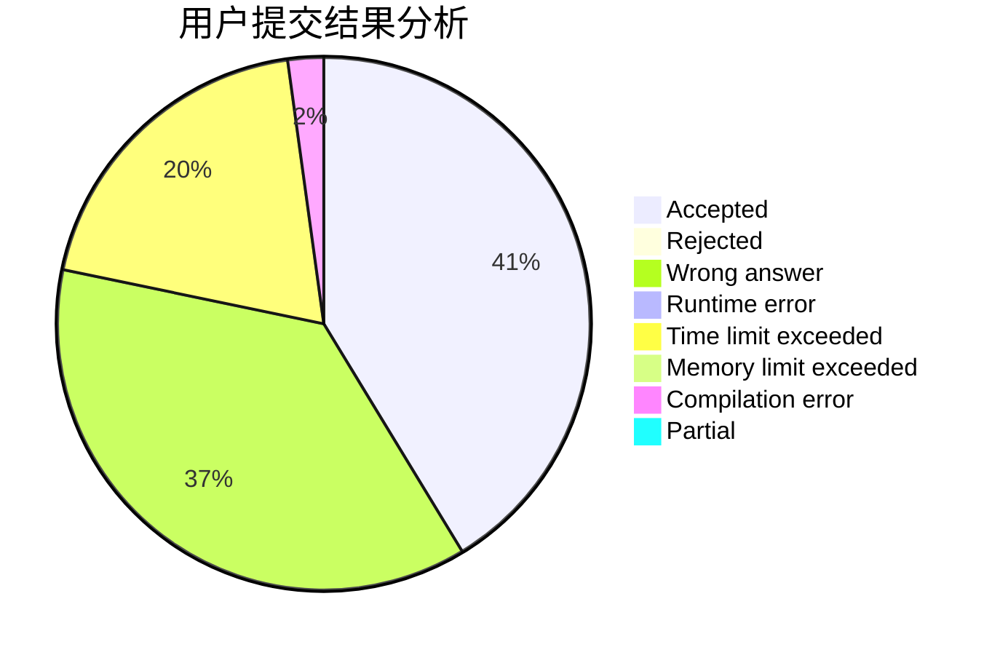
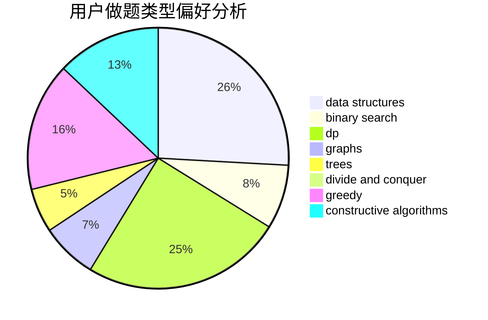
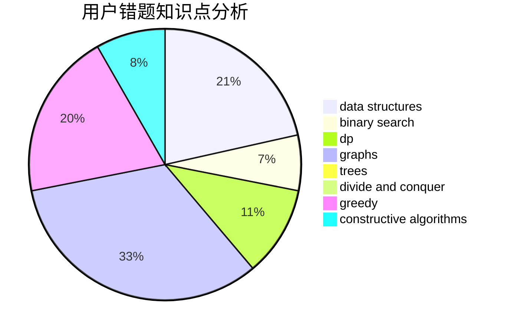

# XiaoXkkk

<!-- tabs:start -->

#### **用户提交结果分析**

#### **用户做题类型偏好分析**

#### **用户错题知识点分析**

<!-- tabs:end -->
# 推荐题目
[913A](https://codeforces.com/contest/913/problem/A)		implementation,
                        math		  
[1307E](https://codeforces.com/contest/1307/problem/E)		binary search,
                        combinatorics,
                        dp,
                        greedy,
                        implementation,
                        math		  
[817B](https://codeforces.com/contest/817/problem/B)		combinatorics,
                        implementation,
                        math,
                        sortings		  
[989A](https://codeforces.com/contest/989/problem/A)		implementation,
                        strings		  
[1280C](https://codeforces.com/contest/1280/problem/C)		dfs and similar,
                        graphs,
                        greedy,
                        trees		  
[1131B](https://codeforces.com/contest/1131/problem/B)		greedy,
                        implementation		  
[216D](https://codeforces.com/contest/216/problem/D)		binary search,
                        sortings,
                        two pointers		  
[334B](https://codeforces.com/contest/334/problem/B)		sortings		  
[1031B](https://codeforces.com/contest/1031/problem/B)		nan		  
[300E](https://codeforces.com/contest/300/problem/E)		binary search,
                        math,
                        number theory		  
