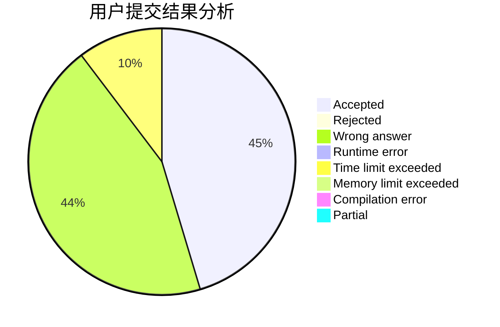
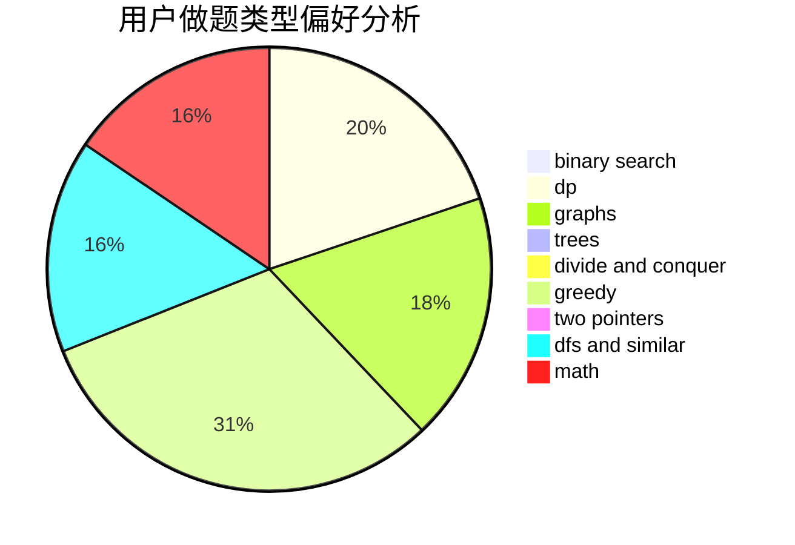

# XiaoyuHan

<!-- tabs:start -->

#### **用户提交结果分析**

#### **用户做题类型偏好分析**

<!-- tabs:end -->
# 推荐题目
[463B](https://codeforces.com/contest/463/problem/B)
[699D](https://codeforces.com/contest/699/problem/D)
[1511F](https://codeforces.com/contest/1511/problem/F)
[1395E](https://codeforces.com/contest/1395/problem/E)
[1328C](https://codeforces.com/contest/1328/problem/C)
[1209D](https://codeforces.com/contest/1209/problem/D)
[1471C](https://codeforces.com/contest/1471/problem/C)
[1467B](https://codeforces.com/contest/1467/problem/B)
[1490C](https://codeforces.com/contest/1490/problem/C)
[1497B](https://codeforces.com/contest/1497/problem/B)
