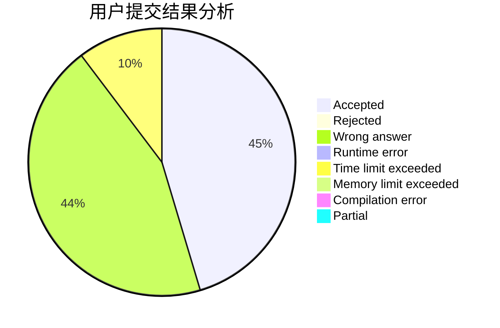
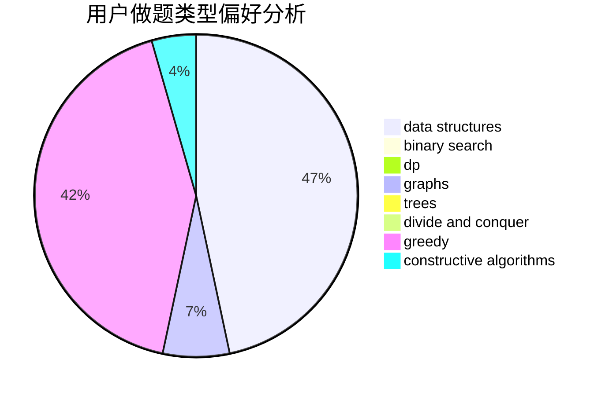

# XiaoyuHan

<!-- tabs:start -->

#### **用户提交结果分析**

#### **用户做题类型偏好分析**

#### **用户错题知识点分析**

<!-- tabs:end -->
# 推荐题目
[463B](https://codeforces.com/contest/463/problem/B)		brute force,
                        implementation,
                        math		  
[699D](https://codeforces.com/contest/699/problem/D)		dsu,graphs,sortings,trees		  
[1511F](https://codeforces.com/contest/1511/problem/F)		brute force,
                        data structures,
                        dp,
                        matrices,
                        string suffix structures,
                        strings		  
[1395E](https://codeforces.com/contest/1395/problem/E)		dsu,graphs,sortings,trees		  
[1328C](https://codeforces.com/contest/1328/problem/C)		greedy,
                        implementation		  
[1209D](https://codeforces.com/contest/1209/problem/D)		dfs and similar,
                        dsu,
                        graphs		  
[1471C](https://codeforces.com/contest/1471/problem/C)		dsu,graphs,sortings,trees		  
[1467B](https://codeforces.com/contest/1467/problem/B)		brute force,
                        implementation		  
[1490C](https://codeforces.com/contest/1490/problem/C)		binary search,
                        brute force,
                        brute force,
                        math		  
[1497B](https://codeforces.com/contest/1497/problem/B)		constructive algorithms,
                        greedy,
                        math		  
