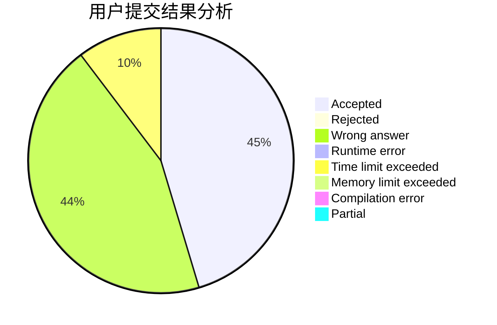
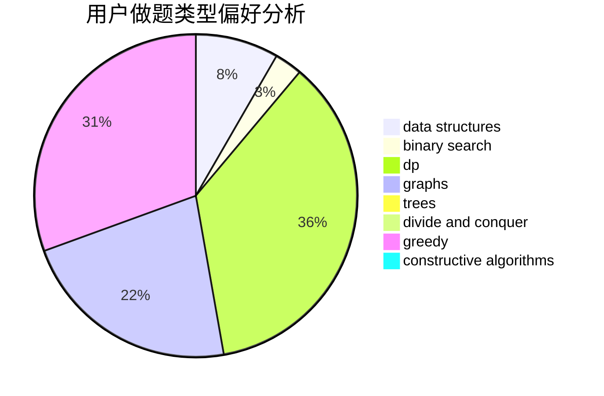

# XiaoyuHan

<!-- tabs:start -->

#### **用户提交结果分析**

#### **用户做题类型偏好分析**

#### **用户错题知识点分析**

<!-- tabs:end -->
# 推荐题目
[442D](https://codeforces.com/contest/442/problem/D)		data structures,
                        trees		  
[674G](https://codeforces.com/contest/674/problem/G)		dsu,graphs,sortings,trees		  
[1501E](https://codeforces.com/contest/1501/problem/E)		dsu,graphs,sortings,trees		  
[1385E](https://codeforces.com/contest/1385/problem/E)		constructive algorithms,
                        dfs and similar,
                        graphs		  
[1321D](https://codeforces.com/contest/1321/problem/D)		dsu,graphs,sortings,trees		  
[1205B](https://codeforces.com/contest/1205/problem/B)		bitmasks,
                        brute force,
                        graphs,
                        shortest paths		  
[1464B](https://codeforces.com/contest/1464/problem/B)		dsu,graphs,sortings,trees		  
[1458C](https://codeforces.com/contest/1458/problem/C)		math,
                        matrices		  
[1482E](https://codeforces.com/contest/1482/problem/E)		data structures,
                        divide and conquer,
                        dp		  
[1489D](https://codeforces.com/contest/1489/problem/D)		dsu,graphs,sortings,trees		  
