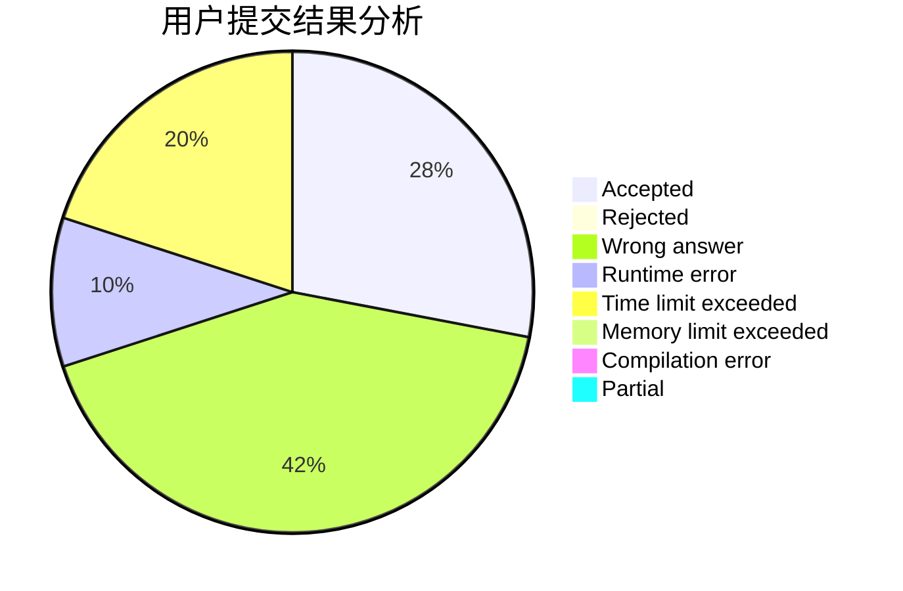
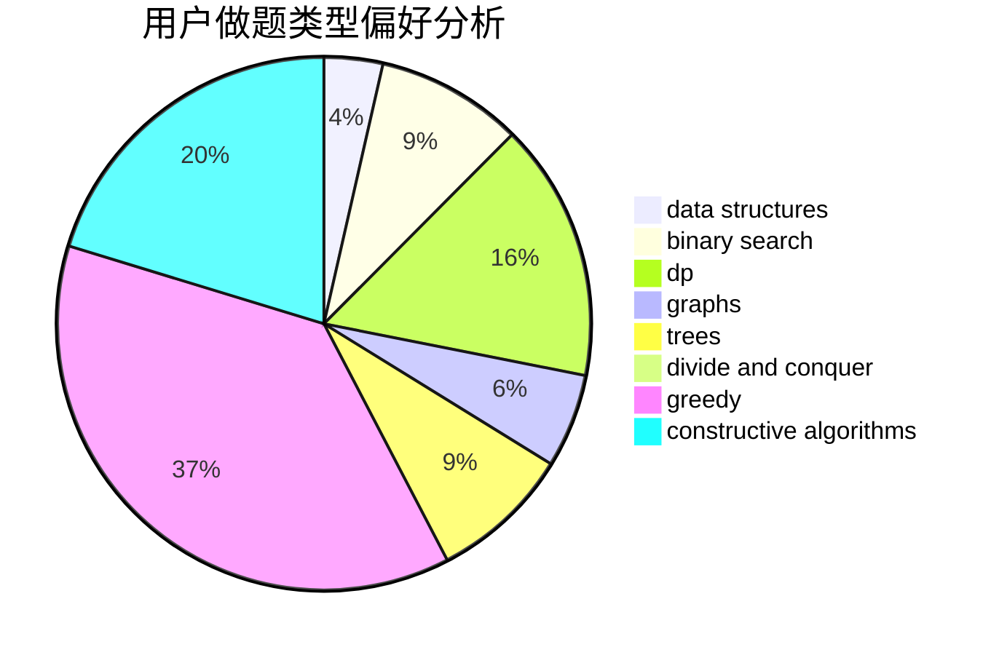
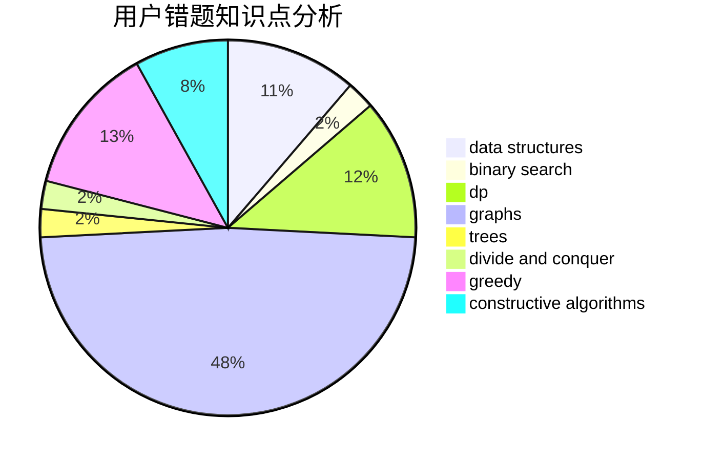

# XinShi

<!-- tabs:start -->

#### **用户提交结果分析**

#### **用户做题类型偏好分析**

#### **用户错题知识点分析**

<!-- tabs:end -->
# 推荐题目
[840C](https://codeforces.com/contest/840/problem/C)		combinatorics,
                        dp		  
[1202A](https://codeforces.com/contest/1202/problem/A)		bitmasks,
                        greedy		  
[917D](https://codeforces.com/contest/917/problem/D)		dp,
                        math,
                        matrices,
                        trees		  
[1038C](https://codeforces.com/contest/1038/problem/C)		greedy,
                        sortings		  
[952B](https://codeforces.com/contest/952/problem/B)		brute force,
                        interactive		  
[117D](https://codeforces.com/contest/117/problem/D)		divide and conquer,
                        math		  
[723A](https://codeforces.com/contest/723/problem/A)		implementation,
                        math,
                        sortings		  
[841D](https://codeforces.com/contest/841/problem/D)		dsu,graphs,sortings,trees		  
[802D](https://codeforces.com/contest/802/problem/D)		math		  
[12622](https://codeforces.com/contest/1262/problem/2)		dsu,graphs,sortings,trees		  
