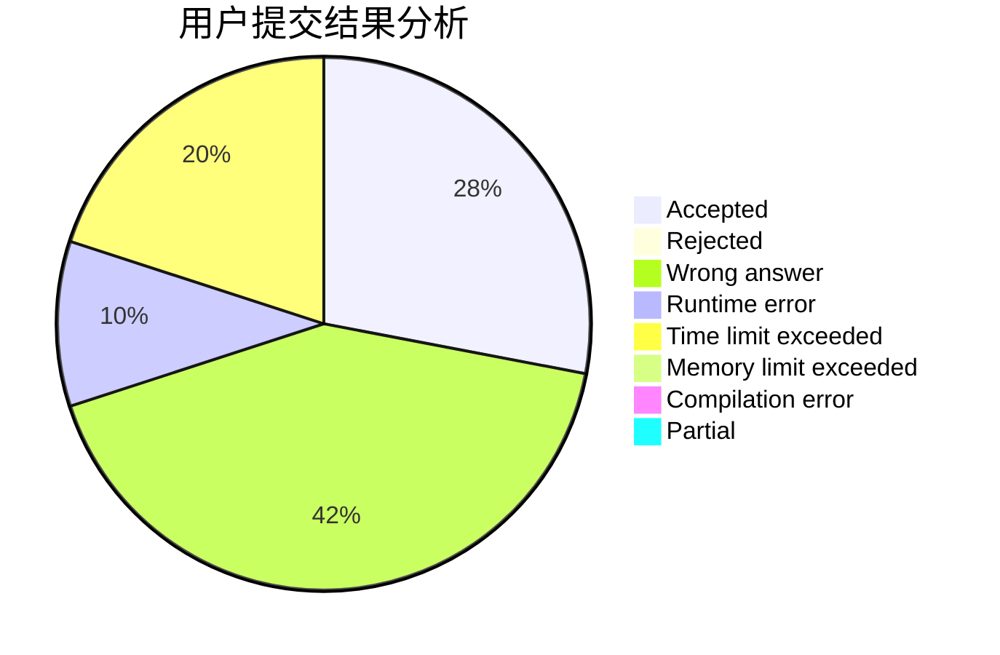
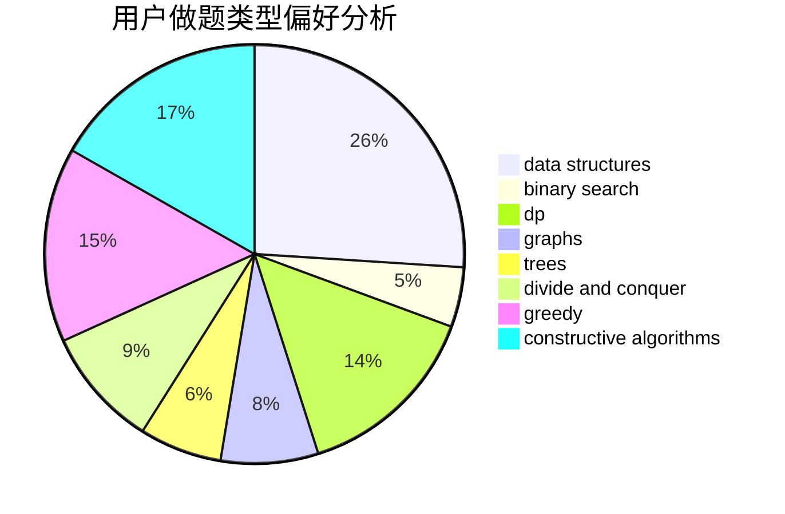
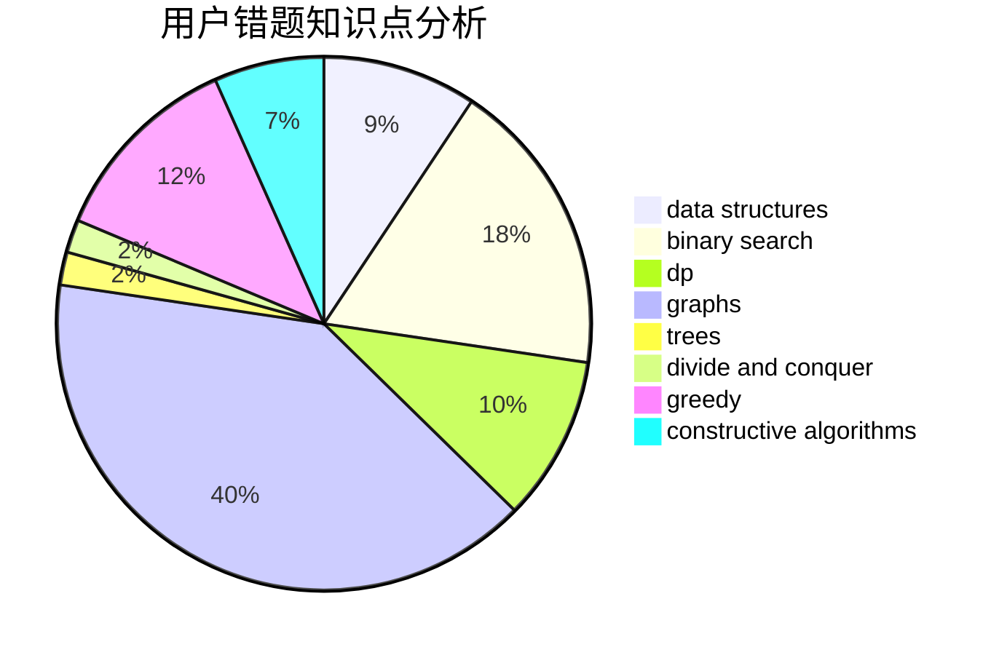

# XinShi

<!-- tabs:start -->

#### **用户提交结果分析**

#### **用户做题类型偏好分析**

#### **用户错题知识点分析**

<!-- tabs:end -->
# 推荐题目
[820C](https://codeforces.com/contest/820/problem/C)		dsu,graphs,sortings,trees		  
[1198C](https://codeforces.com/contest/1198/problem/C)		constructive algorithms,
                        graphs,
                        greedy,
                        sortings		  
[901A](https://codeforces.com/contest/901/problem/A)		constructive algorithms,
                        trees		  
[1037H](https://codeforces.com/contest/1037/problem/H)		data structures,
                        string suffix structures		  
[931B](https://codeforces.com/contest/931/problem/B)		constructive algorithms,
                        implementation		  
[1176F](https://codeforces.com/contest/1176/problem/F)		dp,
                        implementation,
                        sortings		  
[703E](https://codeforces.com/contest/703/problem/E)		dp,
                        number theory		  
[822A](https://codeforces.com/contest/822/problem/A)		implementation,
                        math,
                        number theory		  
[785A](https://codeforces.com/contest/785/problem/A)		implementation,
                        strings		  
[1254E](https://codeforces.com/contest/1254/problem/E)		combinatorics,
                        dfs and similar,
                        dsu,
                        trees		  
