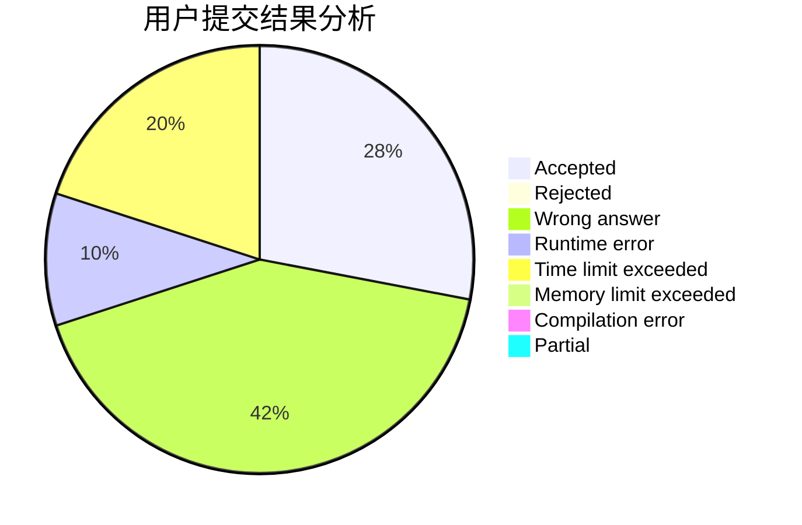
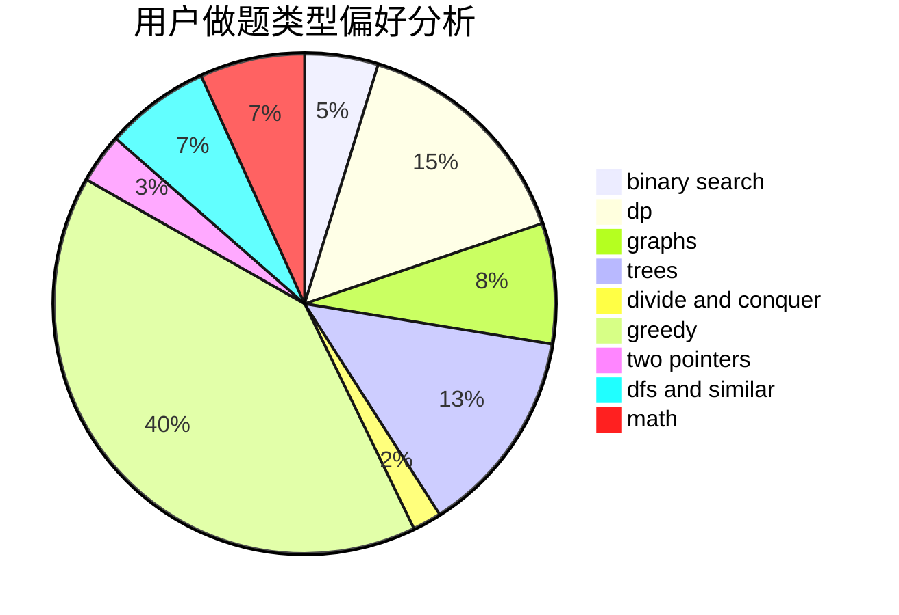

# XinShi

<!-- tabs:start -->

#### **用户提交结果分析**

#### **用户做题类型偏好分析**

<!-- tabs:end -->
# 推荐题目
[840C](https://codeforces.com/contest/840/problem/C)
[1202A](https://codeforces.com/contest/1202/problem/A)
[917D](https://codeforces.com/contest/917/problem/D)
[1038C](https://codeforces.com/contest/1038/problem/C)
[952B](https://codeforces.com/contest/952/problem/B)
[117D](https://codeforces.com/contest/117/problem/D)
[723A](https://codeforces.com/contest/723/problem/A)
[841D](https://codeforces.com/contest/841/problem/D)
[802D](https://codeforces.com/contest/802/problem/D)
[12622](https://codeforces.com/contest/1262/problem/2)
