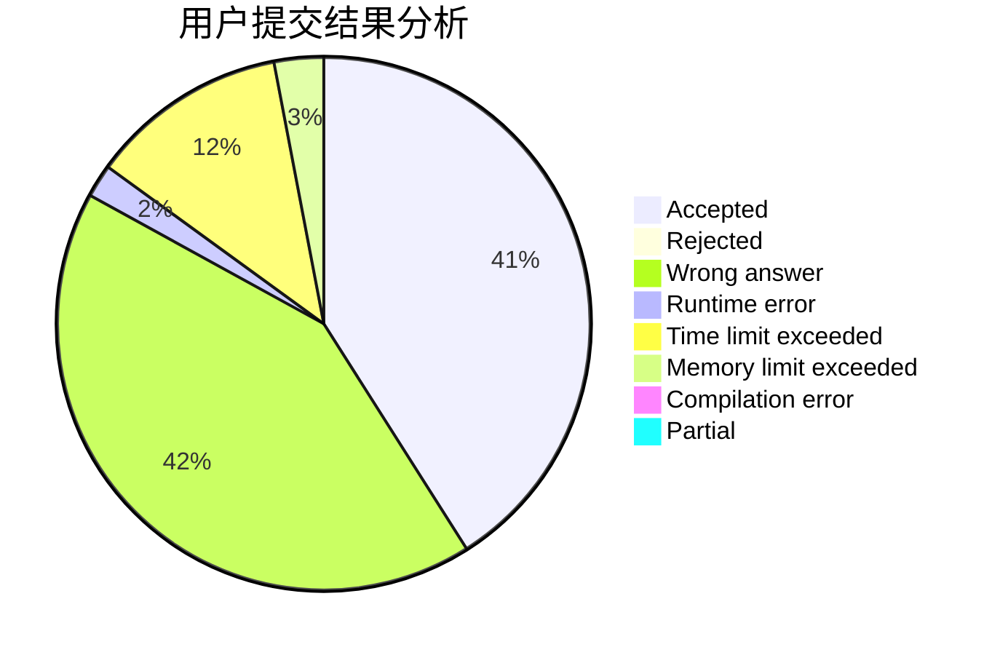
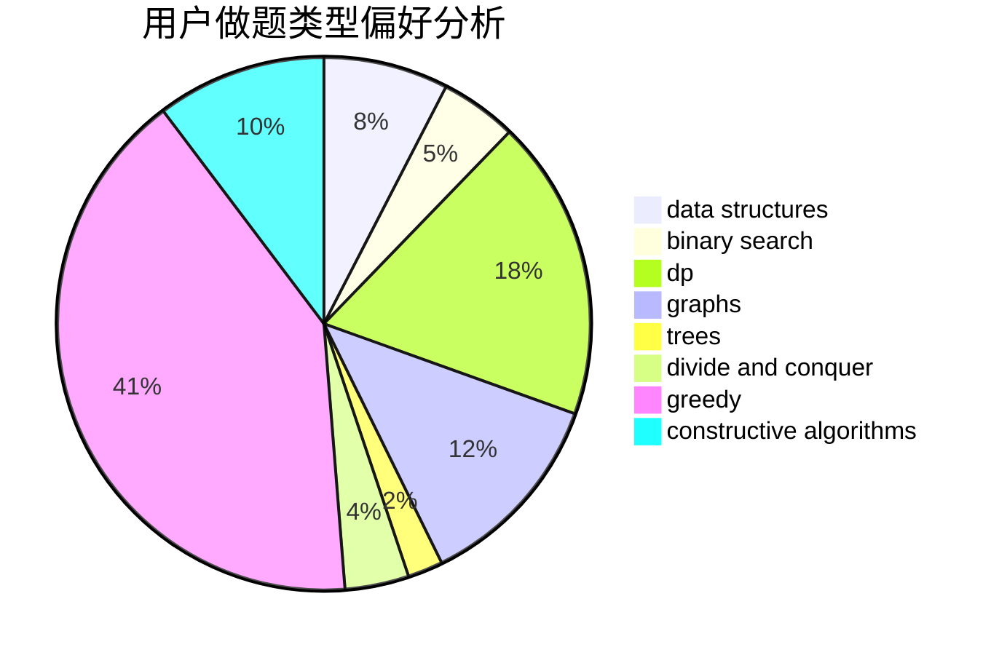
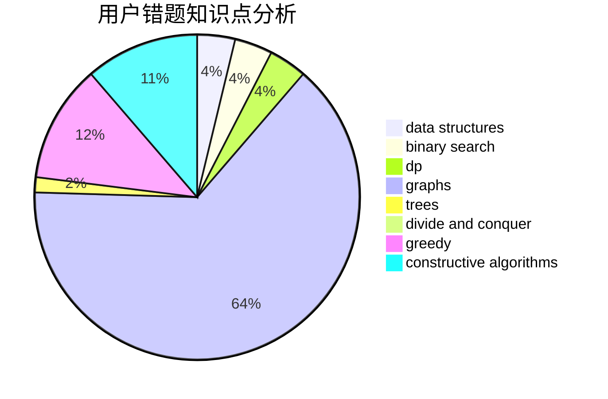

# Xiuchen
<!-- tabs:start -->
#### **用户提交结果分析**

#### **用户做题类型偏好分析**

#### **用户错题知识点分析**

<!-- tabs:end -->
# 推荐题目
[Logistical Questions](http://codeforces.com/problemset/problem/566/C)		dfs and similar,
                        divide and conquer,
                        trees		  
[Tell Your World](http://codeforces.com/problemset/problem/849/B)		brute force,
                        geometry		  
[Cat Party (Easy Edition)](http://codeforces.com/problemset/problem/1163/B1)		data structures,
                        implementation		  
[Radix sum](http://codeforces.com/problemset/problem/1103/E)		fft,
                        math,
                        number theory		  
[Two Fairs](http://codeforces.com/problemset/problem/1276/B)		combinatorics,
                        dfs and similar,
                        dsu,
                        graphs		  
[Azamon Web Services](http://codeforces.com/problemset/problem/1281/B)		greedy		  
[Super Jaber](http://codeforces.com/problemset/problem/1301/F)		dfs and similar,
                        graphs,
                        implementation,
                        shortest paths		  
[Plus from Picture](http://codeforces.com/problemset/problem/1182/B)		dfs and similar,
                        implementation,
                        strings		  
[Escaping on Beaveractor](http://codeforces.com/problemset/problem/331/D3)		data structures,
                        implementation,
                        trees		  
[Party](http://codeforces.com/problemset/problem/23/B)		constructive algorithms,
                        graphs,
                        math		  
<!-- tabs:start -->
#### **data structures**
[Logistical Questions](http://codeforces.com/problemset/problem/1163/B1)		data structures,
                        implementation		  
[Tell Your World](http://codeforces.com/problemset/problem/331/D3)		data structures,
                        implementation,
                        trees		  
[Cat Party (Easy Edition)](http://codeforces.com/problemset/problem/1407/D)		data structures,
                        dp,
                        graphs		  
[Radix sum](http://codeforces.com/problemset/problem/601/B)		data structures,
                        math		  
[Two Fairs](http://codeforces.com/problemset/problem/650/D)		binary search,
                        data structures,
                        dp,
                        hashing		  
[Azamon Web Services](http://codeforces.com/problemset/problem/845/D)		data structures,
                        dp,
                        greedy		  
[Super Jaber](http://codeforces.com/problemset/problem/1446/F)		binary search,
                        data structures,
                        geometry		  
[Plus from Picture](http://codeforces.com/problemset/problem/1299/C)		data structures,
                        geometry,
                        greedy		  
[Escaping on Beaveractor](http://codeforces.com/problemset/problem/763/D)		data structures,
                        graphs,
                        hashing,
                        shortest paths,
                        trees		  
[Party](http://codeforces.com/problemset/problem/731/D)		brute force,
                        data structures,
                        greedy,
                        sortings		  
#### **binary search**
[Logistical Questions](https://codeforces.com/contest/199/problem/E)		binary search,
                        geometry		  
[Tell Your World](http://codeforces.com/problemset/problem/490/E)		binary search,
                        brute force,
                        greedy,
                        implementation		  
[Cat Party (Easy Edition)](http://codeforces.com/problemset/problem/650/D)		binary search,
                        data structures,
                        dp,
                        hashing		  
[Radix sum](http://codeforces.com/problemset/problem/965/D)		binary search,
                        flows,
                        greedy,
                        two pointers		  
[Two Fairs](http://codeforces.com/problemset/problem/1446/F)		binary search,
                        data structures,
                        geometry		  
[Azamon Web Services](http://codeforces.com/problemset/problem/1492/C)		binary search,
                        data structures,
                        dp,
                        greedy,
                        two pointers		  
[Super Jaber](http://codeforces.com/problemset/problem/1463/D)		binary search,
                        constructive algorithms,
                        greedy,
                        two pointers		  
[Plus from Picture](http://codeforces.com/problemset/problem/1490/G)		binary search,
                        data structures,
                        math		  
[Escaping on Beaveractor](http://codeforces.com/problemset/problem/1479/D)		binary search,
                        bitmasks,
                        brute force,
                        data structures,
                        probabilities,
                        trees		  
[Party](http://codeforces.com/problemset/problem/1436/E)		binary search,
                        data structures,
                        two pointers		  
#### **dp**
[Logistical Questions](http://codeforces.com/problemset/problem/1407/D)		data structures,
                        dp,
                        graphs		  
[Tell Your World](http://codeforces.com/problemset/problem/461/B)		dfs and similar,
                        dp,
                        trees		  
[Cat Party (Easy Edition)](http://codeforces.com/problemset/problem/178/F2)		dp,
                        sortings,
                        strings		  
[Radix sum](http://codeforces.com/problemset/problem/765/E)		dfs and similar,
                        dp,
                        greedy,
                        implementation,
                        trees		  
[Two Fairs](http://codeforces.com/problemset/problem/482/C)		bitmasks,
                        dp,
                        probabilities		  
[Azamon Web Services](http://codeforces.com/problemset/problem/1181/C)		brute force,
                        combinatorics,
                        dp,
                        implementation		  
[Super Jaber](http://codeforces.com/problemset/problem/650/D)		binary search,
                        data structures,
                        dp,
                        hashing		  
[Plus from Picture](http://codeforces.com/problemset/problem/482/D)		combinatorics,
                        dp,
                        trees		  
[Escaping on Beaveractor](https://codeforces.com/contest/259/problem/D)		brute force,
                        combinatorics,
                        dp		  
[Party](http://codeforces.com/problemset/problem/149/D)		dp		  
#### **graph**
[Logistical Questions](http://codeforces.com/problemset/problem/1276/B)		combinatorics,
                        dfs and similar,
                        dsu,
                        graphs		  
[Tell Your World](http://codeforces.com/problemset/problem/1301/F)		dfs and similar,
                        graphs,
                        implementation,
                        shortest paths		  
[Cat Party (Easy Edition)](http://codeforces.com/problemset/problem/23/B)		constructive algorithms,
                        graphs,
                        math		  
[Radix sum](http://codeforces.com/problemset/problem/22/C)		graphs		  
[Two Fairs](http://codeforces.com/problemset/problem/1407/D)		data structures,
                        dp,
                        graphs		  
[Azamon Web Services](https://codeforces.com/contest/1362/problem/D)		constructive algorithms,
                        graphs,
                        greedy,
                        sortings		  
[Super Jaber](http://codeforces.com/problemset/problem/466/E)		dfs and similar,
                        dsu,
                        graphs,
                        trees		  
[Plus from Picture](https://codeforces.com/contest/1341/problem/E)		dfs and similar,
                        dp,
                        graphs,
                        shortest paths		  
[Escaping on Beaveractor](http://codeforces.com/problemset/problem/1327/D)		brute force,
                        dfs and similar,
                        graphs,
                        math,
                        number theory		  
[Party](http://codeforces.com/problemset/problem/1147/A)		graphs		  
#### **trees**
[Logistical Questions](http://codeforces.com/problemset/problem/566/C)		dfs and similar,
                        divide and conquer,
                        trees		  
[Tell Your World](http://codeforces.com/problemset/problem/331/D3)		data structures,
                        implementation,
                        trees		  
[Cat Party (Easy Edition)](http://codeforces.com/problemset/problem/461/B)		dfs and similar,
                        dp,
                        trees		  
[Radix sum](http://codeforces.com/problemset/problem/765/E)		dfs and similar,
                        dp,
                        greedy,
                        implementation,
                        trees		  
[Two Fairs](http://codeforces.com/problemset/problem/466/E)		dfs and similar,
                        dsu,
                        graphs,
                        trees		  
[Azamon Web Services](http://codeforces.com/problemset/problem/482/D)		combinatorics,
                        dp,
                        trees		  
[Super Jaber](http://codeforces.com/problemset/problem/734/E)		dfs and similar,
                        dp,
                        trees		  
[Plus from Picture](http://codeforces.com/problemset/problem/763/D)		data structures,
                        graphs,
                        hashing,
                        shortest paths,
                        trees		  
[Escaping on Beaveractor](http://codeforces.com/problemset/problem/1336/A)		dfs and similar,
                        dp,
                        greedy,
                        sortings,
                        trees		  
[Party](http://codeforces.com/problemset/problem/1479/D)		binary search,
                        bitmasks,
                        brute force,
                        data structures,
                        probabilities,
                        trees		  
#### **divide and conquer**
[Logistical Questions](http://codeforces.com/problemset/problem/566/C)		dfs and similar,
                        divide and conquer,
                        trees		  
[Tell Your World](http://codeforces.com/problemset/problem/1461/D)		binary search,
                        brute force,
                        data structures,
                        divide and conquer,
                        implementation,
                        sortings		  
[Cat Party (Easy Edition)](http://codeforces.com/problemset/problem/1466/G)		combinatorics,
                        divide and conquer,
                        hashing,
                        math,
                        string suffix structures,
                        strings		  
[Radix sum](http://codeforces.com/problemset/problem/1490/D)		dfs and similar,
                        divide and conquer,
                        implementation		  
[Two Fairs](https://codeforces.com/contest/1483/problem/C)		data structures,
                        divide and conquer,
                        dp		  
[Azamon Web Services](http://codeforces.com/problemset/problem/1491/E)		brute force,
                        dfs and similar,
                        divide and conquer,
                        number theory,
                        trees		  
[Super Jaber](http://codeforces.com/problemset/problem/1303/G)		data structures,
                        divide and conquer,
                        geometry,
                        trees		  
[Plus from Picture](http://codeforces.com/problemset/problem/1494/D)		constructive algorithms,
                        data structures,
                        dfs and similar,
                        divide and conquer,
                        dsu,
                        greedy,
                        sortings,
                        trees		  
[Escaping on Beaveractor](http://codeforces.com/problemset/problem/1482/E)		data structures,
                        divide and conquer,
                        dp		  
[Party](http://codeforces.com/problemset/problem/566/C)		dfs and similar,
                        divide and conquer,
                        trees		  
#### **greedy**
[Logistical Questions](http://codeforces.com/problemset/problem/1281/B)		greedy		  
[Tell Your World](https://codeforces.com/contest/1362/problem/D)		constructive algorithms,
                        graphs,
                        greedy,
                        sortings		  
[Cat Party (Easy Edition)](http://codeforces.com/problemset/problem/765/E)		dfs and similar,
                        dp,
                        greedy,
                        implementation,
                        trees		  
[Radix sum](http://codeforces.com/problemset/problem/67/B)		greedy		  
[Two Fairs](http://codeforces.com/problemset/problem/490/E)		binary search,
                        brute force,
                        greedy,
                        implementation		  
[Azamon Web Services](http://codeforces.com/problemset/problem/494/A)		greedy		  
[Super Jaber](http://codeforces.com/problemset/problem/965/D)		binary search,
                        flows,
                        greedy,
                        two pointers		  
[Plus from Picture](http://codeforces.com/problemset/problem/845/D)		data structures,
                        dp,
                        greedy		  
[Escaping on Beaveractor](http://codeforces.com/problemset/problem/1358/B)		greedy,
                        sortings		  
[Party](http://codeforces.com/problemset/problem/1332/C)		dfs and similar,
                        dsu,
                        greedy,
                        implementation,
                        strings		  
#### **constructive algorithms**
[Logistical Questions](http://codeforces.com/problemset/problem/23/B)		constructive algorithms,
                        graphs,
                        math		  
[Tell Your World](https://codeforces.com/contest/1362/problem/D)		constructive algorithms,
                        graphs,
                        greedy,
                        sortings		  
[Cat Party (Easy Edition)](http://codeforces.com/problemset/problem/815/B)		brute force,
                        combinatorics,
                        constructive algorithms,
                        math		  
[Radix sum](https://codeforces.com/contest/287/problem/C)		constructive algorithms,
                        math		  
[Two Fairs](http://codeforces.com/problemset/problem/1373/E)		brute force,
                        constructive algorithms,
                        dp,
                        greedy		  
[Azamon Web Services](http://codeforces.com/problemset/problem/1208/C)		constructive algorithms		  
[Super Jaber](http://codeforces.com/problemset/problem/1349/B)		constructive algorithms,
                        greedy,
                        math		  
[Plus from Picture](http://codeforces.com/problemset/problem/1453/B)		constructive algorithms,
                        implementation		  
[Escaping on Beaveractor](http://codeforces.com/problemset/problem/1493/A)		constructive algorithms,
                        greedy		  
[Party](http://codeforces.com/problemset/problem/1463/D)		binary search,
                        constructive algorithms,
                        greedy,
                        two pointers		  
#### **sortings**
[Logistical Questions](http://codeforces.com/problemset/problem/178/F2)		dp,
                        sortings,
                        strings		  
[Tell Your World](https://codeforces.com/contest/1362/problem/D)		constructive algorithms,
                        graphs,
                        greedy,
                        sortings		  
[Cat Party (Easy Edition)](http://codeforces.com/problemset/problem/1358/B)		greedy,
                        sortings		  
[Radix sum](http://codeforces.com/problemset/problem/16/B)		greedy,
                        implementation,
                        sortings		  
[Two Fairs](http://codeforces.com/problemset/problem/731/D)		brute force,
                        data structures,
                        greedy,
                        sortings		  
[Azamon Web Services](http://codeforces.com/problemset/problem/1336/A)		dfs and similar,
                        dp,
                        greedy,
                        sortings,
                        trees		  
[Super Jaber](https://codeforces.com/contest/1496/problem/C)		geometry,
                        greedy,
                        math,
                        sortings		  
[Plus from Picture](http://codeforces.com/problemset/problem/1495/A)		geometry,
                        greedy,
                        math,
                        sortings		  
[Escaping on Beaveractor](http://codeforces.com/problemset/problem/1497/A)		brute force,
                        data structures,
                        greedy,
                        sortings		  
[Party](http://codeforces.com/problemset/problem/1427/A)		math,
                        sortings		  
<!-- tabs:end -->
