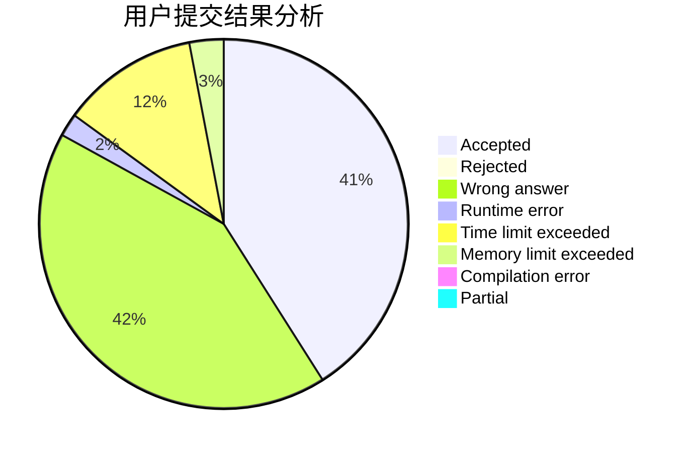
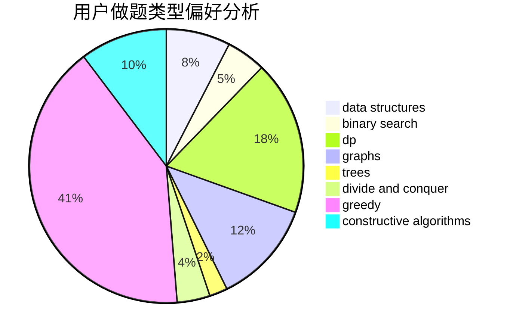
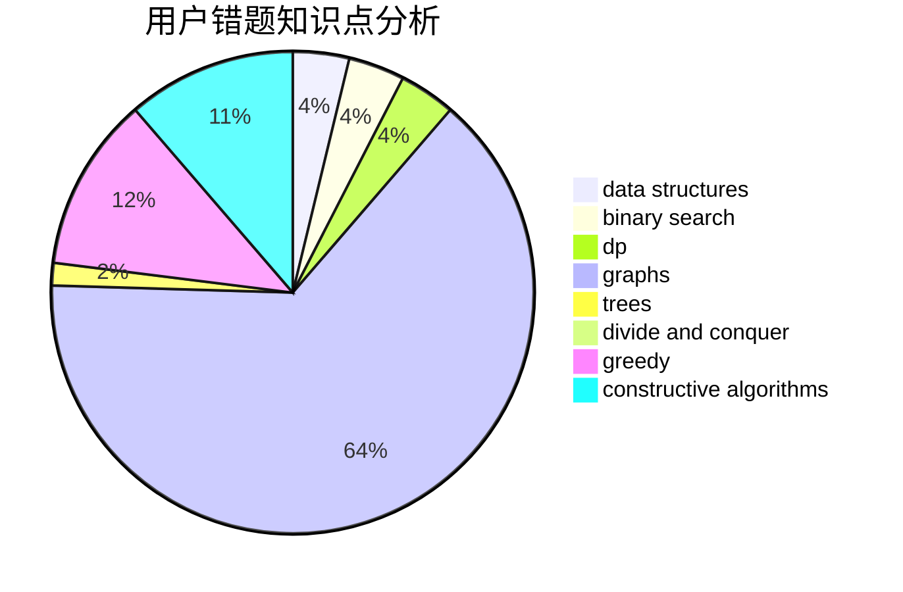

# Xiuchen

<!-- tabs:start -->

#### **用户提交结果分析**

#### **用户做题类型偏好分析**

#### **用户错题知识点分析**

<!-- tabs:end -->
# 推荐题目
[849B](https://codeforces.com/contest/849/problem/B)		brute force,
                        geometry		  
[1276B](https://codeforces.com/contest/1276/problem/B)		combinatorics,
                        dfs and similar,
                        dsu,
                        graphs		  
[1103E](https://codeforces.com/contest/1103/problem/E)		fft,
                        math,
                        number theory		  
[1281B](https://codeforces.com/contest/1281/problem/B)		greedy		  
[566C](https://codeforces.com/contest/566/problem/C)		dfs and similar,
                        divide and conquer,
                        trees		  
[199E](https://codeforces.com/contest/199/problem/E)		dsu,graphs,sortings,trees		  
[1362D](https://codeforces.com/contest/1362/problem/D)		dsu,graphs,sortings,trees		  
[1131A](https://codeforces.com/contest/1131/problem/A)		math		  
[1163B1](https://codeforces.com/contest/1163B/problem/1)		data structures,
                        implementation		  
[482D](https://codeforces.com/contest/482/problem/D)		combinatorics,
                        dp,
                        trees		  
