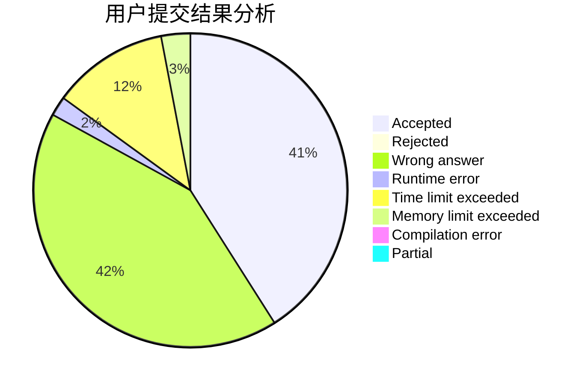
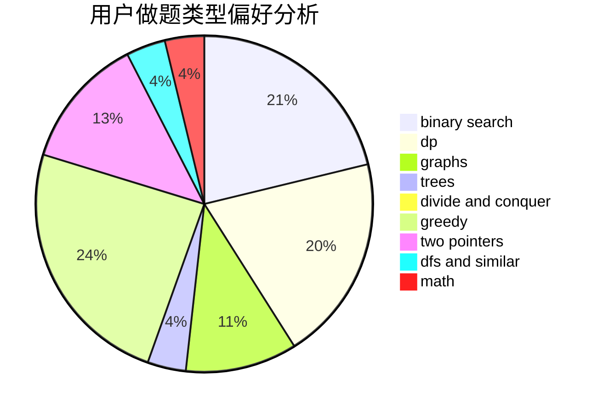

# Xiuchen

<!-- tabs:start -->

#### **用户提交结果分析**

#### **用户做题类型偏好分析**

<!-- tabs:end -->
# 推荐题目
[868D](https://codeforces.com/contest/868/problem/D)
[1282C](https://codeforces.com/contest/1282/problem/C)
[1104C](https://codeforces.com/contest/1104/problem/C)
[1287B](https://codeforces.com/contest/1287/problem/B)
[585B](https://codeforces.com/contest/585/problem/B)
[220E](https://codeforces.com/contest/220/problem/E)
[136C](https://codeforces.com/contest/136/problem/C)
[1132G](https://codeforces.com/contest/1132/problem/G)
[1164P](https://codeforces.com/contest/1164/problem/P)
[501C](https://codeforces.com/contest/501/problem/C)
