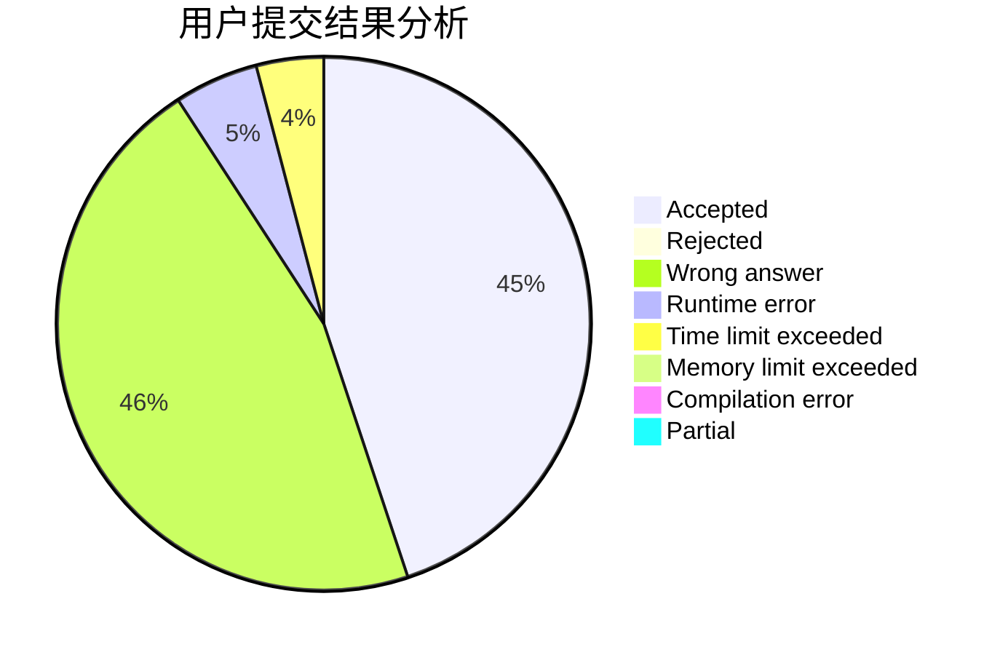
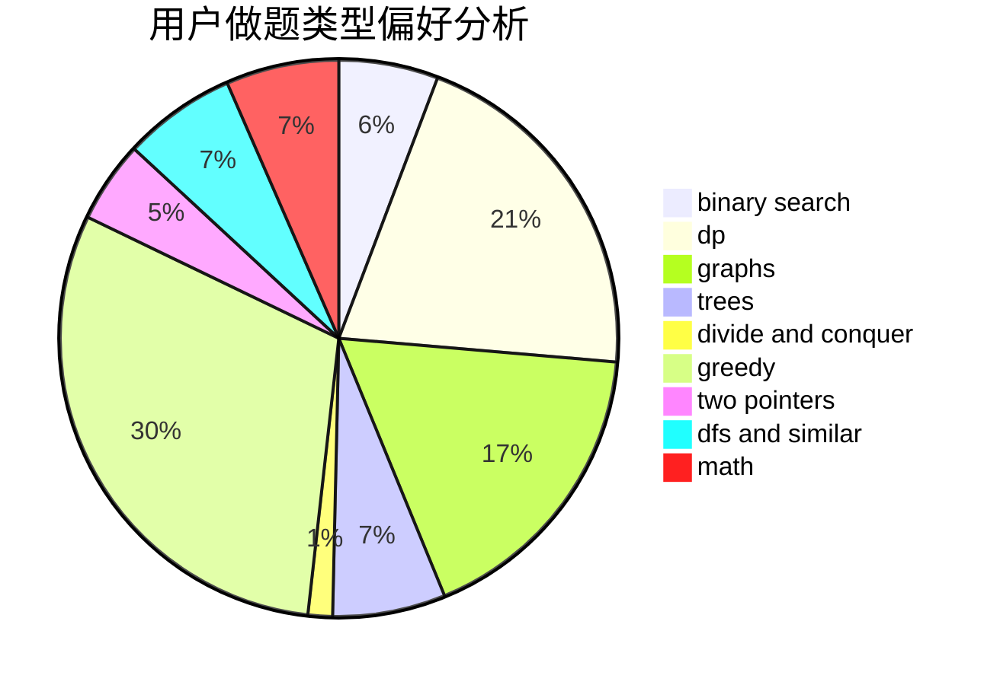

# XuZihan

<!-- tabs:start -->

#### **用户提交结果分析**

#### **用户做题类型偏好分析**

<!-- tabs:end -->
# 推荐题目
[1470E](https://codeforces.com/contest/1470/problem/E)
[1373E](https://codeforces.com/contest/1373/problem/E)
[1036B](https://codeforces.com/contest/1036/problem/B)
[615D](https://codeforces.com/contest/615/problem/D)
[771D](https://codeforces.com/contest/771/problem/D)
[872A](https://codeforces.com/contest/872/problem/A)
[791C](https://codeforces.com/contest/791/problem/C)
[1082C](https://codeforces.com/contest/1082/problem/C)
[946B](https://codeforces.com/contest/946/problem/B)
[1288B](https://codeforces.com/contest/1288/problem/B)
