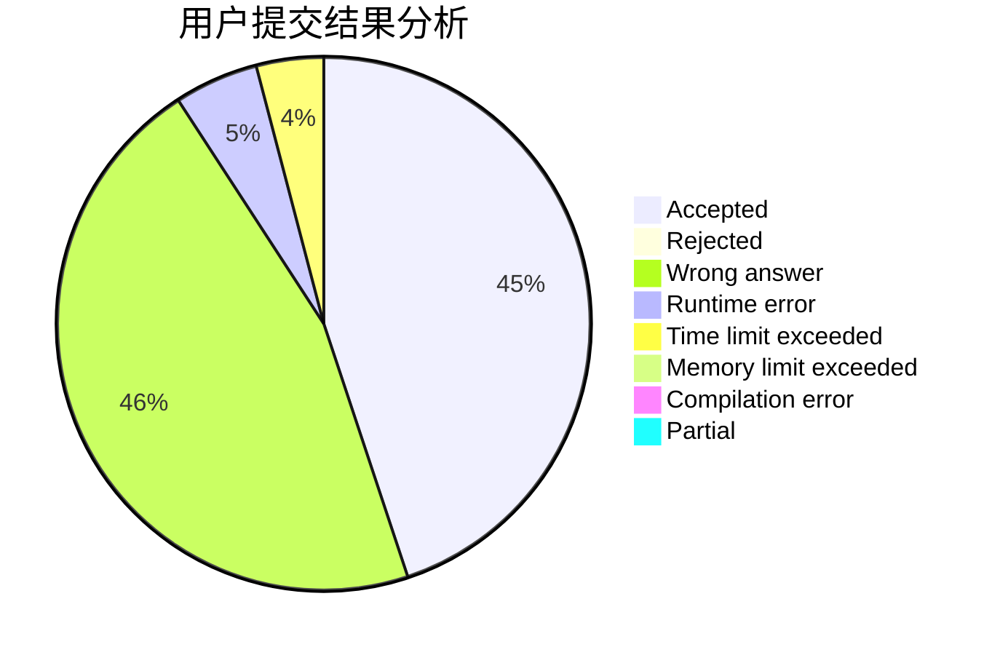
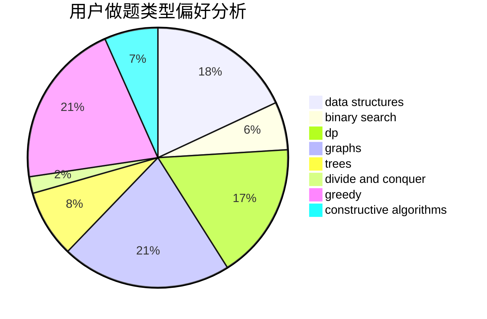

# XuZihan

<!-- tabs:start -->

#### **用户提交结果分析**

#### **用户做题类型偏好分析**

#### **用户错题知识点分析**

<!-- tabs:end -->
# 推荐题目
[1470E](https://codeforces.com/contest/1470/problem/E)		binary search,
                        combinatorics,
                        data structures,
                        dp,
                        graphs,
                        implementation,
                        two pointers		  
[1373E](https://codeforces.com/contest/1373/problem/E)		brute force,
                        constructive algorithms,
                        dp,
                        greedy		  
[1036B](https://codeforces.com/contest/1036/problem/B)		math		  
[615D](https://codeforces.com/contest/615/problem/D)		math,
                        number theory		  
[771D](https://codeforces.com/contest/771/problem/D)		dp		  
[872A](https://codeforces.com/contest/872/problem/A)		dsu,graphs,sortings,trees		  
[791C](https://codeforces.com/contest/791/problem/C)		dsu,graphs,sortings,trees		  
[1082C](https://codeforces.com/contest/1082/problem/C)		greedy,
                        sortings		  
[946B](https://codeforces.com/contest/946/problem/B)		math,
                        number theory		  
[1288B](https://codeforces.com/contest/1288/problem/B)		math		  
