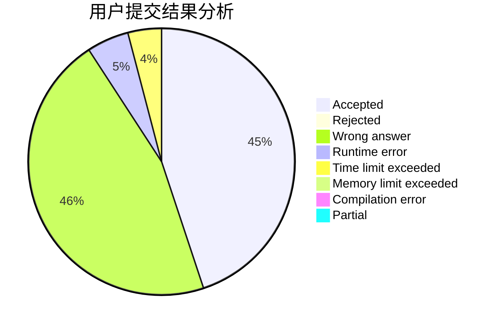
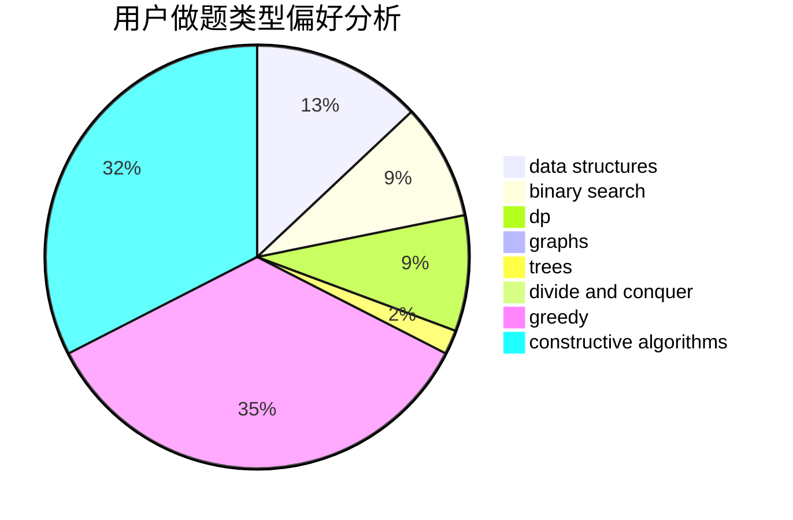

# XuZihan

<!-- tabs:start -->

#### **用户提交结果分析**

#### **用户做题类型偏好分析**

#### **用户错题知识点分析**

<!-- tabs:end -->
# 推荐题目
[1463D](https://codeforces.com/contest/1463/problem/D)		binary search,
                        constructive algorithms,
                        greedy,
                        two pointers		  
[1366F](https://codeforces.com/contest/1366/problem/F)		binary search,
                        dp,
                        geometry,
                        graphs		  
[1034D](https://codeforces.com/contest/1034/problem/D)		binary search,
                        data structures,
                        two pointers		  
[598A](https://codeforces.com/contest/598/problem/A)		math		  
[750H](https://codeforces.com/contest/750/problem/H)		dfs and similar,
                        dsu,
                        graphs,
                        interactive		  
[853D](https://codeforces.com/contest/853/problem/D)		binary search,
                        dp,
                        greedy		  
[771D](https://codeforces.com/contest/771/problem/D)		dp		  
[1081G](https://codeforces.com/contest/1081/problem/G)		math,
                        probabilities		  
[922B](https://codeforces.com/contest/922/problem/B)		brute force		  
[1281F](https://codeforces.com/contest/1281/problem/F)		dsu,graphs,sortings,trees		  
