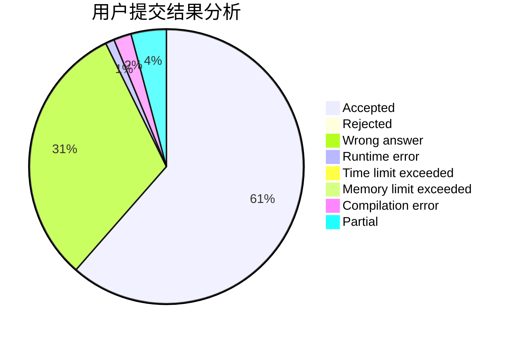
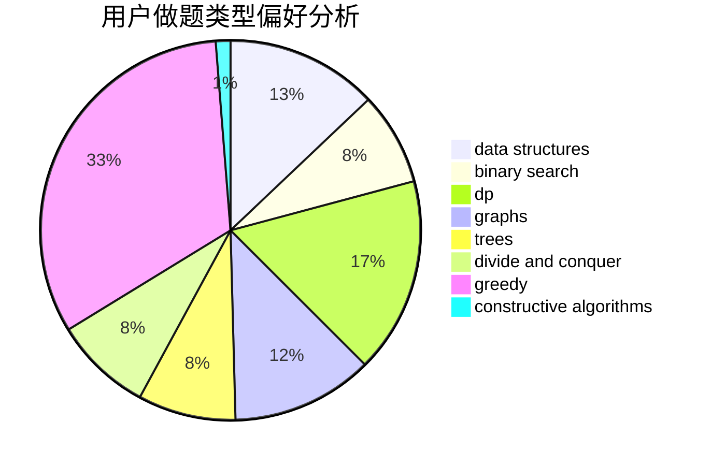
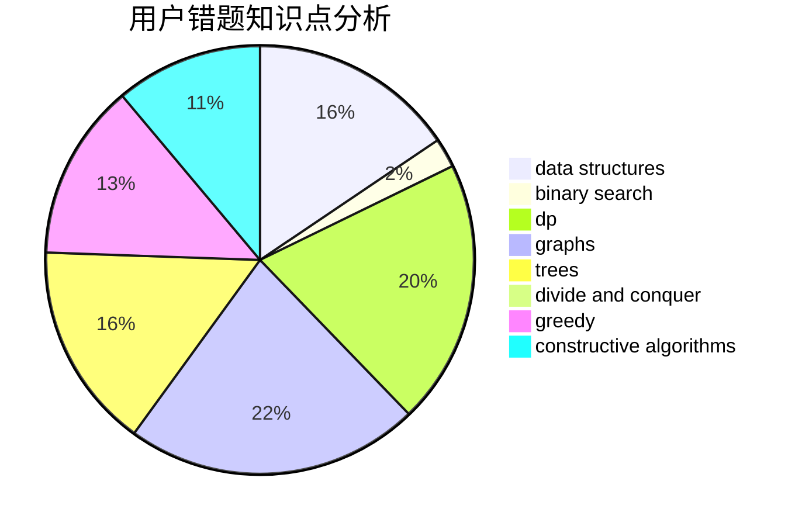

# Alan_zhou

<!-- tabs:start -->

#### **用户提交结果分析**

#### **用户做题类型偏好分析**

#### **用户错题知识点分析**

<!-- tabs:end -->
# 推荐题目
[1342F](https://codeforces.com/contest/1342/problem/F)		bitmasks,
                        brute force,
                        dp		  
[243B](https://codeforces.com/contest/243/problem/B)		graphs,
                        sortings		  
[1436F](https://codeforces.com/contest/1436/problem/F)		combinatorics,
                        math,
                        number theory		  
[1194D](https://codeforces.com/contest/1194/problem/D)		games,
                        math		  
[158B](https://codeforces.com/contest/158/problem/B)		*special problem,
                        greedy,
                        implementation		  
[243C](https://codeforces.com/contest/243/problem/C)		dfs and similar,
                        implementation		  
[241E](https://codeforces.com/contest/241/problem/E)		graphs,
                        shortest paths		  
[12D](https://codeforces.com/contest/12/problem/D)		data structures,
                        sortings		  
[242E](https://codeforces.com/contest/242/problem/E)		bitmasks,
                        data structures		  
[240F](https://codeforces.com/contest/240/problem/F)		data structures		  
