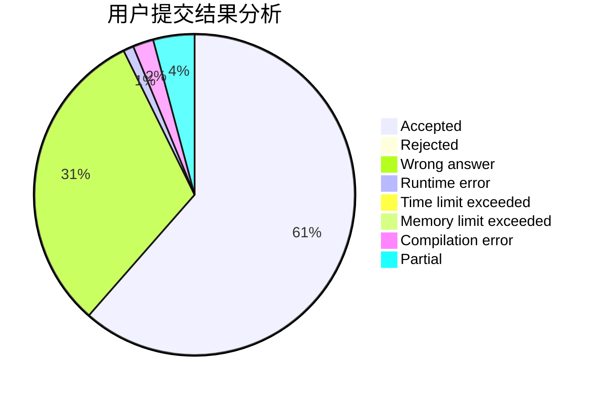
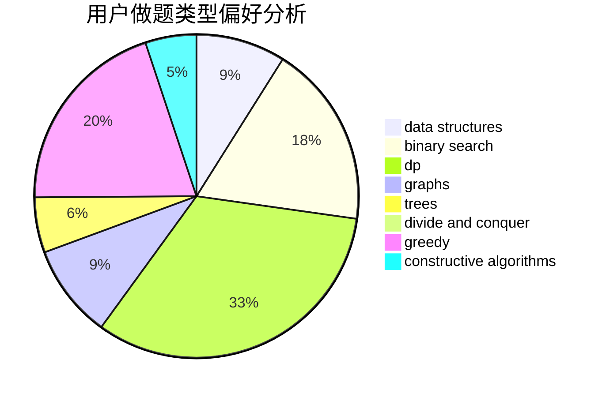
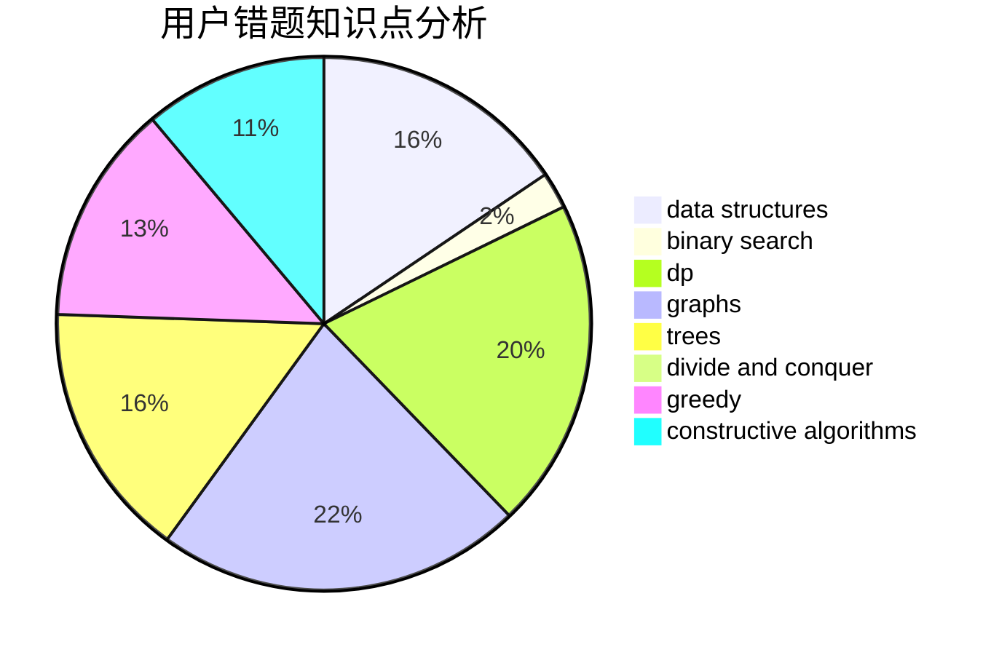

# Alan_zhou

<!-- tabs:start -->

#### **用户提交结果分析**

#### **用户做题类型偏好分析**

#### **用户错题知识点分析**

<!-- tabs:end -->
# 推荐题目
[1349D](https://codeforces.com/contest/1349/problem/D)		math,
                        probabilities		  
[264C](https://codeforces.com/contest/264/problem/C)		dp		  
[1446E](https://codeforces.com/contest/1446/problem/E)		constructive algorithms,
                        dfs and similar		  
[1198F](https://codeforces.com/contest/1198/problem/F)		greedy,
                        number theory,
                        probabilities		  
[17E](https://codeforces.com/contest/17/problem/E)		strings		  
[264D](https://codeforces.com/contest/264/problem/D)		dp,
                        two pointers		  
[263C](https://codeforces.com/contest/263/problem/C)		brute force,
                        dfs and similar,
                        implementation		  
[1307E](https://codeforces.com/contest/1307/problem/E)		binary search,
                        combinatorics,
                        dp,
                        greedy,
                        implementation,
                        math		  
[263E](https://codeforces.com/contest/263/problem/E)		brute force,
                        data structures,
                        dp		  
[261D](https://codeforces.com/contest/261/problem/D)		dp		  
