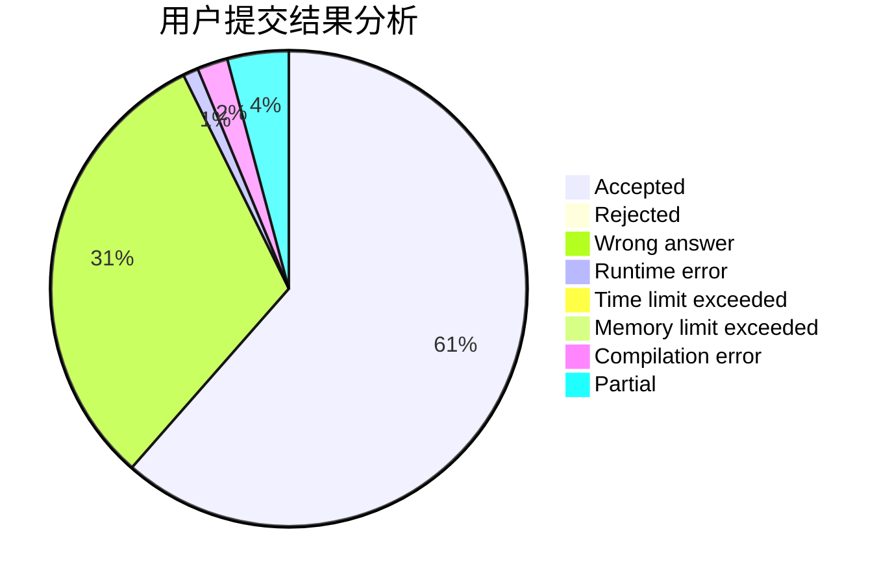
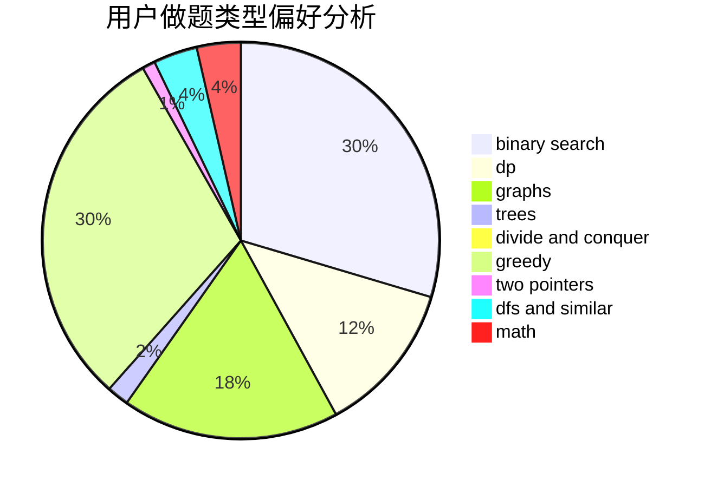

# Alan_zhou

<!-- tabs:start -->

#### **用户提交结果分析**

#### **用户做题类型偏好分析**

<!-- tabs:end -->
# 推荐题目
[1349D](https://codeforces.com/contest/1349/problem/D)
[264C](https://codeforces.com/contest/264/problem/C)
[1446E](https://codeforces.com/contest/1446/problem/E)
[1198F](https://codeforces.com/contest/1198/problem/F)
[17E](https://codeforces.com/contest/17/problem/E)
[264D](https://codeforces.com/contest/264/problem/D)
[263C](https://codeforces.com/contest/263/problem/C)
[1307E](https://codeforces.com/contest/1307/problem/E)
[263E](https://codeforces.com/contest/263/problem/E)
[261D](https://codeforces.com/contest/261/problem/D)
