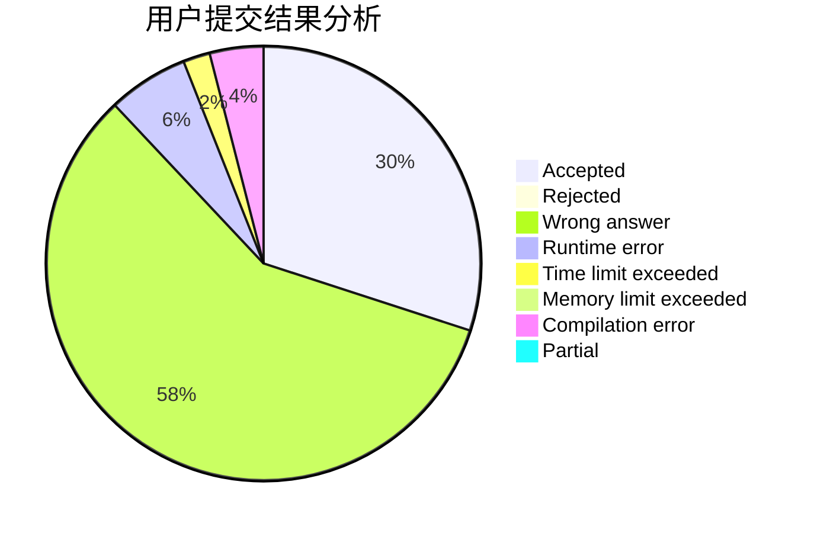
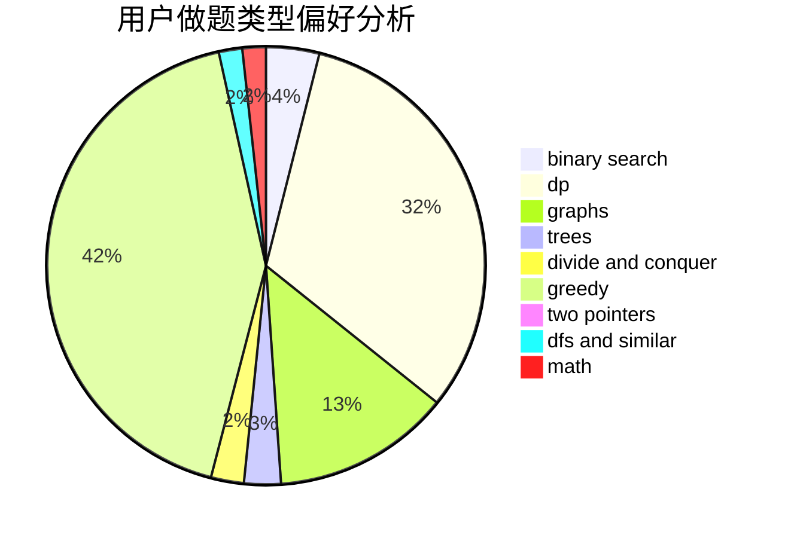

# Xu_Ke

<!-- tabs:start -->

#### **用户提交结果分析**

#### **用户做题类型偏好分析**

<!-- tabs:end -->
# 推荐题目
[1400E](https://codeforces.com/contest/1400/problem/E)
[1343E](https://codeforces.com/contest/1343/problem/E)
[1307B](https://codeforces.com/contest/1307/problem/B)
[582A](https://codeforces.com/contest/582/problem/A)
[1086C](https://codeforces.com/contest/1086/problem/C)
[1144B](https://codeforces.com/contest/1144/problem/B)
[1202F](https://codeforces.com/contest/1202/problem/F)
[883K](https://codeforces.com/contest/883/problem/K)
[1081D](https://codeforces.com/contest/1081/problem/D)
[998D](https://codeforces.com/contest/998/problem/D)
