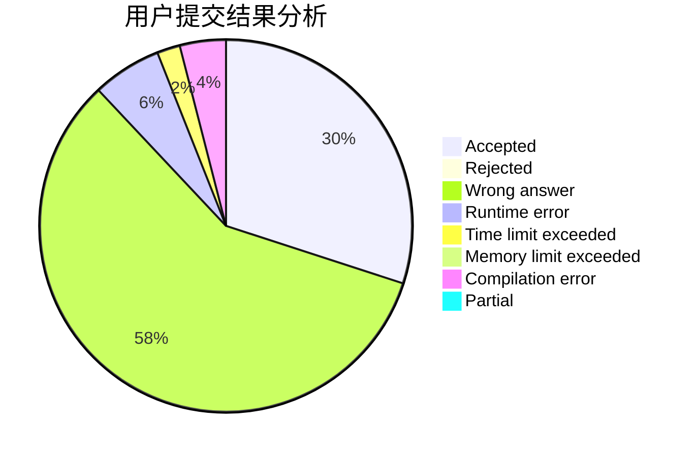
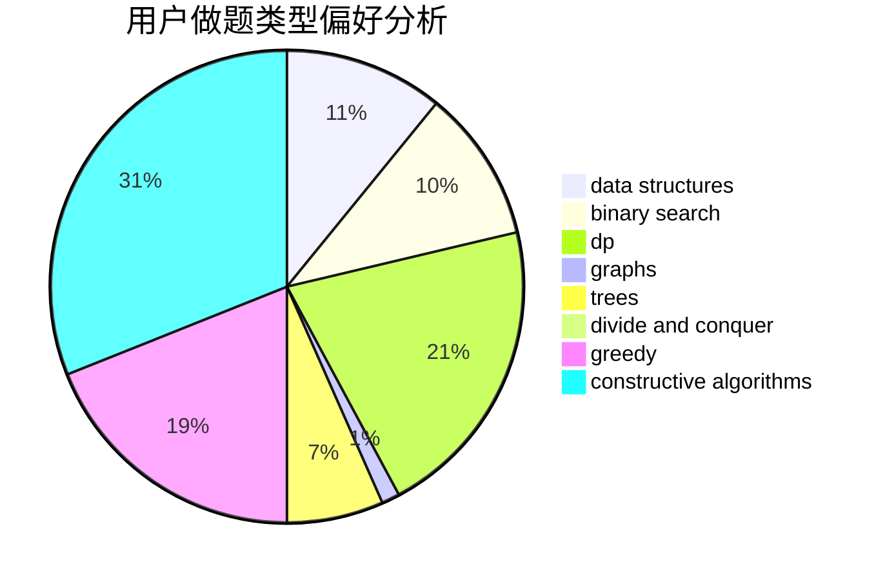
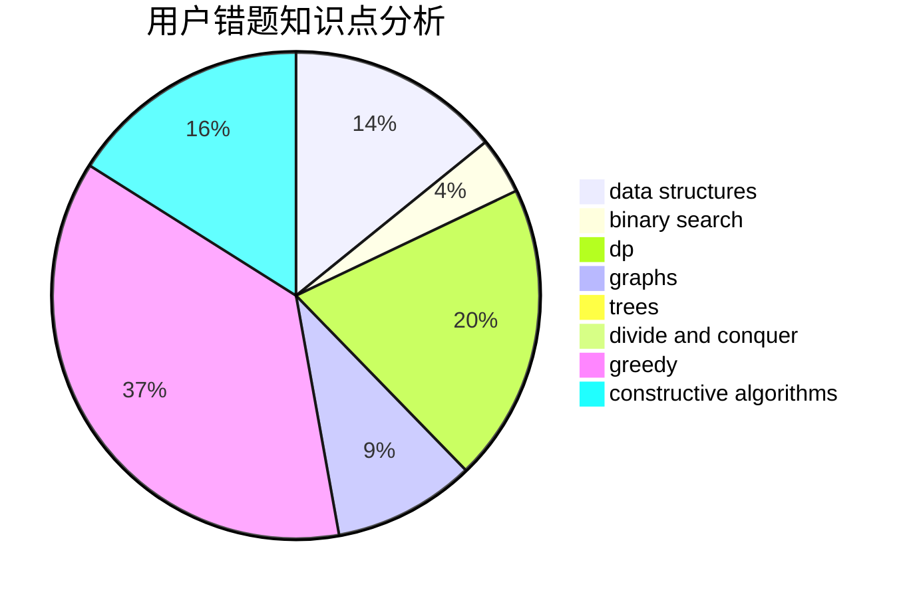

# Xu_Ke

<!-- tabs:start -->

#### **用户提交结果分析**

#### **用户做题类型偏好分析**

#### **用户错题知识点分析**

<!-- tabs:end -->
# 推荐题目
[1392H](https://codeforces.com/contest/1392/problem/H)		combinatorics,
                        dp,
                        math,
                        probabilities		  
[1336D](https://codeforces.com/contest/1336/problem/D)		constructive algorithms,
                        interactive		  
[12A](https://codeforces.com/contest/12/problem/A)		implementation		  
[559C](https://codeforces.com/contest/559/problem/C)		combinatorics,
                        dp,
                        math,
                        number theory		  
[1085G](https://codeforces.com/contest/1085/problem/G)		combinatorics,
                        data structures,
                        dp		  
[1141G](https://codeforces.com/contest/1141/problem/G)		binary search,
                        constructive algorithms,
                        dfs and similar,
                        graphs,
                        greedy,
                        trees		  
[1199B](https://codeforces.com/contest/1199/problem/B)		geometry,
                        math		  
[864B](https://codeforces.com/contest/864/problem/B)		brute force,
                        implementation,
                        strings		  
[1081A](https://codeforces.com/contest/1081/problem/A)		constructive algorithms,
                        math		  
[982F](https://codeforces.com/contest/982/problem/F)		dfs and similar,
                        graphs		  
