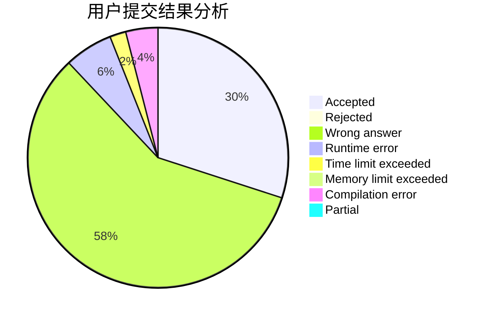
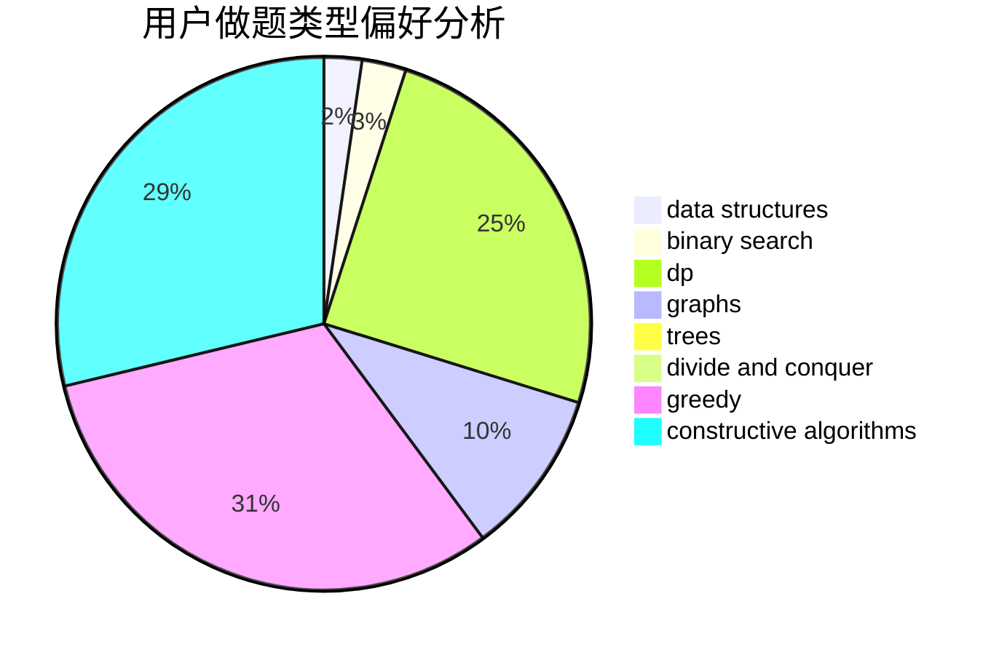
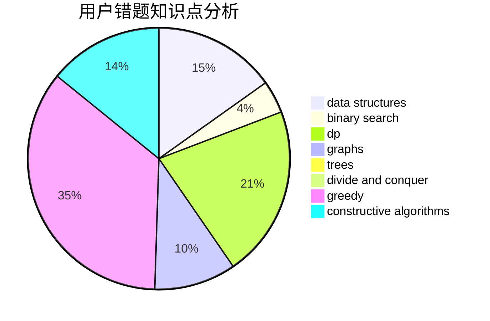

# Xu_Ke

<!-- tabs:start -->

#### **用户提交结果分析**

#### **用户做题类型偏好分析**

#### **用户错题知识点分析**

<!-- tabs:end -->
# 推荐题目
[1400E](https://codeforces.com/contest/1400/problem/E)		data structures,
                        divide and conquer,
                        dp,
                        greedy		  
[1343E](https://codeforces.com/contest/1343/problem/E)		brute force,
                        graphs,
                        greedy,
                        shortest paths,
                        sortings		  
[1307B](https://codeforces.com/contest/1307/problem/B)		geometry,
                        greedy,
                        math		  
[582A](https://codeforces.com/contest/582/problem/A)		constructive algorithms,
                        greedy,
                        number theory		  
[1086C](https://codeforces.com/contest/1086/problem/C)		dsu,graphs,sortings,trees		  
[1144B](https://codeforces.com/contest/1144/problem/B)		greedy,
                        implementation,
                        sortings		  
[1202F](https://codeforces.com/contest/1202/problem/F)		binary search,
                        implementation,
                        math		  
[883K](https://codeforces.com/contest/883/problem/K)		constructive algorithms,
                        greedy,
                        implementation		  
[1081D](https://codeforces.com/contest/1081/problem/D)		dsu,
                        graphs,
                        shortest paths,
                        sortings		  
[998D](https://codeforces.com/contest/998/problem/D)		dsu,graphs,sortings,trees		  
